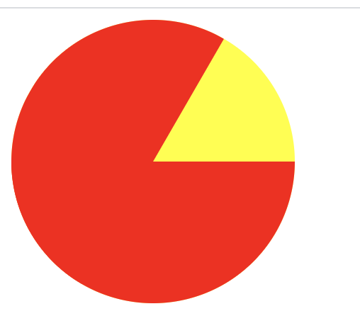
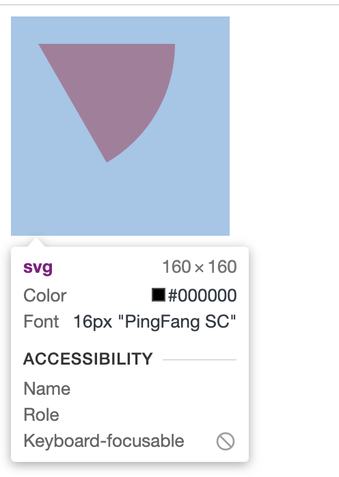

# 绘制图片

## 绘制三角形

1. border 法：原理是基于盒模型，将一边的 border 宽度设为 0，其他两边 border 的颜色设为透明.


```css
<!-- 向上 -- > .triangle-1 {
  width: 0;
  height: 0;
  border-left: 50px solid transparent;
  border-right: 50px solid transparent;
  border-bottom: 100px solid red;
}
```

2. svg：三点绘制一个三角形

```html
<svg height="250" width="250">
  <polygon points="100,10 150,180 50,180" style="fill:lime;stroke:purple;stroke-width:1" />
</svg>
```

<br/>

## 绘制扇形

1. 圆切割法：圆任意不重合的半径和圆弧组成的就是一个扇形。绘制一个圆形的父元素，通过 overflow 切割矩形或三角形的子元素。如图所示：


```html
<!-- html -->
<div class="circle">
  <div class="rect"></div>
</div>
```

```css
<!-- css -- > .circle {
  position: relative;
  width: 80px;
  height: 80px;
  background: red;
  border-radius: 80px;
  overflow: hidden;
}
.rect {
  position: absolute;
  top: 50%;
  left: 50%;
  width: 60px;
  height: 60px;
  background-color: yellow;
  display: block;
  transform: skew(30deg);
  transform-origin: left top;
}
```

2. 两半圆法: 一个圆的两个半圆经中心旋转缓缓打开的部分也是一个扇形。如图所示：



```html
<!-- html 绘制一个60度扇形 -->
<div class="circle">
  <div class="cir cir1"></div>
  <div class="cir cir2"></div>
</div>
```

```css
.circle {
  position: relative;
  width: 200px;
  height: 200px;
  border-radius: 100px;
  background-color: yellow;
}
.cir {
  position: absolute;
  width: 200px;
  height: 200px;
  transform: rotate(30deg);
  clip: rect(0px, 100px, 200px, 0px);
  border-radius: 100px;
  background-color: red;
}
.cir2 {
  transform: rotate(-90deg);
}
```

3. svg：使用 path 绘制扇形，绘制两边和圆弧



```html
<svg height="160" width="160">
  <path fill="red" d="M 20 20 H 120 A 100 100 0 0 1 70 106.602 Z" />
</svg>
```
