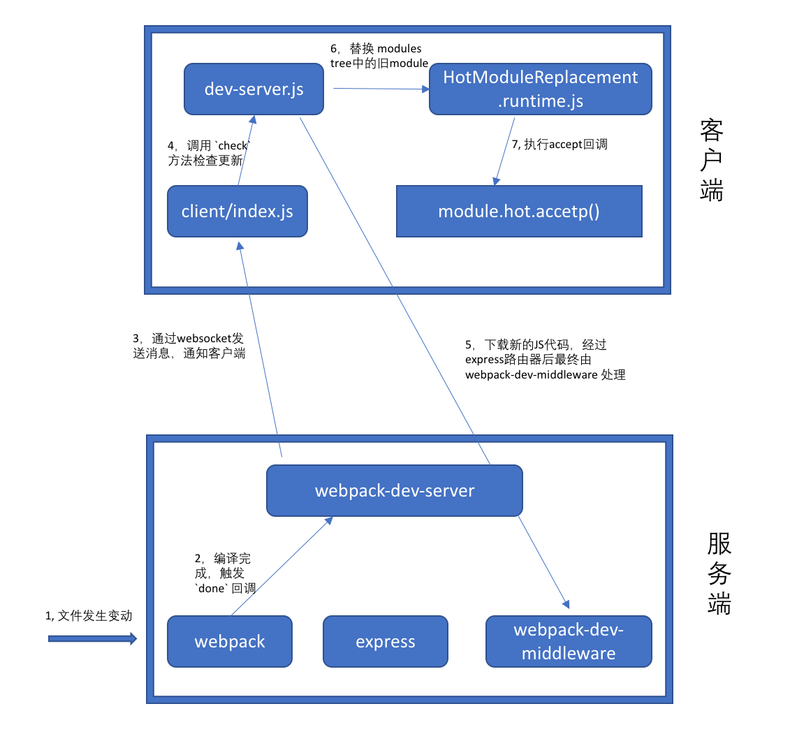

# HMR 的原理

&emsp;&emsp; 我们将分别从服务端（也就是 nodejs）和客户端（也就是浏览器）两部分讲 HMR 热更新的原理。我这里先画出一张流程图：



<br/>

## HMR 在 server 端的实现

<br/>

&emsp;&emsp; webpack 是从 webpack/bin/webpack 开始启动的，但是如果我们使用了 webpack-dev-server，那么就是从 webpack-dev-server/bin/webpack-dev-server.js 启动的。


&emsp;&emsp; 如上图所示，webpack-dev-server 包含了三部分：

- webpack, 负责编译代码
- webpack-dev-server，主要提供了 in-memory 内存文件系统，他会把 webpack 的 outputFileSystem 替换成一个 inMemoryFileSystem，并且拦截全部的浏览器请求，从这个文件系统中把结果取出来返回。
- express，作为服务器

先来总结下 webpack 在 server 端进行热更新的流程：

<font color=green>初始化阶段：</font>

1. webpack-dev-server 初始化的时候

- var compiler = webpack(options) // 创建 webpack 实例
- 监听 compiler 也就是 webpack 的 done 事件
- 创建 express 实例
- 创建 WebpackDevMiddleware 实例
- 设置 express router，WebpackDevServer 会作为 express 的一个中间件拦截所有请求

2. WebpackDevMiddleware 在初始化的时候

- 创建 一个 MemoryFileSystem 实例，替换掉 webpack.outputFileSystem，这样 webpack 编译出的文件其实都是存在内存中，而不是磁盘上
- 把对编译后的文件的请求，都重定向到上面创建的 MemoryFileSystem 中

<font color=green>热更新阶段：</font>

- webpack 监听文件变化，并完成编译
- webpack-dev-server 监听 done 事件，并通过 websocket 向客户端发送消息客户端经过处理后，请求新的 JS 模块代码
- WebpackDevServer 从 MemoryFileSystem 中取出代码，并返回

下面我们来看看代码：初始化阶段

1. webpack-dev-server.js 会创建一个 webpack 实例：

```javascript
let compiler;
try {
  compiler = webpack(webpackOptions);
} catch (e) {}
let server;
try {
  server = new Server(compiler, options);
} catch (e) {}
```

2. 接着，`webpack-dev-server/lib/Server.js` 会创建 express 和 WebpackDevMiddleware：

```javascript
function Server(compiler, options) {
  compiler.plugin('done', (stats) => {
    this._sendStats(this.sockets, stats.toJson(clientStats)); // 当完成编译的时候，就通过 websocket 发送给客户端一个消息（一个 `hash` 和 一个`ok`)
    this._stats = stats;
  });

  // Init express server
  const app = (this.app = new express()); // eslint-disable-line

  // middleware for serving webpack bundle
  this.middleware = webpackDevMiddleware(compiler, options);
}

// 后面会有一行
app.use(this.middleware); // middleware会拦截所有请求，如果发现对应的请求是要请求 `dist` 中的文件，则会进行处理。
```

热更新阶段：在热更新阶段，首先会触发这几行代码：

```javascript
compiler.plugin('done', (stats) => {
  this._sendStats(this.sockets, stats.toJson(clientStats));
  this._stats = stats;
});
```

`_sendStats` 会通过 websocket 给客户端发送两条消息。客户端收到消息后，会去请求一个 json 配置文件，然后根据配置请求新的 JS 模块代码。这些请求都会被 `WebpackDevMiddleware` 拦截：

```javascript
function webpackDevMiddleware(req, res, next) {
  function goNext() {
    if (!context.options.serverSideRender) return next();
    return new Promise(function (resolve) {
      shared.ready(function () {
        res.locals.webpackStats = context.webpackStats;
        resolve(next());
      }, req);
    });
  }

  if (req.method !== 'GET') {
    return goNext();
  }
  // 如果发现这个请求是 publicPath 中的文件内容，那么就从 fs 中取出内容并返回
  // 如果不是，那么 next，交给 `webpack-dev-server` 进行处理
  var filename = getFilenameFromUrl(context.options.publicPath, context.compiler, req.url);
  if (filename === false) return goNext();

  return new Promise(function (resolve) {
    shared.handleRequest(filename, processRequest, req);
    function processRequest() {
      // ...
      // server content
      var content = context.fs.readFileSync(filename);
      // ....
      if (res.send) res.send(content);
      else res.end(content);
      resolve();
    }
  });
}
```

<br/>

## HMR 在浏览器中的工作流程

<br/>

&emsp;&emsp; webpack 在 启用 HMR 之后，会在 server 端（nodejs 端）监听文件改动，并且一旦发生变动就把新的代码编译后发送到浏览器。浏览器中也会有 HMR 相关的代码，会通过 socket 和 server 保持通信，获取新代码并进行热替换。这里我们先不看 webpack 在 nodejs 端是如何编译的，而是先看看在浏览器中是如何工作的。

HMR 工作流程：

1. client 和 server 建立一个 websocket 通信
2. 当有文件发生变动的时候，webpack 编译文件，并通过 websocket 向 client 发送一条更新消息
3. client 根据收到的 hash 值，通过 ajax 获取一个 manifest 描述文件
4. client 根据 manifest 获取新的 JS 模块的代码
5. 当取到新的 JS 代码之后，会更新 modules tree，（installedModules)
6. 调用之前通过 `module.hot.accept` 注册好的回调，可能是 loader 提供的，也可能是你自己写的

这里以 用 `webpack-dev-server` 为例，当我们启用了 HMR 后，他会把我们的入口文件包一层，加上两个依赖：

```javascript
/***/ 0:
// 这个模块是新加的，我们的入口就是 index，而这里加了一个模块，引用了 index，并且额外加了两行 require
/***/ (function(module, exports, __webpack_require__) {
__webpack_require__("./node_modules/webpack-dev-server/client/index.js?http://localhost:8080");
__webpack_require__("./node_modules/webpack/hot/dev-server.js");
module.exports = __webpack_require__("./src/index.js");
/***/ })
/******/ })
```

其中:

- `client/index.js` 主要负责建立 socket 通信，并在收到消息后调用对应的方法。
- `dev-server.js` 会调用 `module.hot.check` 方法，最终真正去做代码更新的，是在 `webpack/lib/HotModuleReplacement.runtime.js` 文件中。顺便说下，你在 console 中看到的 HMR log，几乎都是在 `dev-server.js` 中输出的，有兴趣可以看下这个文件的源码。我们的代码启用了 HMR 之后会多出 9000 行代码，很大一部分就是由于引入了 webpack 中 HMR runtime 相关的代码导致的。

我们先从这个文件开始看：

1. 初始化的时候，client.js 会启动一个 socket 和 `webpack-dev-server` 建立连接，然后等待 `hash` 和 `ok` 消息。
2. 当有文件内容改动的时候，首先会收到 `webpack-dev-server` 发来的 `hash` 消息，得到新的 哈希值并保存起来。
3. 然后会立刻接收到 `ok` 消息，表示现在可以加载最新的代码了，于是进入 `reloadApp` 方法。
4. reloadApp -> check()
5. check => hotDownloadManifest, 这里会下载一个本次热更新的 manifest 文件，url 就是用上面存的 `hash` 拼接出来的，大概这样：`8b52a72952cca784407e.hot-update.json`，结果大概长这样：`{"h":"8b52a72952cca784407e","c":{"0":true}}`。这里仔细观察会发现，每一次取到的 manifest 中的 hash 都是上一次 `hash` 消息的值，这样应该是为了保证顺序。
6. hotDownloadManifest 下载完配置文件后，可以看到其中有一个 `h` ，这个 hash 就是我们等会要取编译后的新代码的地址，在 `hotEnsureUpdateChunk` 方法中最终会通过 jsonp 的方式把新的代码加载进来。
7. 加载到新的模块代码后，会有一系列的对 依赖树 比如 `installedModules` 的更新操作。
8. 最终，在 `hotApply` 中会执行我们的 `module.hot.accept` 注册的回调函数

上面说的这些 JS 代码，都是被 webpack 打包在我们的 `bundle.js` 头部的代码。都是在浏览器中执行的。

我们来看一下代码：

首先，我们的 bundle 文件会被加入 `webpack-dev-server/client.js`，他会创建一个 socket 和 devserver 连接，监听事件，主要代码如下：

```javascript
const onSocketMsg = {
  hash: function msgHash(hash) {
    // 在 `hash` 事件触发的时候，把 `hash` 记下来
    currentHash = hash;
  },
  ok: function msgOk() {
    // `ok` 事件触发的时候，表示server已经便已完成最新代码，
    sendMsg('Ok');
    if (useWarningOverlay || useErrorOverlay) overlay.clear();
    if (initial) return (initial = false); // eslint-disable-line no-return-assign
    reloadApp();
  }
};
// 省略
function reloadApp() {
  if (hot) {
    log.info('[WDS] App hot update...');
    // eslint-disable-next-line global-require
    const hotEmitter = require('webpack/hot/emitter');
    hotEmitter.emit('webpackHotUpdate', currentHash); // 触发这个事件的时候，会触发 `dev-server.js` 中的 check 方法
  }
  // 省略
}
```

`dev-server.js` 中的 check 方法，最终会进入到这里：

```javascript
function hotCheck(apply) {
  if (hotStatus !== 'idle') throw new Error('check() is only allowed in idle status');
  hotApplyOnUpdate = apply;
  hotSetStatus('check');
  return hotDownloadManifest(hotRequestTimeout).then(function (update) {
    // 取到了 manifest后，就可以通过jsonp 加载最新的模块的JS代码了
    hotEnsureUpdateChunk(chunkId);
  });
}
```

加载 JS 的代码如下：

```javascript
function hotDownloadUpdateChunk(chunkId) {
  // eslint-disable-line no-unused-vars
  // 通过jsonp的方式加载
  var head = document.getElementsByTagName('head')[0];
  var script = document.createElement('script');
  script.type = 'text/javascript';
  script.charset = 'utf-8';
  script.src = __webpack_require__.p + '' + chunkId + '.' + hotCurrentHash + '.hot-update.js';
  head.appendChild(script);
}
```

加载到的代码如下：

```javascript
webpackHotUpdate(0, {
  /***/ './build/css-loader/index.js?modules!./src/style.css': /***/ function (module, exports, __webpack_require__) {
    exports = module.exports = __webpack_require__('./build/css-loader/css-base.js')();
    exports.i(__webpack_require__('./src/global.css'));
    exports.push([
      module.i,
      "@import './global.css';\n\nh1 {\n  color: blue;\n}\n\n._input_css_12__avatar {\n  width: 100px;\n  height: 100px;\n  background-image: url('" +
        __webpack_require__('./src/avatar.jpeg') +
        "');\n  background-size: cover;\n}\n\n._input_css_12__avatar2 {\n  width: 100px;\n  height: 100px;\n  background-image: url('" +
        __webpack_require__('./src/m.png') +
        "');\n  background-size: cover;\n}\n",
      ''
    ]);
    exports.locals = { avatar: '_input_css_12__avatar', avatar2: '_input_css_12__avatar2' };

    /***/
  }
});
//# sourceMappingURL=0.8b52a72952cca784407e.hot-update.js.map
```

到此为止，我们就已经得到了新模块的 JS 代码了，下面要做的就是调用对应的 `accept` 回调，这也是在 `hotApply` 方法的后面部分做的：

```javascript
for(moduleId in outdatedDependencies) {
  if(Object.prototype.hasOwnProperty.call(outdatedDependencies, moduleId)) {
    module = installedModules[moduleId];
    if(module) {
      moduleOutdatedDependencies = outdatedDependencies[moduleId];
      var callbacks = [];
      for(i = 0; i < moduleOutdatedDependencies.length; i++) {
        dependency = moduleOutdatedDependencies[i];
        cb = module.hot._acceptedDependencies[dependency]; // 先去到所有对这个模块注册的 accept 回调
        if(cb) {
            if(callbacks.indexOf(cb) >= 0) continue;
            callbacks.push(cb);
        }
      }
      for(i = 0; i < callbacks.length; i++) {
        cb = callbacks[i];
        try {
            cb(moduleOutdatedDependencies); // 挨个调用一遍
        } // ...
      }
    }
  }
 }
```
