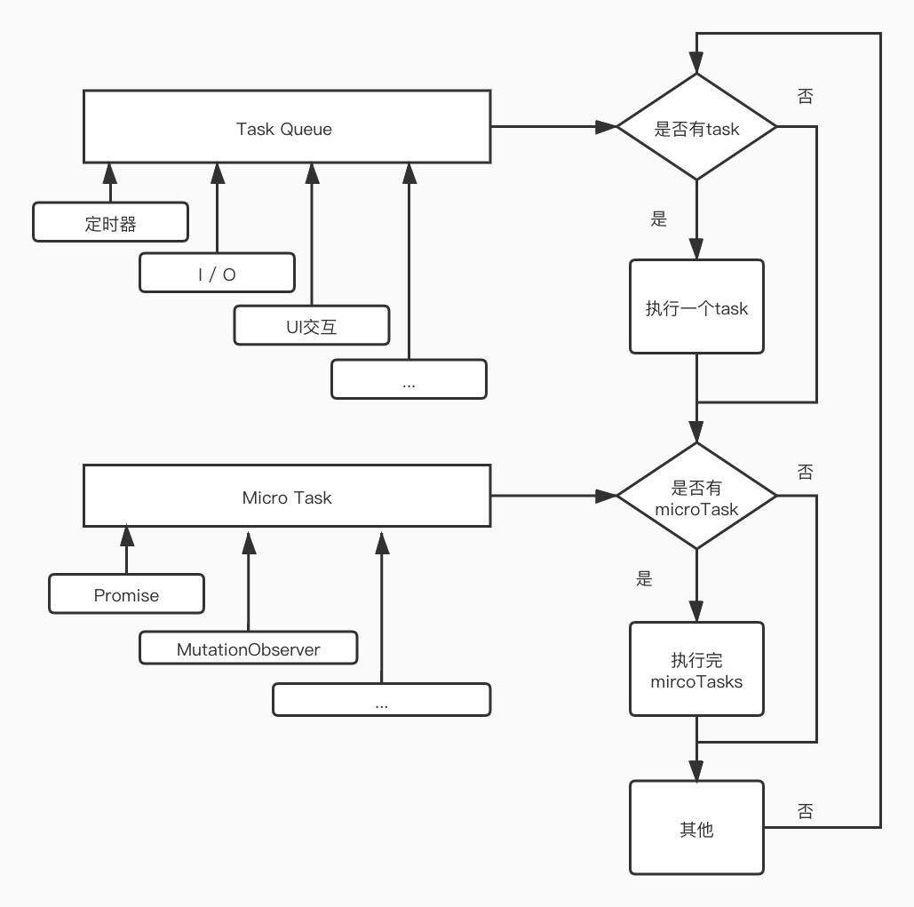
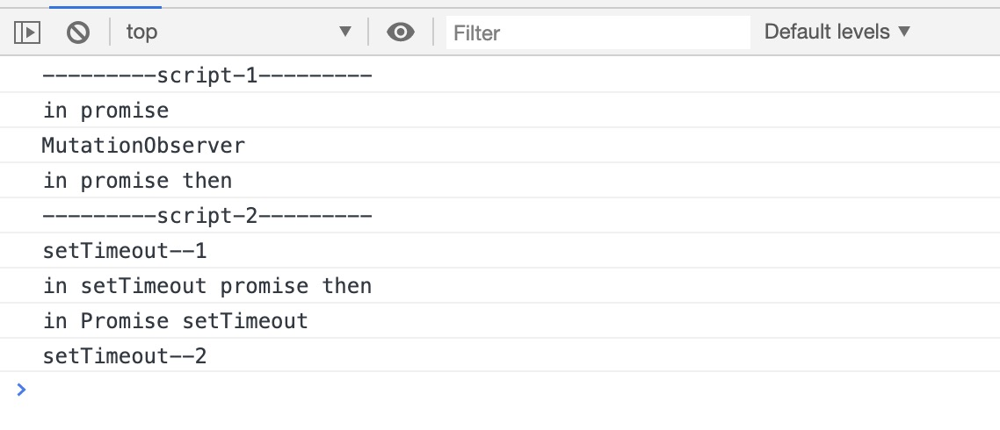

# EventLoop

&emsp;&emsp; javascript 是一门单线程的脚本语言(这里我们不考虑 worker)，或者说只有一个主线程，也就是它一次只能执行一段代码。那么例如像 onClick 注册的回调函数、必不可少的 ajax 等等异步操作需要借助 EventLoop 来执行。

<br/>

## 执行模型

&emsp;&emsp; event loop 是一个执行模型，在不同的地方有不同的实现。浏览器和 NodeJS 基于不同的技术实现了各自的 Event Loop。

- 浏览器的 Event Loop 是在 html5 的规范中明确定义。
- NodeJS 的 Event Loop 则是基于 libuv 实现的。

<br/>

$\color{green}{浏览器中的EventLoop}$

#### 宏任务和微任务

&emsp;&emsp; 首先来了解下宏任务和微任务，异步任务分为 task（宏任务，也可称为 macroTask）和 microtask（微任务，也叫 jobs）两类。 Task:

- setTimeout
- setInterval
- setImmediate (Node 独有)
- requestAnimationFrame (浏览器独有)
- I/O
- UI rendering (浏览器独有)
- script 标签

MicroTask:

- process.nextTick (Node 独有)
- Promise
- MutationObserver

&emsp;&emsp; 当满足执行条件时，task 和 microtask 会被放入各自的队列中，等待放入执行线程执行，我们把这两个队列称为 Task Queue(也叫 Macrotask Queue)和 Microtask Queue。

**基本流程：**



1. 从任务队列 task queue 选择中最先进入的任务执行，如果队列为空，则执行 microtask queue。
2. 检查该 task 是否注册了 microtask queue，如果有，则按注册顺序依次执行 microtask。如果没有则继续下一步。
3. 一些其他操作，例如界面渲染。
4. 重复以上步骤。

这样的一次流程称为 event loop 的一次循环，即是一次 tick。

**例子** 下面我们通过一个例子来具体分析分析：

```Javascript
<script>
  console.log('---------script-1---------')
​
  const box = document.querySelector('.box')
  const observer = new MutationObserver(function (mutationsList, observer) {
    console.log('MutationObserver')
  });
  observer.observe(box, { attributes: true, childList: true, subtree: true });
  box.setAttribute('name', 'rename')
​
  setTimeout(() => {
    console.log('setTimeout--1')
    new Promise(resolve => resolve()).then(() => {
      console.log('in setTimeout promise then')
    })
  })
​
  new Promise((resolve, reject) => {
    setTimeout(() => {
      console.log('in Promise setTimeout')
    })
    console.log('in promise')
    resolve()
  }).then(() => {
    console.log('in promise then')
  })
​
  setTimeout(() => {
    console.log('setTimeout--2')
  })
</script>
<script>
  console.log('---------script-2---------')
</script>
​
```

<br/>

---

<div align="center"><font color=blue size=4>0 1</font></div>

首先执行第一个 script：

1. console.log 同步代码直接输出
2. 注册了一个 MutationObserver，添加到当前 task 的 microtask queue
3. setTimeout 定时器，往 task queue 中添加了一个宏任务
4. new Promise，首先执行里面的同步代码，添加定时器和 console.log，再在当前 task 的 microtask queue 中添加一个 promise 的 microtask
5. setTimeout 定时器，在往 task queue 中添加了一个宏任务

<br/>
<div align="center"><font color=blue size=4>0 2</font></div>
<br/>

第一个 task 中的同步任务执行完成，查看当前 task 的 microtask queue，不为空，则依次执行队列中的 microtask。

1. 执行 MutationObserver 的回调函数
2. 执行 Promise.then 的回调函数

<br/>
<div align="center"><font color=blue size=4>0 3</font></div>
<br/>

microtask queue 执行完毕，script1 的 task 从执行栈弹出，script2 压入栈执行。输出 console.log。script2 中没有注册异步任务，循环后执行下一个 task - setTimeout1。

1. 输出同步代码 console.log
2. 往自身的 microtask queue 中添加一个 promise 的 microtask

<br/>
<div align="center"><font color=blue size=4>0 4</font></div>
<br/>

接着

1. 执行自身的 microtask queue，promise.then 注册的函数，控制台输出 in setTimeout promise then。
2. 执行完其他操作后，进入下一轮循环，执行在 promise 中注册的定时器，该 task 中没有 microtask，继续下一轮循环，执行 setTimemout2。
3. 执行完后，js 线程空闲等他其他操作。

&emsp;&emsp; 浏览器下的执行结果和我们分析的一致



<br/>

$\color{green}{Node中的EventLoop}$

&emsp;&emsp; node 的 event Loop 是基于 libuv 库实现的。我们看看 libuv 中的主要函数 uv_run（只保留 mode=UV_RUN_DEFAULT 默认轮询模式）。

```C
int uv_run(uv_loop_t* loop, uv_run_mode mode) {
  int timeout;
  int r;
  int ran_pending;
​
​  r = uv__loop_alive(loop);
  if (!r)
    uv__update_time(loop);
​
  while (r != 0 && loop->stop_flag == 0) {
    uv__update_time(loop);
    uv__run_timers(loop); // 这个阶段执行timer（setTimeout、setInterval）的回调
​
    ran_pending = uv__run_pending(loop);
    uv__run_idle(loop);
    uv__run_prepare(loop);
​
    timeout = 0;
    if (mode == UV_RUN_DEFAULT)
      timeout = uv_backend_timeout(loop);
​
    uv__io_poll(loop, timeout); // 获取新的I/O事件, 适当的条件下node将阻塞在这里
    uv__run_check(loop); // 执行 setImmediate() 的回调
    uv__run_closing_handles(loop); // 执行close事件的callback，例如socket.on("close",func)
​
    r = uv__loop_alive(loop);
    if (mode == UV_RUN_ONCE || mode == UV_RUN_NOWAIT)
      break;
  }
​
  /* The if statement lets gcc compile it to a conditional store. Avoids
   * dirtying a cache line.
   */
  if (loop->stop_flag != 0)
    loop->stop_flag = 0;
​
  return r;
}
```

while 循环中就是我们的 eventLoop。用文字描述描述 eventLoop 的步骤如下：

1. timers：执行满足条件的 setTimeout、setInterval 回调。
2. I/O callbacks：是否有已完成的 I/O 操作的回调函数，来自上一轮的 poll 残留。
3. idle，prepare：可忽略
4. poll：等待还没完成的 I/O 事件，会因 timers 和超时时间等结束等待。
5. check：执行 setImmediate 的回调。
6. close callbacks：关闭所有的 closing handles，一些 onclose 事件。
7. 重复以上步骤。

```
   ┌───────────────────────┐
┌─>│        timers         │<————— 执行 setTimeout()、setInterval() 的回调
│  └──────────┬────────────┘
|             |<-- 执行所有 Next Tick Queue 以及 MicroTask Queue 的回调
│  ┌──────────┴────────────┐
│  │     pending callbacks │<————— 执行由上一个 Tick 延迟下来的 I/O 回调（待完善，可忽略）
│  └──────────┬────────────┘
|             |<-- 执行所有 Next Tick Queue 以及 MicroTask Queue 的回调
│  ┌──────────┴────────────┐
│  │     idle, prepare     │<————— 内部调用（可忽略）
│  └──────────┬────────────┘
|             |<-- 执行所有 Next Tick Queue 以及 MicroTask Queue 的回调
|             |                   ┌───────────────┐
│  ┌──────────┴────────────┐      │   incoming:   │ - (执行几乎所有的回调，除了 close callbacks 以及 timers 调度的回调和 setImmediate() 调度的回调，在恰当的时机将会阻塞在此阶段)
│  │         poll          │<─────┤  connections, │
│  └──────────┬────────────┘      │   data, etc.  │
│             |                   |               |
|             |                   └───────────────┘
|             |<-- 执行所有 Next Tick Queue 以及 MicroTask Queue 的回调
|  ┌──────────┴────────────┐
│  │        check          │<————— setImmediate() 的回调将会在这个阶段执行
│  └──────────┬────────────┘
|             |<-- 执行所有 Next Tick Queue 以及 MicroTask Queue 的回调
│  ┌──────────┴────────────┐
└──┤    close callbacks    │<————— socket.on('close', ...)
   └───────────────────────┘
```

<br/>

$\color{green}{经典例子}$

最后给大家讲一个经典例子

```
setTimeout(()=>{
  console.log('timer1')
  Promise.resolve().then(function() {
    console.log('promise1')
  })
}, 0)
setTimeout(()=>{
  console.log('timer2')
  Promise.resolve().then(function() {
    console.log('promise2')
  })
}, 0)
```

结果如下：

- 浏览器环境：time1，promise1，time2，promise2
- node11 以下：time1，time2，promise1，promise2
- node11 及以上：time1，promise1，time2，promise2

在 node 11 版本中，node 下 Event Loop 已经与浏览器趋于相同。我们可以用浏览器的微任务和宏任务解释，11 版本前的 timer，由于到期时间相近，会在 timer 阶段合并执行。所以打出 time1 后，打印 time2。

<br/>

### 结束语

如果有错误或者不严谨的地方，欢迎指正~
