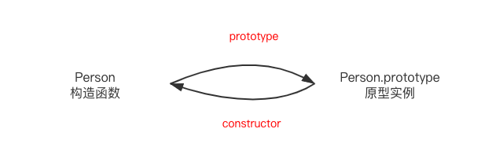
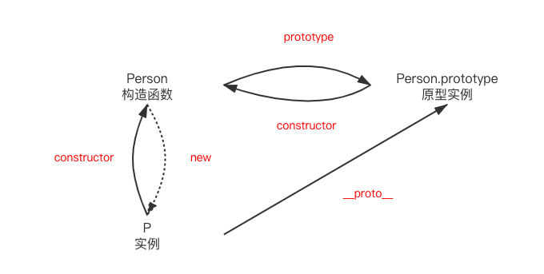
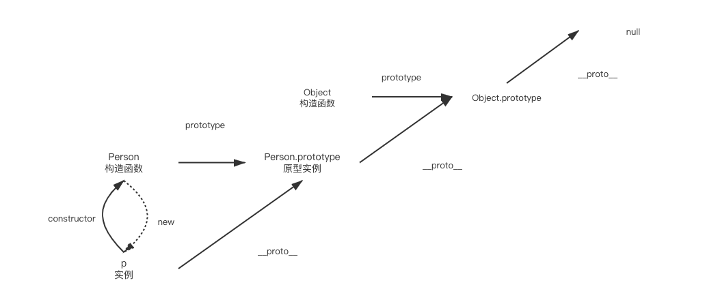
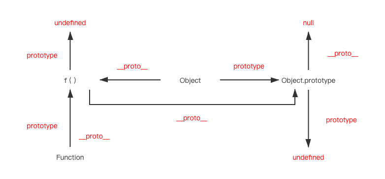
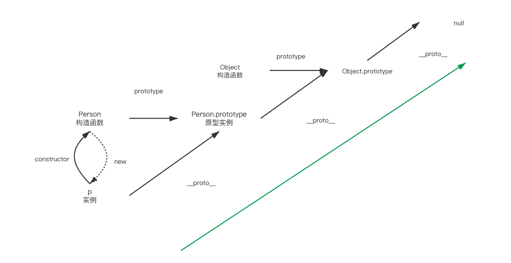
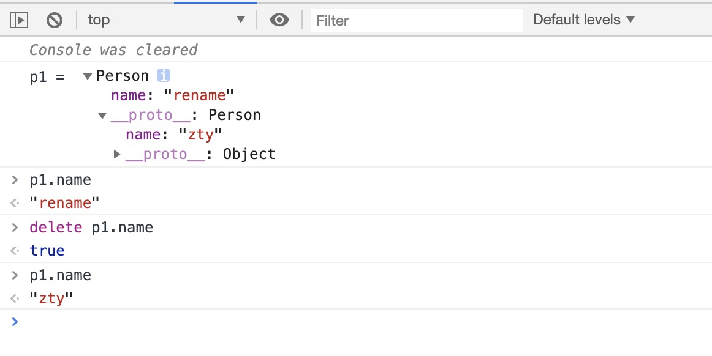

# 原型和原型链

<br/>

## **proto** 和 prototype

<br/>

$\color{green}{普通的构造函数和对象}$

&emsp;&emsp; 首先熟记一下三点：

- \_\_proto\_\_ 是对象实例才有的属性，指向对象的原型。
- prototype 是构造函数才有的属性，该属性指向了一个对象，这个对象正是调用该构造函数而创建的实例的原型
- 实例的**proto**属性 和 构造函数的 prototype 都指向该对象原型-

&emsp;&emsp; 那么什么是原型呢？每一个 JavaScript 对象(null 除外)在创建的时候就会关联另一个对象，这个对象就是我们所说的原型，每一个对象都会从原型"继承"属性和方法。

&emsp;&emsp; 我们从一个例子来看看，我们先声明一个构造函数 Person:

```Javascript
function Person(name) {
  this.name = name
}
```

&emsp;&emsp; 这里构造函数 Person 的 prototype 将指向他们的对象原型，对象原型的构造函数将指向 Person 即： 

&emsp;&emsp; 那么实例又会有什么样的联系呢？我们 new 一个实例 p, new 一个对象的原理如下：

1. 创建一个空对象，构造函数中的 this 指向这个空对象
2. 这个新对象的**proto**设置为构造函数的 prototype
3. 执行构造函数方法，属性和方法被添加到 this 引用的对象中
4. 如果构造函数中没有返回其它对象，那么返回 this，即创建的这个的新对象，否则，返回构造函数中返回的对象。

&emsp;&emsp; 从 new 一个对象的原理上我们可以看到实例的 **proto** 也指向了原型实例。添加后的图如下。 

&emsp;&emsp; 构造函数，实例，原型实例呈现一个三角循环。但是原型实例，和构造函数并不能访问实例，因为你可以同时 new 无数个实例，但构造函数和原型实例都只有一个。

&emsp;&emsp; 继续往上查看，Person.prototype 的**proto**将指向 Object.prototype，即 Object 构造函数的 prototype。

```Javascript
Person.prototype.__proto__ === Object.prototype
```

&emsp;&emsp; 在继续往上 Object.prototype.\_\_proto\_\_ 将等于 null。到达 Object.prototype 时已经到了顶级的原型。 

<br/>

$\color{green}{Function 和 Object}$

&emsp;&emsp; 下面我们看看 Function 和 Object。直接给出结论： 

&emsp;&emsp; 我们归纳以下几点：

- Function 的 prototype 和**proto**属性都指向 f () 匿名函数
- Object 作为构造函数时，他的 prototype 指向 Object.prototype 对象原型，作为实例时，他的**proto**指向匿名函数。我们可以认为 Function 实例和 Object 实例都是继承于该匿名函数。
- 匿名函数作为$\color{red}{顶级构造函数}$，他不需要 prototype 属性，即 prototype=undefined，当作为对象时，他的对象原型是 Object.prototype。
- Object.prototype 作为$\color{red}{顶级构造对象}$，他的**proto**等于 null，表示继承于一个空的对象。没有 prototype 属性。

<br/>

## 原型链

&emsp;&emsp; 在上面我们通过 Person 的示意图中看到的，用 **proto** 链接的这条就是我们的原型链。原型链用于查找对象上的属性，当属性未从当前的对象上获取到的时候会从该原型链上查找，直到查到相应的属性。 

&emsp;&emsp; 我们用一个具体的例子说明：

```Javascript
function Person(name) {
  this.name = name
}
let p = new Person('zty')
let p1 = Object.create(p)
p1.name = "rename"
```

&emsp;&emsp; Object.create 函数会以对象 p 为原型对象创建对象 P1，当我们访问 p1.name 时，会得到‘rename’。如果我们将该属性删除，那么访问 p1.name 会得到什么呢？让我们大胆猜想，基于原型链的特性，在本身未找到 name 属性，它会沿着原型链向上查找 name 属性。那么答案就应该是 name="zty"。  &emsp;&emsp; 从控制台中验证答案。结果和猜想一致

<br/>

## 几个和原型相关的函数

- Object.create
- Object.setPrototypeOf 和 Object.getPrototypeOf
- instanceof 和 isPrototypeOf

&emsp;&emsp; Object.create(obj) 可以基于某个对象为原型创建对象。

&emsp;&emsp; **proto**是一个内部属性,不是一个正式的对外的 API。我们访问 obj.**proto**其实使用的就是 Object.getPrototypeOf(obj)。Object.setPrototypeOf 则可以为对象附加原型链。如同上面使用的 Object.create，下面两种的效果是一致的。

```javascript
let p1 = Object.create(p);
// 等价于
let p1 = {};
Object.setPrototypeOf(p1, p);
```

&emsp;&emsp; instanceof 运算符用于检测构造函数的 prototype 属性是否出现在某个实例对象的原型链上。

&emsp;&emsp; isPrototypeOf 则用于判断一个对象是否被包含在另一个对象的原型链中

```javascript
p1 instanceof Person // true
// p1继承于p 而p.__proto === Person.prototype
​
p.isPrototypeOf(p1) // true
// p1继承p
```

## 结束语

<a href="../../case/html/js/__proto__type.html" >原型和原型链 - html 代码文件</a>

如果有错误或者不严谨的地方，欢迎指正~
