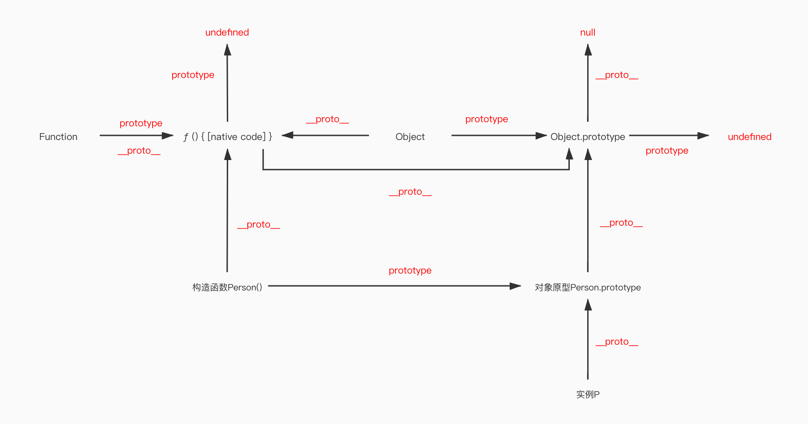

# Title

原型和原型链

 

## 原型

每一个 JavaScript 对象(null 除外)在创建的时候就会关联另一个对象，这个对象就是我们所说的原型，每一个对象都会从原型"继承"属性和方法。

- \_\_proto\_\_ 是对象实例才有的属性，指向对象的原型。
- prototype 是构造函数才有的属性，该属性指向了一个对象，这个对象正是调用该构造函数而创建的实例的原型
- 实例的**proto**属性 和 构造函数的 prototype 都指向该对象原型
- Function 的 prototype 和**proto**属性都指向 f () 匿名函数
- Object 作为构造函数时，他的 prototype 指向 Object.prototype 对象原型，作为实例时，他的**proto**指向匿名函数。我们可以认为 Function 实例和 Object 实例都是继承于该匿名函数。
- 匿名函数作为“顶级构造函数”，他不需要 prototype 属性，即 prototype=undefined，当作为对象时，他的对象原型是 Object.prototype。
- Object.prototype 作为“顶级构造对象”，他的**proto**等于 null，表示继承于一个空的对象。没有 prototype 属性。

送大家一张我自己刻脑子里的图：

 

 

## 原型链

用 proto 链接的这条就是我们的原型链。原型链用于查找对象上的属性，当属性未从当前的对象上获取到的时候会从该原型链上查找，直到查到相应的属性。

原型链的顶层指向 window，严格模式下不会指向 window 而是 undefined
