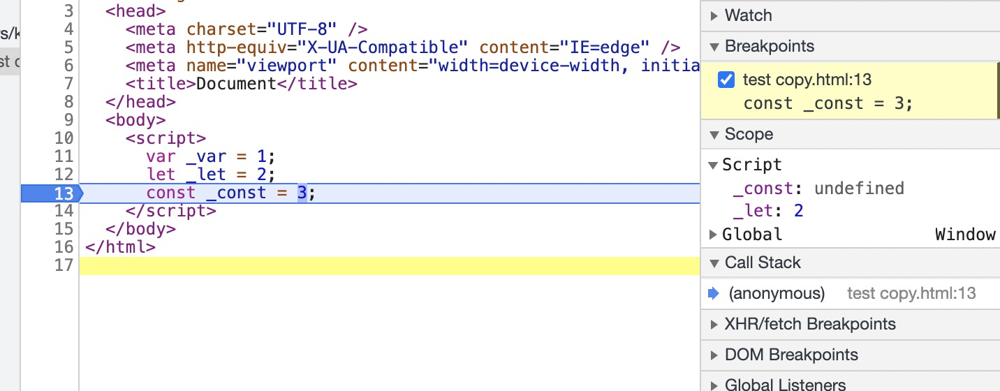

# Title

声明变量时，var let const 的区别

 

## let, const 和 var 的区别

- let 和 var 都用于声明变量，而 const 必须初始化，且用于声明常量，这个常量指的是普通类型的值不变和复杂类型的内存地址不变。
- var 存在变量提升，而 let，const 存在“暂时性死区”，即在变量声明之前就访问变量的话，会直接提示 ReferenceError，而不像 var 那样使用默认值 undefined
- let,const 只有块级作用域，而 var 只有全局作用域和函数作用域概念
- 在全局作用域中，用 let 和 const 声明的全局变量并没有在全局对象中，只是一个块级作用域（Script）中。获取时，直接获取即可

 

