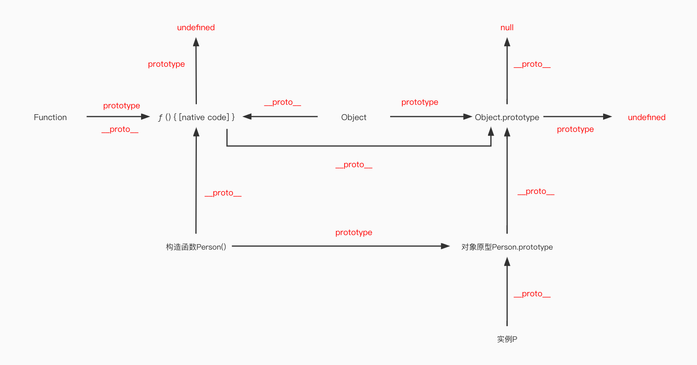

# 简介

前端学习小本本


除了图片包含的，还有网络，算法，设计模式等等一起学习！

<br/>

## 目录

- 一、网络
  - 1.1 OSI 七层模型和 TCP/IP 四层模型
  - 1.2 HTTP
    - 1.2.1 HTTP 0.9
    - 1.2.2 HTTP 1.0
    - 1.2.3 HTTP 1.1
  - 1.3 HTTP2.0 和 HTT3.0
    - 1.3.1 HTTP2.0
    - 1.3.2 二进制分帧
    - 1.3.3 HTTP3.0
  - 1.4 HTTPS
    - 1.4.1 HTTPS 链接过程
  - 1.5 HTTP 头
    - 1.5.1 状态码
    - 1.5.2 常用请求头
  - 1.6 TCP 和 UDP
    - 1.6.1 两者的区别
    - 1.6.2 TCP 三次握手和四次挥手
    - 1.6.3 TCP KeepAlive
    - 1.6.4 TCP 可靠性
  - 1.7 WebSocket
    - 1.7.1 连接过程
    - 1.7.2 WebSocket 与 HTTP 协议相比，
  - 1.8 DNS
    - 1.8.1 DNS 与 TCP 和 UDP
  - 1.9 CDN
    - 1.9.1 基础架构
    - 1.9.2 回源
- 二、Javascript
  - 2.1 基础类型和类型检测
  - 2.2 原型和原型链
    - 2.2.1 原型
    - 2.2.2 原型链
    - 2.2.3 手写 instanceof
  - 2.3 作用域
    - 2.3.1 全局，函数，块级作用域
    - 2.3.2 闭包
    - 2.3.3 变量提升
  - 2.4 JS 运算符
    - 2.4.1 位运算符
  - 2.5 this
    - 2.5.1 执行环境
    - 2.5.2 实现一个 bind
    - 2.5.3 实现一个 call
    - 2.5.4 实现一个 apply
  - 2.6 new 的原理
    - 2.6.1 实现一个 new 函数
  - 2.7 class 和继承
    - 2.7.1 class
    - 2.7.2 继承
    - 2.7.3 ES5-实现继承的几种方式
    - 2.7.4 实现一个继承 inherits 函数
  - 2.8 ES6/7
    - 2.8.1 let, const 和 var 的区别
    - 2.8.2 箭头函数
    - 2.8.3 Promise
    - 2.8.4 Set, Map, WeakSet, WeakMap
    - 2.8.5 Proxy 和 Reflect
  - 2.9 Number
    - 2.9.1 最大安全数
    - 2.9.2 浮点数计算精确度问题
    - 2.9.3 Number.isNaN 和 isNaN 的区别
    - 2.9.4 [1, 2, 3].map(parseInt)
    - 2.9.5 实现 (5).add(3).minus(2) 功能
  - 2.10 Array
    - 2.10.1 数组的常用方法
    - 2.10.2 map 和 forEach 的区别
    - 2.10.3 手写 reduce
  - 2.11 js 模块化方案
    - 2.11.1 AMD 和 CMD
    - 2.11.1 CommonJs
    - 2.11.2 ES6 Module
    - 2.11.3 CommonJS 和 ES6 模块的区别
    - 2.11.4 UMD
    - 2.11.5 模块化发展历程
  - 2.12 js 异步发展方案
    - 2.12.1 回调函数 callback
    - 2.12.2 Promise
    - 2.12.3 generator
    - 2.12.4 async/await
  - 2.13 script 的 jsonp、async 和 defer
  - 2.14 BigInt
- 三、Css
  - 3.1 优先级(权重)
    - 3.1.1 选择器
  - 3.2 单位
    - 3.2.1 为什么 padding/margin 的百分比单位基于父元素的宽度而不是高度
  - 3.3 盒子模型
  - 3.4 BFC
    - 3.4.1 特性和应用
  - 3.5 层叠上下文
  - 3.6 居中方案
    - 3.6.1 水平居中
    - 3.6.2 垂直居中
    - 3.6.3 水平垂直居中
  - 3.7 float
  - 3.8 position
  - 3.9 transition、animation 和 transform
    - 3.9.1 transition
    - 3.9.2 animation 和 keyframes
    - 3.9.3 transform
  - 3.10 一像素边框
  - 3.11 移动端点击 300ms 延迟
  - 3.12 css 应用
    - 3.12.1 绘制三角形
    - 3.12.2 绘制扇形
  - 3.13 flex
    - 3.13.1 主轴和交叉轴
    - 3.13.2 flex: 0 1 auto 的意思
  - 3.14 移动端适配方案
  - 3.15 css 模块化

<br/>
<br/>

# 一、网络

<br/>

## 1.1 OSI 七层模型和 TCP/IP 四层模型

<br/>

<table>
	<tr>
		<td>七层模型</td>
		<td>四层模型</td>
		<td>功能</td>
		<td>协议</td>
	</tr>
	<tr>
	 <td>应用层</td>
		<td rowspan="3">应用层</td>
		<td>文件传输，电子邮件，虚拟终端等</td>
		<td>HTTP, FTP, DNS域名系统等</td>
	</tr>
	<tr>
		<td>表示层</td>
		<td>数据格式化，代码转换，数据加密</td>
		<td>Telnet，SNMP</td>
	</tr>
	<tr>
		<td>会话层</td>
		<td>建立、维护和管理会话链接</td>
		<td>SMTP，DNS</td>
	</tr>
	<tr>
		<td>传输层</td>
		<td>传输层</td>
		<td>提供端对端的接口，数据传输</td>
		<td>TCP传输控制协议, UDP用户数据报协议，SSL安全套接字协议</td>
	</tr>
	<tr>
		<td>网络层</td>
		<td>网络层</td>
		<td>为数据包选择路由</td>
		<td>IP，ICMP, RIP等</td>
	</tr>
	<tr>
		<td>数据链路层</td>
		<td rowspan="2">数据链路层</td>
		<td>传输有地址的帧以及错误检测功能</td>
		<td>PPP，ARP, RARP等</td>
	</tr>
	<tr>
		<td>物理层</td>
		<td>以二进制形式在物理传输媒体上传输数据</td>
		<td>IEEE标准</td>
	</tr>
</table>

<br/>

MAC 地址在数据链路层：

- 定位数据包的路径，如发送者，接受者
- 即网卡地址，每个网卡都是独一无二的 12 个 16 进制数
- 前 6 个代表厂商，后 6 个表示流水号

IP 在网络层

- IPv4：32 个二进制，4 字节\*8 位，如 255.255.255.0
- IPv6：128 个二进制，8 字节\*16 位，如 2001:DB8:0:23:8:800:200C:417A

port 端口和 socket 在传输层

<br/>

## 1.2 HTTP

<br/>

超文本传输协议，是互联网上应用最为广泛的一种网络协议，是一个客户端和服务器端请求和响应的标准。

<br/>

### 1.2.1 HTTP 0.9

<br/>

传统的 request – response 的模式，只支持 GET 请求

<br/>

### 1.2.2 HTTP 1.0

<br/>

在 http 0.9 的基础上增加了几个变化：

- 在请求中加入了 HTTP 版本号
- HTTP 开始有 header 了
- 增加了 HTTP Status Code 标识相关的状态码。
- 还有 Content-Type 可以传输其它的文件了。

**_但是，HTTP1.0 性能上有一个很大的问题，那就是每请求一个资源都要新建一个 TCP 链接，而且是串行请求_**

<br/>

### 1.2.3 HTTP 1.1

<br/>

HTTP/1.1 主要解决了 HTTP 1.0 的网络性能的问题，以及增加了一些新的东西：

- 可以设置 keepalive 来让 HTTP 重用 TCP 链接
- 然后支持 pipeline 网络传输，只要第一个请求发出去了，不必等其回来，就可以发第二个请求出去，可以减少整体的响应时间。
- 支持 Chunked Responses ，也就是说，在 Response 的时候，不必说明 Content-Length。这样，客户端就不能断连接，直到收到服务端的 EOF 标识。
- 协议头注增加了 Language, Encoding, Type 等等头。
- 加入了一个很重要的头—— HOST。
- 加入了 OPTIONS 方法，其主要用于 CORS 应用。

<br/>

## 1.3 HTTP2.0 和 HTT3.0

<br/>

### 1.3.1 HTTP2.0

超文本传输协议 2.0，是下一代 HTTP 协议。在开放互联网上 HTTP2.0 将只用于 https 网址，而 http 网址将继续使用 HTTP/1。他有以下优点：

- 提升访问速度
- 允许多路复用：多路复用允许同时通过单一的 HTTP/2 连接发送多重请求-响应信息。改善了：在 http1.1 中，浏览器客户端在同一时间，针对同一域名下的请求有一定数量限制（连接数量），超过限制会被阻塞。(使用请求 ID 对应响应)
- 二进制分帧：HTTP2.0 会将所有的传输信息分割为更小的信息或者帧，并对他们进行二进制编码
- 首部压缩: HPACK（HTTP2 头部压缩算法）压缩格式对传输的 header 进行编码。并在两端建立索引表，进行缓存。下次发送只需发送索引。
- 服务器端推送

<br/>

### 1.3.2 二进制分帧

<br/>

- 帧(frame)包含部分：
  - 类型 Type
  - 长度 Length
  - 标记 Flags，如结束帧
  - 流标识 Stream，标识属于那个流
  - payload：数据
- 流是连接中的一个虚拟信道，可以承载双向消息传输。每个流有唯一整数标识符。为了防止两端流 ID 冲突，客户端发起的流具有奇数 ID，服务器端发起的流具有偶数 ID。

在 HTTP/2 中，有两个非常重要的概念，分别是帧（frame）和流（stream）。 帧代表着最小的数据单位，每个帧会标识出该帧属于哪个流，流也就是多个帧组成的数据流，在同一域名下所有请求都是基于流。 HTTP2 采用二进制数据帧传输，取代了 HTTP1.x 的文本格式，二进制格式解析更高效。 多路复用代替了 HTTP1.x 的序列和阻塞机制，所有的相同域名请求都通过同一个 TCP 连接并发完成。同一 Tcp 中可以发送多个请求，对端可以通过帧中的标识知道属于哪个请求。通过这个技术，可以避免 HTTP 旧版本中的队头阻塞问题（Pipelining），极大的提高传输性能。

<br/>

### 1.3.3 HTTP3.0

<br/>

HTTP2.0 虽然性能已经不错了，还有什么不足吗？

- 建立连接时间长(本质上是 TCP 的问题)
- 队头阻塞问题，队头阻塞问题可能存在于 HTTP 层和 TCP 层。HTTP2.0 协议的多路复用机制解决了 HTTP 层的队头阻塞问题，但是在 TCP 层仍然存在队头阻塞问题。TCP 协议在收到数据包之后，这部分数据可能是乱序到达的，但是 TCP 必须将所有数据收集排序整合后给上层使用，如果其中某个包丢失了，就必须等待重传，从而出现某个丢包数据阻塞整个连接的数据使用。
- 移动互联网领域表现不佳(弱网环境)，以及无法进行连接迁移，一条连接由一个四元组标识，在当今移动互联网的时代，如果一台手机从一个 wifi 环境切换到另一个 wifi 环境，ip 发生变化，那么连接必须重新建立，inflight 的包全部丢失。

HTTP3.0 又称为 HTTP Over QUIC，其弃用 TCP 协议，改为使用基于 UDP 协议的 QUIC 协议来实现。

<br/>

## 1.4 HTTPS

<br/>

是以安全为目标的 HTTP 通道，即 HTTP 下加入 SSL 层，SSL 加密是在传输层实现的。http 是明文传输，https 则是具有安全性的 ssl 加密传输协议

<br/>

### 1.4.1 HTTPS 链接过程

<br/>

1. 客户端发起 https 请求，并且携带自己支持的密钥算法和哈希算法
2. 服务端接收请求后，从中挑选出一套自己支持的加密算法和哈希算法，如果不支持则连接断开。 然后会把符合的算法和证书发给客户端，证书里包含了密钥的公钥。
3. 客户端检验证书的合法性，包括失效日期，网站地址，颁发的机构等。验证通过后，客户端会生成一个随机字符串，然后用服务端的公钥进行加密。再用这个随机字符串加密（握手信息+握手信息的 hash 值）。hash 主要来比对，防止篡改
4. 服务端通过私钥进行解密，并验证客户端的信息，随后使用同样的随机字符串加密握手信息和握手信息的 HASH 值发给客户端。
5. 客户端接收到服务端发回来的握手信息后，用一开始生成的随机字符串对密文进行解密，来对握手信息进行校验，校验通过后，握手完毕。
6. 从这里之后，客户端和服务端的通信就使用那串随机字符串进行 AES 对称加密通信。（SSL 加密建立）

<br/>

## 1.5 HTTP 头

<br/>

### 1.5.1 状态码

<br/>

1. 信息

- 100 Continue: 继续, 客户端应继续其请求
- 101 Switching Protocols: 切换协议
- 102 Processing: 处理将被继续执行

2. 成功

- <font color=#ff502c>200 OK</font>: 请求成功
- 201 Created: 请求已经被实现
- 202 Accepted: 服务器已接受请求，但尚未处理
- <font color=#ff502c>204 No Content</font>: 服务器成功处理，但未返回内容

3. 重定向

- 300 Multiple Choices: 被请求的资源有一系列可供选择的回馈信息， 用户或浏览器能够自行选择一个首选的地址进行重定向。
- <font color=#ff502c>301 Moved Permanently</font>: 被请求的资源已永久移动到新位置
- <font color=#ff502c>302 Move temporarily</font>: 请求的资源临时从不同的 URI 响应请求
- 303 See Other: 对应当前请求的响应可以在另一个 URI 上被找到，而且客户端应当采用 GET 的方式访问那个资源
- <font color=#ff502c>304 Not Modified</font>: 所请求的资源未修改，服务器返回此状态码时，不会返回任何资源
- 305 Use Proxy: 被请求的资源必须通过指定的代理才能被访问

4. 客户端错误

- <font color=#ff502c>400 Bad Request</font>: 语义有误，当前请求无法被服务器理解 | 请求参数有误
- <font color=#ff502c>401 Unauthorized</font>: 当前请求需要用户验证
- <font color=#ff502c>403 Forbidden</font>: 服务器已经理解请求，但是拒绝执行它
- <font color=#ff502c>404 Not Found</font>: 请求失败，请求所希望得到的资源未被在服务器上发现
- <font color=#ff502c>405 Method Not Allowed</font>: 请求行中指定的请求方法不能被用于请求相应的资源。例如使用服务端为未允许的 PUT，DELETE 请求。
- 408 Request Timeout: 请求超时
- 409 Conflict: 由于和被请求的资源的当前状态之间存在冲突，请求无法完成
- 410 Gone: 被请求的资源在服务器上已经不再可用，而且没有任何已知的转发地址
- 413 Request Entity Too Large: 服务器拒绝处理当前请求，因为该请求提交的实体数据大小超过了服务器愿意或者能够处理的范围
- 414 Request-URI Too Long: 请求的 URI 长度超过了服务器能够解释的长度，因此服务器拒绝对该请求提供服务（http 协议未规定长度，但是浏览器，nginx 会限制，Chrome:8182）
- <font color=#ff502c>415 Unsupported Media Type</font>: 对于当前请求的方法和所请求的资源，请求中提交的实体并不是服务器中所支持的格式，因此请求被拒绝

5. 服务端错误

- <font color=#ff502c>500 Internal Server Error</font>: 服务器遇到了一个未曾预料的状况，导致了它无法完成对请求的处理
- 501 Not Implemented: 服务器不支持当前请求所需要的某个功能
- <font color=#ff502c>502 Bad Gateway</font>: 作为网关或者代理工作的服务器尝试执行请求时，从上游服务器接收到无效的响应
- 503 Service Unavailable: 由于临时的服务器维护或者过载，服务器当前无法处理请求
- <font color=#ff502c>504 Gateway Timeout</font>: 作为网关或者代理工作的服务器尝试执行请求时，未能及时从上游服务器（URI 标识出的服务器，例如 HTTP、FTP、LDAP）或者辅助服务器（例如 DNS）收到响应
- 505 HTTP Version Not Supported: 服务器不支持，或者拒绝支持在请求中使用的 HTTP 版本

<br/>

### 1.5.2 常用请求头

<br/>

通用头部

- Cache-Control：指定请求和响应遵循的缓存机制。

  - public：表明响应可以被任何对象缓存，即使是通常不可缓存的内容。（例如：1.该响应没有 max-age 指令或 Expires 消息头；2. 该响应对应的请求方法是 POST 。）
  - private：表明响应只能被单个用户缓存，不能作为共享缓存（即代理服务器不能缓存它）
  - no-cache：在发布缓存副本之前，强制要求缓存把请求提交给原始服务器进行验证(协商缓存验证)。
  - no-store：缓存不应存储有关客户端请求或服务器响应的任何内容，即不使用任何缓存。
  - max-age：设置缓存存储的最大周期，超过这个时间缓存被认为过期(单位秒)。还是仍由缓存提供。若同时还发送了 max-stale 指令，则使用期可能会超过其过期时间。
  - s-maxage，max-stale，min-fresh 等

- Connection：连接管理

  - Close：在完成本次请求的响应后，断开连接。
  - Keepalive：在完成本次请求的响应后，保持连接，等待本次连接的后续请求。
  - Keep-Alive：如果浏览器请求保持连接，则该头部表明希望 WEB 服务器保持连接多长时间（秒），如 Keep-Alive：300。

- Date 消息发送的日期和时间，世界标准时。

- Transfor-Encoding 报文主体的传输编码格式

- Upgrade 升级协议。如 http1.0 升级到 http1.1，http 升级到 websocket

请求头部

- Host：请求资源所在的服务器 (唯一一个 HTTP/1.1 规范里要求必须出现的字段)
- Accept：客户端或者代理能够处理的媒体类型。还有 Accept-Charset，Accept-Encoding，Accept-Language
- If-Match：对象的 ETag 没有改变才执行请求的动作，去获取文档。
- If-None-Match：对象的 ETag 改变了，才执行请求的动作，去获取文档。
- If-Modified-Since：如果请求的对象在该头部指定的时间之后修改了，才执行请求的动作（比如返回对象），否则返回代码 304，告诉浏览器该对象没有修改。
- If-Unmodified-Since：如果请求的对象在该头部指定的时间之后没修改过，才执行请求的动作（比如返回对象）。
- Range：实体的字节范围请求。例如：Range: bytes=1173546
- Referer：表明自己是从哪个网页 URL 获得点击当前请求中的网址
- User-Agent：客户端信息

响应头部

- Location：重定向的 URI
- ETag：表示资源唯一资源的字符串
- Server：服务器的信息

实体头部

- Allow 资源可支持 HTTP 请求方法
- Last-Modified 资源最后修改时间
- Expires 实体主体过期时间
- Content-Language：实体资源语言
- Content-Encoding：实体编码格式
- Content-Length：实体大小，后端可知道 body 的大小
- Content-Range：实体传送的范围
- Content-Type：实体媒体类型
- Content-MD5：主体的 MD5 校验和

<br/>

## 1.6 TCP 和 UDP

<br/>

### 1.6.1 两者的区别

<br/>

UDP 协议全称是用户数据报协议

- 面向无连接： 首先 UDP 是不需要和 TCP 一样在发送数据前进行三次握手建立连接的，想发数据就可以开始发送了。并且也只是数据报文的搬运工，不会对数据报文进行任何拆分和拼接操作。
- 有单播，多播，广播的功能
- 不可靠性：这种不可靠性体现在无连接上
- 头部开销小，传输数据报文时是很高效的

<br/>

TCP 协议全称是传输控制协议是一种面向连接的、可靠的、基于字节流的传输层通信协议

- 面向连接：发送数据之前必须在两端建立连接。建立连接的方法是“三次握手”
- 仅支持单播传输：只能进行点对点的数据传输，不支持多播和广播传输方式
- 可靠传输：判断丢包，误码靠的是 TCP 的段编号以及确认号
- 提供拥塞控制：当网络出现拥塞的时候，TCP 能够减小向网络注入数据的速率和数量，缓解拥塞

<br/>

### 1.6.2 TCP 三次握手和四次挥手

<br/>

<font color=#ff502c>TCP 连接采用三次握手</font>

1. 客服端首先发送一个带有 SYN 标志地数据包给服务端。自身进入 sent 状态，等待服务端确认
2. 服务端接收后，回传一个带有 SYN/ACK 标志的数据包传递确认信息，表示我收到了，服务端进入 rcvd 收到状态。
3. 最后，客户端收到确认，再回传一个带有 ACK 标志的数据包，代表我知道了，表示"握手"结束，两端进入 established 确立状态。

为什么需要三次握手？可能有以下两种情况

- 客户端发出第一次挥手后就失效了，那么服务端接收后就产生 TCP 链接是无用的，需要第三次挥手确认
- 服务端发送的数据因为网络情况丢失了，客户端超时后重新发起了链接，那么上次的 TCP 链接服务端因为没有接受到回应而一直开着，造成了资源浪费

<font color=#ff502c>TCP 断开采用四次挥手</font>

1. 客户端发送一带有个 FIN 标志地数据包给服务端，用来关闭客户端到服务端的数据传送，客户端进入 FIN_WAIT_1 状态。
2. 服务端收到后，发送一个 ACK 数据包给客户端，自身进入 CLOSE_WAIT 状态。
3. 服务端发送一个 FIN，用来关闭服务端到客户端的数据传送，服务端进入 LAST_ACK 状态。
4. 客户端收到 FIN 后，进入 TIME_WAIT 状态，接着发送一个 ACK 给 服务端，服务端进入 CLOSED 状态，通信结束。

为什么中间服务端发送了两次？因为此时服务端可能还有数据没有发送完，所以并不会马上关闭 socket，而是等待数据发送后再发送 FIN 标志。


2MSL:

TCP 报文段最大生存时间(Maximum Segment Lifetime)。他是任何报文段被丢弃前在网络的最长时间。

当一个 tcp 执行一个主动关闭，并发回最后一个 ACK，该链接必须在 TIME_WATE 状态的停留时间为 2 倍的 MSL。这样可让 TCP 再次发送最后一个 ACK 以防这个 ACK 丢失（比如另一个端超时并重发最后的 FIN）。

这种 2MSL 等待的另一个结果是相同端口下的链接必须在 2MSL 结束后才能被使用。

拓展：

如果处于 2MSL 状态下的主机出现故障，他在 MSL 内重新启动，会使用故障前 2MSL 的端口建立一个新的链接么。如果重连是链接不了的。为了解决这个问题有了平静时间。

平静时间：TCP 在重启后的 MSL 时间内不能建立任何链接，这称为平静时间，但只有极少数主机准守，因为大部分重启时间大于 MSL.

<br/>

### 1.6.3 TCP KeepAlive

TCP 的保活定时器的提供了保活机制即 KeepAlive，保活机制默认是关闭的，TCP 连接的任何一方都可打开此功能。如果在一段时间内此连接都不活跃，开启保活功能的一端会向对端发送一个保活探测报文。

- 若对端正常存活，且连接有效，对端必然能收到探测报文并进行响应。此时，发送端收到响应报文则证明 TCP 连接正常，**重置保活时间计数器**即可。
- 若由于网络原因或其他原因导致，发送端无法正常收到保活探测报文的响应。那么在一定探测时间间隔后，将继续发送保活探测报文。直到收到对端的响应，或者达到配置的**探测循环次数上限**都没有收到对端响应，这时对端会被认为不可达，TCP 连接随存在但已失效，需要将连接做中断处理。
- 若对端主机崩溃且已经重启，那么重启后原连接失效，对方由于不认识原报文，会响应**复位报文段**，请求段将连接断开

<br/>

### 1.6.4 TCP 可靠性

<br/>

TCP 通过序列号、超时重传、检验和、流量控制、滑动窗口、拥塞控制实现可靠性。

- ACK 应答机制：发送的每一条消息，都需要对方发送一条消息来回复消息是否被收到。

- 序列号：TCP 对每个报文进行编号，这些编号就是序列号。而序列号有多种作用 a：保证可靠性，当接收到的数据失序时，就能立马知道 b：去除重复的报文，数据传输过程中的确认应答，重发控制，重复控制等功能都要依靠序列号来实先。 c：提高效率，可以实现多次发送，一次确认。

- 校验和：TCP 将保持它首部和数据的检验和

- 超时重传：当 TCP 发出一个段后，它启动一个定时器，等待目的端确认收到这个报文段。如果不能及时收到一个确认，将重发这个报文段。

- 流量控制：TCP 连接的每一方都有固定大小的缓冲空间，TCP 的接收端只允许发送端发送接收端缓冲区能接纳的我数据。当接收方来不及处理发送方的数据，能提示发送方降低发送的速率，防止包丢失。

- 拥塞控制：拥塞控制使得宏观网络中的资源能够合理的应用。实现的算法有四个，慢开始，拥塞避免，快速回复，和快速重传.

  - 慢开始，拥塞窗口大大小呈指数形式 2^n
  - 拥塞避免，当拥塞发生时，超时或收到重复确定

- 滑动窗口：（解决了快的发送方 -> 慢的接收方）TCP 建立连接的初始，接收端会告诉发送端自己的接收窗口大小。发送端构造自己的窗口，窗口内是可发送的数据，发送后会向右滑动。接收端接收能力会影响接收端窗口的大小。如果消息没被确认怎么办，假如 31，32，33，34，报文发送了，32，33，34 都被确认了，31 没被确认怎么办呢？这时就重新发送 31，并且 31 之后的数据报全部重新发送。 - 窗口左沿向右边靠近为窗口合拢。这种现象发生在数据被发送和确认时。 - 当窗口右边沿向右移动时将允许发送更多的数据，我们称之为窗口张开。这种现象发生在另一端的接收进程读取已经确认的数据并释放掉 TCP 的接收缓存时。 - 当接收方确认数据后，这个滑动窗口不时地向右移动。窗口两个边沿的相对运动增加或减少窗口的大小。（窗口的初始初始大小配置，一般为 4096 字节即 4kb）

<br/>

## 1.7 WebSocket

<br/>

WebSocket 是 HTML5 中的协议，支持持久连续，http 协议不支持持久性连接。Http1.0 和 HTTP1.1 都不支持持久性的链接，HTTP1.1 中的 keep-alive，将多个 http 请求合并为 1 个。但还是一一对应的，且服务端不能直接推送

<br/>

### 1.7.1 连接过程

<br/>

1. 发送一个 GET 请求，升级协议。（这里就需要三次握手协议）关键是请求头:

- Upgrade: websocket
- Connection: Upgrade

2. 服务器给客户端 switching protocol （状态码 101）
3. 接下来的通信都是 websocket，这样就很好的连接了

<br/>

### 1.7.2 WebSocket 与 HTTP 协议相比，

相同点主要有：

- 都是基于 TCP 的应用层协议；
- 都使用 Request/Response 模型进行连接的建立；
- 在连接的建立过程中对错误的处理方式相同，在这个阶段 WS 可能返回和 HTTP 相同的返回码；
- 都可以在网络中传输数据

不同之处在于：

- WS 使用 HTTP 来建立连接，但是定义了一系列新的 header 域，这些域在 HTTP 中并不会使用；
- WS 的连接不能通过中间人来转发，它必须是一个直接连接；
- WS 连接建立之后，通信双方都可以在任何时刻向另一方发送数据；
- WS 连接建立之后，数据的传输使用帧来传递，不再需要 Request 消息；
- WS 的数据帧有序。

<br/>

## 1.8 DNS

<br/>

域名：如 baidu.1com

IP：192.168.0.0

域名系统（服务）协议（DNS）是一种分布式网络目录服务，主要用于域名与 IP 地址的相互转换，以及控制因特网的电子邮件的发送。为了保证高可用、高并发和分布式，它设计成了树状的层次结构。由根 DNS 服务器、顶级域 DNS 服务器和权威 DNS 服务器组成。

解析顺序是首先从浏览器缓存、操作系统缓存以及本地 DNS 缓存 (/etc/hosts) 逐级查找，然后从本地 DNS 服务器、根 DNS、顶级 DNS 以及权威 DNS 层层递归查询。

还可以基于域名在内网、外网进行负载均衡。

不过传统的 DNS 有很多问题(解析慢、更新不及时)，还有域名劫持(解析到错误的 IP)。

HTTPDNS 通过客户端 SDK 和服务端配合，直接通过 HTTP 调用解析 DNS 的方式，可以绕过传统 DNS 这些缺点，实现智能调度.

HTTPNDS 不走传统的 DNS 解析，而是自己搭建基于 HTTP 协议的 DNS 服务器集群，分布在多个地点和多个运营商。当客户端需要 DNS 解析的时候，直接通过 HTTP 协议进行请求这个服务器集群，得到就近的地址。

在客户端的 SDK 里动态请求服务端，获取 HTTPDNS 服务器的 IP 列表，缓存到本地。随着不断地解析域名，SDK 也会在本地缓存 DNS 域名解析的结果。

当手机应用要访问一个地址的时候，首先看是否有本地的缓存，如果有就直接返回。这个缓存和本地 DNS 的缓存不一样的是，这个是手机应用自己做的，而非整个运营商统一做的。如何更新、何时更新，手机应用的客户端可以和服务器协调来做这件事情。

<br/>

### 1.8.1 DNS 与 TCP 和 UDP

<br/>

DNS 在区域传输的时候使用 TCP 协议，其他时候使用 UDP 协议。

- DNS 区域传输的时候使用 TCP 协议：

  1.辅域名服务器会定时（一般 3 小时）向主域名服务器进行查询以便了解数据是否有变动。如有变动，会执行一次区域传送，进行数据同步。区域传送使用 TCP 而不是 UDP，因为数据同步传送的数据量比一个请求应答的数据量要多得多。

  2.TCP 是一种可靠连接，保证了数据的准确性。

- 域名解析时使用 UDP 协议：

客户端向 DNS 服务器查询域名，一般返回的内容都不超过 512 字节，用 UDP 传输即可。不用经过三次握手，这样 DNS 服务器负载更低，响应更快。

<br/>

## 1.9 CDN

CDN 的全称是 Content Delivery Network，即内容分发网络。基本原理是在用户和服务器之间增加 Cache 层，主要是通过接管 DNS 实现，将用户的请求引导到 Cache 上获得源服务器的数据，从而降低网络的访问时间。CDN 的关键技术主要有负载均衡，内容存储和分发技术。

- 负载均衡：使用整体性的网络负载均衡技术，通过内容路由器中的重定向（DNS）机制，在多个远程 POP 上均衡用户的请求，以使用户请求得到最近内容源的响应。
- 内容分发：借助于建立索引、缓存、流分裂、组播（Multicast）等技术，将内容发布或投递到距离用户最近的远程服务点（POP）处。
- 内容存储：在功能上包括对各种内容格式的支持，对部分缓存的支持;在性能上包括支持的容量、多文件吞吐率、可靠性、稳定性，都是存储需要考虑的问题。

<br/>

### 1.9.1 基础架构

<br/>

最简单的 CDN 网络由一个 DNS 服务器和几台缓存服务器组成：

1. 当用户点击网站页面上的内容 URL，经过本地 DNS 系统解析，DNS 系统会最终将域名的解析权交给 CNAME 指向的 CDN 专用 DNS 服务器。
2. CDN 的 DNS 服务器将 CDN 的全局负载均衡设备 IP 地址返回给用户
3. 用户向 CDN 的全局负载均衡设备发起内容 URL 访问请求
4. CDN 全局负载均衡设备根据用户 IP 地址，以及用户请求的内容 URL，选择一台用户所属区域的区域负载均衡设备，告诉用户向这台设备发起请求
5. 区域负载均衡设备会为用户选择一台合适的缓存服务器提供服务，选择的依据包括：根据用户 IP 地址，判断哪一台服务器距用户最近；根据用户所请求的 URL 中携带的内容名称，判断哪一台服务器上有用户所需内容；查询各个服务器当前的负载情况，判断哪一台服务器尚有服务能力。基于以上这些条件的综合分析之后，区域负载均衡设备会向
6. 全局负载均衡设备返回一台缓存服务器的 IP 地址
7. 全局负载均衡设备把服务器的 IP 地址返回给用户用户向缓存服务器发起请求，缓存服务器响应用户请求，将用户所需内容传送到用户终端。如果这台缓存服务器上并没有用户想要的内容，而区域均衡设备依然将它分配给了用户，那么这台服务器就要向它的上一级缓存服务器请求内容，直至追溯到网站的源服务器将内容拉到本地

<br/>

### 1.9.2 回源

CDN 的核心点有两个，一个是缓存，一个是回源。

这两个概念都非常好理解。对标到上面描述的过程，“缓存”就是说我们把资源 copy 一份到 CDN 服务器上这个过程，“回源”就是说 CDN 发现自己没有这个资源（一般是缓存的数据过期了），转头向根服务器（或者它的上层服务器）去要这个资源的过程。

回源域名一般是 cdn 领域的专业术语，通常情况下，是直接用 ip 进行回源的，但是如果客户源站有多个 ip，并且 ip 地址会经常变化，对于 cdn 厂商来说，为了避免经常更改配置（回源 ip），会采用回源域名方式进行回源，这样即使源站的 ip 变化了，也不影响原有的配置。

<br/>
<br/>

# 二、Javascript

<br/>

JavaScript 一种直译式脚本语言，是一种

- 解释型： 不需要编译
- 动态类型: 运行的时候类型可变
- 弱类型：数据类型可以忽略，存在隐式转换
- 基于原型：原型继承

的语言。它的解释器被称为 JavaScript 引擎，为浏览器的一部分，广泛用于客户端的脚本语言，最早是在 HTML（标准通用标记语言下的一个应用）网页上使用，用来给 HTML 网页增加动态功能。

<br/>

## 2.1 基础类型和类型检测

<br/>

- 简单类型：Undefined, Null, boolean, number, string。 _存储结构-栈_
- 复杂类型：Object, Array, Date, Function, RegExp （Symbol， Set, Map）_存储结构-堆_
- 基本包装类型：Boolean, Number, String _存储结构-堆_

类型检测：

- typeof: 区分不了引用类型（typeof null === Object）
- instanceof: 区分不了普通类型
- constructor: 容易篡改
- Object.prototype.toString.call()： 完美(ES6 的也能区分)

```javascript
Object.prototype.toString.call('a') === [Object String]
Object.prototype.toString.call(Null) === [Object Null]
```

**async 函数**

```javascript
Object.prototype.toString.call(async function () {}) ===[object AsyncFunction]
```

如果经过编译后就可能需要判断内容

```javascript
export function isAsyncFunction(fn) {
  let fnStr = fn.toString();
  return (
    Object.prototype.toString.call(fn) === '[object AsyncFunction]' ||
    fnStr.includes('return _regenerator.default.async(function')
  );
}
```

<br/>

## 2.2 原型和原型链

<br/>

### 2.2.1 原型

<br/>

每一个 JavaScript 对象(null 除外)在创建的时候就会关联另一个对象，这个对象就是我们所说的原型，每一个对象都会从原型"继承"属性和方法。

- \_\_proto\_\_ 是对象实例才有的属性，指向对象的原型。
- prototype 是构造函数才有的属性，该属性指向了一个对象，这个对象正是调用该构造函数而创建的实例的原型
- 实例的**proto**属性 和 构造函数的 prototype 都指向该对象原型
- Function 的 prototype 和**proto**属性都指向 f () 匿名函数
- Object 作为构造函数时，他的 prototype 指向 Object.prototype 对象原型，作为实例时，他的**proto**指向匿名函数。我们可以认为 Function 实例和 Object 实例都是继承于该匿名函数。
- 匿名函数作为“顶级构造函数”，他不需要 prototype 属性，即 prototype=undefined，当作为对象时，他的对象原型是 Object.prototype。
- Object.prototype 作为“顶级构造对象”，他的**proto**等于 null，表示继承于一个空的对象。没有 prototype 属性。

送大家一张我自己刻脑子里的图：



<br/>

### 2.2.2 原型链

<br/>

用 proto 链接的这条就是我们的原型链。原型链用于查找对象上的属性，当属性未从当前的对象上获取到的时候会从该原型链上查找，直到查到相应的属性。

原型链的顶层指向 window，严格模式下不会指向 window 而是 undefined

<br/>

### 2.2.3 手写 instanceof

<br/>

```javascript
// 对象 instanceof 函数   [] instanceof Array
function instance_of(child, Par) {
  const baseType = ['string', 'number', 'boolean', 'undefined', 'symbol'];
  if (baseType.includes(typeof child)) {
    return false;
  }

  let RP = Par.prototype; //取 Par 的显示原型
  child = child.__proto__; //取 child 的隐式原型
  while (true) {
    if (child === null) {
      return false;
    }
    if (child === RP) {
      return true;
    }
    child = child.__proto__;
  }
}
```

<br/>

## 2.3 作用域

<br/>

作用域是指程序源代码中定义变量的区域。

作用域规定了如何查找变量，也就是确定当前执行代码对变量的访问权限。

JavaScript 采用词法作用域(lexical scoping)，也就是静态作用域。

静态作用域与动态作用域因为 JavaScript 采用的是词法作用域，函数的作用域在函数定义的时候就决定了。

而与词法作用域相对的是动态作用域，函数的作用域是在函数调用的时候才决定的

<br/>

### 2.3.1 全局，函数，块级作用域

<br/>

1.全局作用域：页面打开时创建，关闭时销毁；全局对象 window 表示浏览器窗口，可以直接使用，全局作用域中创建的对象都会作为 window 对象的属性保存。

2.函数作用域：调用函数时创建函数作用域，执行完后作用域销毁；每调用 1 次，就创建一个新的函数作用域，他们之间相互独立。

3.块级作用域：由 { } 包括，if 语句和 for 语句里面的{ }也属于块作用域。如果没有块级作用域

- 在 if 或者 for 循环中声明的变量会泄露成全局变量
- 内层变量可能会覆盖外层变量

<br/>

### 2.3.2 闭包

<br/>

MDN 对闭包的定义为：闭包是指那些能够访问自由变量的函数。

那什么是自由变量呢？自由变量是指在函数中使用的，但既不是函数参数也不是函数的局部变量的变量。

闭包是函数和声明该函数的词法环境的组合，这个环境包含了这个闭包创建时所能访问的所有局部变量

可能产生闭包的二种情况：

- 函数作为返回值，
- 函数作为参数传递

优点:

- 可以读取函数内部的变量
- 另一个就是让这些变量的值始终保持在内存中，不会在函数调用后被自动清除，同时这也算是个缺点。（在函数中 return 一个函数出来）
- 可用于模拟私有变量和方法

缺点:

- 消耗内存，影响网页性能
- 可能会引起内存泄漏（不再用到的内存，但是没有及时释放，就叫做内存泄漏）

<br/>

### 2.3.3 变量提升

<br/>

JavaScript 中，函数及变量的声明都将被提升到函数的最顶部。

JavaScript 中，变量可以在使用后声明，也就是变量可以先使用再声明。

```javascript
a = 1;
// 或
var a = 1;
```

=>

```javascript
var a;

a = 1;
```

<br/>


<br/>

## 2.4 JS 运算符

<br/>

### 2.4.1 位运算符

<br/>

**位运算中，数值 1 表示 true，0 表示 false**

- 逻辑位运算符：
  - 按位与（&）奇数 & 1 = 1，偶数 & 1 = 0
  - 按位或（|）
  - 按位异或（^）两个值不相同，结果为 1。两个值相同，结果为 0。
  - 按位非（~）： 位非运算实际上就是对数字进行取负运算，再减 1。
- 移位运算符：
  - 左移（<<）
  - 右移（>>）
  - 无符号右移（>>>）：连符号位都给他移动了，1 为负，0 为正

<br/>

## 2.5 this

<br/>

- this 指的是当前的执行环境
- 一般时指向 window, 严格模式下 this 绑定到 undefined
- 对象调用函数的情况下，指向调用者
- 构造函数下，指向实例
- bind call apply with 函数可以绑定 this 的指向
  - call: call(this, arg1, arg2, ...)。会执行该函数
  - apply: apply(this, firstArg | argArray[]) 多个参数可使用参数数组，会执行该函数
  - bind: bind(this, firstArg | argArray[]) 返回一个函数，函数内的 this 指向传入的 this。多次 bind 只有第一次有效。
  - with: with (expression) { statement } // with'语句將某个对象添加到作用域链的顶部(window 之下，没有切断作用域链，在 expression 中找不到定义的，仍会往 window 上寻找)，在严格模式该标签禁止使用

<br/>

### 2.5.1 执行环境

<br/>

执行环境( execution context,为简单起见,有时也称为“环境”)是 JavaScript 中最为重要的一个概念。执行环境定义了变量或函数有权访问的其他数据,决定了它们各自的行为。每个执行环境都有一个与之关联的变量对象( variable object),环境中定义的所有变量和函数都保存在这个对象中。虽然我们编写的代码无法访问这个对象,但解析器在处理数据时会在后台使用它。

```javascript
var name = 'zty';

var obj = {
  name: '124'
  getName: function () {
    var self = this;
    return function () {
      console.log('name', this.name); //  zty
      console.log('name', self.name); // 124
    };
  }
};

obj.getName()();
```

<br/>

### 2.5.2 实现一个 bind

<br/>

```javascript
Function.prototype._bind = function (context, ...args) {
  context = context || window;
  const fnSymbol = Symbol('fn');
  context[fnSymbol] = this;

  return function (..._args) {
    args = args.concat(_args);

    context[fnSymbol](...args);
    delete context[fnSymbol];
  };
};
```

<br/>

### 2.5.3 实现一个 call

<br/>

```javascript
Function.prototype._call = function (context, ...args) {
  context = context || window;

  const fnSymbol = Symbol('fn');
  context[fnSymbol] = this; // 这个this 就是这个函数实例了

  context[fnSymbol](...args);
  delete context[fnSymbol];
};
```

<br/>

### 2.5.4 实现一个 apply

<br/>

```javascript
Function.prototype._apply = function (context, argsArr) {
  context = context || window;

  const fnSymbol = Symbol('fn');
  context[fnSymbol] = this;

  context[fnSymbol](...argsArr);
  delete context[fnSymbol];
};
```

<br/>

## 2.6 new 的原理

<br/>

1. 创建一个空对象，构造函数中的 this 指向这个空对象
2. 这个新对象的**proto**设置为即构造函数的 prototype
3. 执行构造函数方法，属性和方法被添加到 this 引用的对象中
4. 如果构造函数中没有返回其它对象，那么返回 this，即创建的这个的新对象，否则，返回构造函数中返回的对象。

<br/>

### 2.6.1 实现一个 new 函数

<br/>

```javascript
let _new = function (factory, ...rest) {
  let o = {
    __proto__: factory.prototype
  };
  let res = factory.apply(o, rest);
  return typeof res === 'object' ? res : o;
};
```

<br/>

## 2.7 class 和继承

<br/>

### 2.7.1 class

<br/>

ES6 之前实例化对象是通过构造函数实现的，ES6 后可以通过关键字 class 创建类（可以认为是一种语法糖）

- class 中的 constructor 就是在实例化对象调用的构造函数，该构造函数可不写。
- 实例对象必须使用 new 关键字生成
- class 不可以当做函数执行
- class 不存在变量提升
- class 中定义的属性和方法都挂在原型上，所有的实例对象都有这些属性和方法。构造函数中定义的是实例的属性和方法。
- class 中可以通过 static 定义静态方法，静态变量需在类外声明（calss.staticName==staticValue）。静态属性和方法只可以通过 class 来调用，实例不可调用

<br/>

### 2.7.2 继承

<br/>

继承属性，方法，静态方法

- ES6 继承: 通过 extends 关键字
- ES5 继承: 通过修改原型链实现继承

本质：

- ES5 的继承，实质是先创造子类的实例对象 this，然后再将父类的方法添加到 this 上面（Parent.call(this)）。
- ES6 的继承机制完全不同，实质是先将父类实例对象的属性和方法，加到 this 上面（所以必须先调用 super 方法），然后再用子类的构造函数修改 this。

<br/>

### 2.7.3 ES5-实现继承的几种方式

<br/>

1. 原型链继承：替换子类型的原型

```javascript
function superClass(name) {
  this.name = name;
}
function subClass(sex) {
  this.sex = sex;
}

// 继承了superClass
subClass.prototype = new superClass();
```

缺点：

- 包含引用类型的原型属性会被所有实例共享
- 在创建子类型的实例时，不能向超类型的构造函数中传递参数

<br/>

2. 经典继承（借用构造函数）：为了避免实例共享原型属性而带来的技术

```javascript
function subClass(name, sex) {
  // 继承了superClass的属性
  superClass.call(this, name);
  this.sex = sex;
}
```

缺点:

- 无法做到函数复用
- 不能继承超类型在原型上定义的方法

<br/>

3. 组合继承：融合了原型链继承和经典继承，避免了他们的缺陷

```javascript
function subClass(name, sex) {
  // 继承了superClass的属性
  superClass.call(this, name); // 第一次调用
  this.sex = sex;
}
// 继承方法
subClass.prototype = new superClass(); // 第二次调用
subClass.prototype.constructor = subClass;
```

缺点:

- 需要调用两次超类型的构造函数

<br/>

4. 原型继承：基于已有的对象创建新的对象

```javascript
// 以一个对象作为实例的原型对象
function object(o) {
  function F() {}
  F.prototype = o;
  return new F();
}

// 在ES5 规范化了该继承
Object.create();
```

缺点：

- 包含引用类型的原型属性会被所有实例共享

<br/>

5. 寄生式继承：思路和工厂模式类似，即创建一个仅用于继承过程的函数

```javascript
function createAnother(o) {
  // 创建新对象
  var clone = Object.create(o);
  // 增强这个对象
  o.say = function () {};
  return o;
}
```

缺点：

- 无法做到函数复用

<br/>

6. 寄生式组合继承：通过构造函数来继承属性，通过原型链的混成形式来继承方法

```javascript
function inheritsPrototype(subClass, superClass) {
  var prototype = Object.create(superClass.prototype);
  prototype.constructor = subClass;
  subClass.prototype = prototype;
}
```

集寄生式继承和组合继承的优点于一身，是实现基于类型继承的最有效方式

<br/>

### 2.7.4 实现一个继承 inherits 函数

<br/>

使用上面所述的寄生组合式继承

```javascript
function inherits(subClass, superClass) {
  // ... 省略参数校验
  subClass.prototype = Object.create(superClass.prototype, {
    constructor: { value: subClass, writable: true, configurable: true }
  });
}


<!-- 使用 -->
function superClass(name) {
  this.name = name
}

superClass.prototype.say = function() {
  console.log(`hello my name is ${this.name}`)
}

function subClass(sex) {
  this.sex = sex
}

_inherits(subClass, superClass)
```

<br/>

## 2.8 ES6/7

<br/>

### 2.8.1 let, const 和 var 的区别

<br/>

- let 和 var 都用于声明变量，而 const 必须初始化，且用于声明常量，这个常量指的是普通类型的值不变和复杂类型的内存地址不变。
- var 存在变量提升，而 let，const 存在“暂时性死区”，即在变量声明之前就访问变量的话，会直接提示 ReferenceError，而不像 var 那样使用默认值 undefined
- let,const 只有块级作用域，而 var 只有全局作用域和函数作用域概念
- 在全局作用域中，用 let 和 const 声明的全局变量并没有在全局对象中，只是一个块级作用域（Script）中。获取时，直接获取即可


<br/>

### 2.8.2 箭头函数

<br/>

- 更简化的代码语法
- 不绑定 this， 这也意味着使用 call 和 apply 是无法传递 this，第一个参数就是需要传递的参数
- arguments，即没有函数的参数 arguments，但可以使用剩余参数...args 替代

```JavaScript
function foo(arg1,arg2) {
    var f = (...args) => args[1];
    return f(arg1,arg2);
}
foo(1,2);  // 2
```

- 不能使用 new 关键字，因为箭头函数不是一个构造函数
- 没有 prototype 属性
- yield 关键字通常不能在箭头函数中使用（除非是嵌套在允许使用的函数内）。因此，箭头函数不能用作生成器。
- 如果需要放回对象字面量，可以

```
var func = () => ({foo: 1})
// 或
var func = () => {return {foo:1}}
```

<br/>

### 2.8.3 Promise

<br/>

所谓 Promise，简单说就是一个容器，里面保存着某个未来才会结束的事件（通常是一个异步操作）的结果。

Promise 是异步编程的一种解决方案，比传统的解决方案——回调函数和事件——更合理和更强大。清晰的代码结构。避免出现回调地狱

Promise 具有三种状态，分别是初始化的 pending 状态，resolve 后的 fulfilled 状态，rejecte 后的 rejected 状态。

常用方法:

then 和 catch 实际上是注册异步操作成功或失败的回调函数

- Promise.prototype.then() ： 可以有两个参数，第一个是 resolve 的回调，第二个是 reject 的回调
- Promise.prototype.catch()： 相当于.then(null, rejectFun)
- Promise.prototype.finally() 【ES8】
- Promise.all(): 只有所有都变成 fulfilled 状态，包装实例才会变成 fulfilled 状态；如果有一个实例变成 rejected 状态，包装实例就会变成 rejected 状态。
- Promise.allSettled(): 等到所有这些参数实例都返回结果，不管是 fulfilled 还是 rejected，包装实例才会结束。该方法由【ES2020】引入。
- Promise.any(): 只要实例有一个变成 fulfilled 状态，包装实例就会变成 fulfilled 状态；如果所有参数实例都变成 rejected 状态，包装实例就会变成 rejected 状态。该方法目前是一个第三阶段的提案 。
- Promise.race(): 异步操作竞赛，只返回最快的一个
- Promise.resolve()
- Promise.reject()
- Promise.try(): 同步操作也可以像异步一样执行

<br/>

### 2.8.4 Set, Map, WeakSet, WeakMap

<br/>

Set：

- 类似数组，成员唯一、无序且不重复。
- [value, value]，键值与键名是一致的（或者说只有键值，没有键名）。
- 可以遍历，方法有：add、delete、has 等。
- 数组排重[...new Set(array)]

WeakSet：

- 成员都是对象。
- 成员都是弱引用，可以被垃圾回收机制回收，可以用来保存 DOM 节点，不容易造成内存泄漏。
- 不能遍历，方法有 add、delete、has。

Map：

- 本质上是键值对的集合，类似集合。
- 可以遍历，方法很多可以跟各种数据格式转换。

WeakMap：

- 只接受对象作为键名（null 除外），不接受其他类型的值作为键名。
- 键名是弱引用，键值可以是任意的，键名所指向的对象可以被垃圾回收，此时键名是无效的。
- 不能遍历，方法有 get、set、has、delete。

（可以遍历，遍历的方法有 keys, values(), entires(), forEach((value, key) => {} , this)）

```javascript
let s = new Set();
let obj = { a: 1 };
s.add(a);

// 弱引用下, 那么 这个obj的内存会被释放 WeakMap/WeakSet也不会阻止对象从内存移除，
// 但是垃圾回收器并没有指定什么时候移除，可能马上移除，
// 也可能等待更多时批量移除，所以WeakMap, WeakSet元素的个数并不确定。
// 所以两者没有部署Iterator接口，不能用for...of遍历。
obj = null;
```

<br/>

### 2.8.5 Proxy 和 Reflect

<br/>

```javascript
const proxyObj = new Proxy(obj, {
  get: function (target, propKey, receiver) {
    console.log('this = ', this); // 指向这个handler
    console.log('target = ', target);
    console.log('propKey = ', propKey);
    console.log('receiver = ', receiver);
    return Reflect.get(target, propKey, receiver);
  },
  set: function (target, propKey, value, receiver) {
    console.log(`setting ${propKey}!`);
    return Reflect.set(target, propKey, value, receiver);
  },
  // 影响 a in obj 但不影响for in
  has: function (target, propKey) {
    console.log('has propKey = ', propKey);
    if (propKey === 'name') {
      return false;
    }
    return true;
  },
  // 影响for in, Object.keys getOwnPropertyNames等
  ownKeys(target) {
    // console.log('ownKeys this = ', this);
    // return Reflect.ownKeys(target);
    return ['info'];
  }
});

// proxyObj.name;
// console.log('in = ', 'name' in proxyObj);
// for (let k in proxyObj) {
//   console.log('k = ', k);
// }
// console.log('keys = ', Object.keys(proxyObj));

function sum(a, b) {
  return a + b;
}
const proxySum = new Proxy(sum, {
  apply(target, ctx, arg) {
    console.log('target = ', target);
    console.log('ctx = ', ctx); // 指向调用者
    console.log('arg = ', arg);
    return Reflect.apply(target, ctx, arg);
  },
  construct(target, arg, newTarget) {
    return Reflect.construct(target, arg, newTarget);
  }
});
console.log('proxySum = ', proxySum(1, 2));
console.log('new proxySum = ', new proxySum(1, 2));

// 调用 revokeFun() 可以取消代理
let { proxyObj1, revokeFun } = Proxy.revocable({}, {});
```

- 将 Object 对象的一些明显属于语言内部的方法（比如 Object.defineProperty），放到 Reflect 对象上。
- 修改某些 Object 方法的返回结果，让其变得更合理。比如，Object.defineProperty(obj, name, desc)在无法定义属性时，会抛出一个错误，而 Reflect.defineProperty(obj, name, desc)则会返回 false。
- 让 Object 操作都变成函数行为。
- Reflect 对象的方法与 Proxy 对象的方法一一对应,完成默认行为，作为修改行为的基础

<br/>

## 2.9 Number

<br/>

### 2.9.1 最大安全数

<br/>

js 使用 8 位浮动数存储数字，范围是-2^63 ~ 2^63 - 1。但是在超过一定的值后执行加减法就不正确了，这个值叫做最大安全值。

最大安全值为 2^53-1 最大安全值为-2^53+1

js 中 Number 的存储结构是：

- 1 位符号位
- 11 位指数位
- 52 位尾数位

浮点数在保存数字的时候做了规格化处理，对于二进制来说， 小数点前保留一位， 规格化后始终是 1.\*\*\*, 节省了 1 bit，这个 1 并不需要保存。所以是 52+1=53。

可以使用第三方库如 bignum, bigInt 等处理

<br/>

### 2.9.2 浮点数计算精确度问题

<br/>

因为浮点数在计算机内是以二进制存储和计算的，所以在浮点数上计算会存在精度问题如：

```javascript
0.1 + 0.2 = 0.30000000000000004
1.0 - 0.9 = 0.09999999999999998
```

- 使用 toFixed 进行“四舍五入”
- 将数扩大至整数，再进行计算
- 使用例如 number-precision 等第三库进行计算

**值得注意的是**

toFixed 并不是真正的四舍五入。而是使用更公平的银行家舍入法。具体规则是：

> 四舍六入五考虑，五后非零就进一 \
> 五后为零看奇偶，五前为偶应舍去，五前为奇要进一

<br/>

### 2.9.3 Number.isNaN 和 isNaN 的区别

<br/>

Number.isNaN 是判断该值严格等于 NaN，而 isNaN 则是经过类型转换后是否是一个数字。

```javaScript
NaN !== NaN
```

<br/>

### 2.9.4 123-map-parseInt

<br/>

```javascript
// map(item, index, array)
// parseInt(num, radix) radix进制  区间范围介于2~36之间；
// 0则为10  表示把前面的数当成几进制的数来转换

// [1,2,3].map(parseInt) => [1, NaN, NaN] // (1)10 => 1 (2)1 => NaN (3)2 => NaN (2 进制数中没有 3)
```

<br/>

### 2.9.5 实现 (5).add(3).minus(2) 功能

<br/>

```javascript
Number.prototype.add = function (number) {
  if (typeof number !== 'number') {
    throw new Error('请输入数字～');
  }
  return this.valueOf() + number;
};
Number.prototype.minus = function (number) {
  if (typeof number !== 'number') {
    throw new Error('请输入数字～');
  }
  return this.valueOf() - number;
};
```

<br/>

## 2.10 Array

<br/>

### 2.10.1 数组的常用方法

<br/>

**_改变原数组_**:

- pop(), push(),shift(),unshift()
- reverse(),sort()
- forEach
- splice(index, howMany, newAddItem1, newAddItem2, ...) .. 删除项

```
index:必要  表示删除（添加）的开始位置
howmany:必要 表示删除的个数
element1,,,elementx:表示添加的元素
```

其他：

- map, filter, every, some
- find, findIndex
- reduce
- join
- concat

<br/>

### 2.10.2 map 和 forEach 的区别

<br/>

- 都支持三个参数，参数分别为 item（当前每一项），index（索引值），arr（原数组）
- forEach 允许 callback 更改原始数组的元素，无返回值。map 则返回新的数组，表现上可认为是浅拷贝后进行操作。

<br/>

### 2.10.3 手写 reduce

<br/>

```javascript
// array.reduce(function(total, currentValue, currentIndex, arr), initialValue)
Array.prototype._reduce = function (callback, prev) {
  for (let i = 0; i < this.length; i++) {
    //判断有没有设置初始值
    if (typeof prev === 'undefined') {
      //没有初始值，则调用callback,转入当前值，下一个值，当前index为下一个,当前数组
      prev = callback(this[i], this[i + 1], i + 1, this);
    } else {
      //有初始值，则调用callback，传入prev为第一个值，第二个为当前的i,当前index为i,当前数组
      prev = callback(prev, this[i], i, this);
    }
  }
  return prev;
};
```

<br/>

## 2.11 js 模块化方案

<br/>

### 2.11.1 AMD 和 CMD

<br/>

- AMD 是 RequireJS 在推广过程中对模块定义的规范化而产出的。
- CMD 是 SeaJS 在推广过程中对模块定义的规范化而产出的。
- 对于依赖的模块，AMD 可以提前执行，也可以延迟执行，CMD 则是延迟执行。
- AMD 推崇依赖前置，CMD 则推崇就近依赖。（可以说，CMD 就是个"懒人"）
- AMD 支持全局 require、局部 require，但是 CMD 则不支持全局 require，所以 CMD 没有全局 API 而 AMD 有。

```Javascript
// AMD  依赖前置
define(['./zty', './ty'], function(zty, ty) {
  zty.sayName()
  ty.sayName()
})

// CMD
define(function(require, exprots, module) {
  var zty = require('./zty')
  zty.sayName()
  // 需要的时候才去require
  var ty = require('./ty')
  ty.sayName()
})
```

<br/>

### 2.11.1 CommonJs

<br/>

CommonJS 是为服务器提供的一种模块形式的优化，CommonJS 模块建议指定一个简单的用于声明模块服务器端的 API，并且不像 AMD 那样尝试去广泛的操心诸如 io，文件系统，约定以及更多的一揽子问题。它有以下特点：

- 主要运用在服务端 js，如 node
- 全局对象：global
- 一个文件就是一个模块，拥有单独的作用域，所有代码都运行在模块作用域，不会污染全局作用域；模块可以多次加载，但只会在第一次加载的时候运行一次，然后运行结果就被缓存了，以后再加载，就直接读取缓存结果；(你可以暴露一个时间戳来测试)
- 模块的加载顺序，按照代码的出现顺序，
- 同步加载
- 通过 require 来加载模块：require 基本功能：读取并执行一个 JS 文件，然后返回该模块的 module.exports 对象，如果没有发现指定模块会报错
- 通过 exports 和 module.exports 来暴露模块中的内容

那么 exports 和 module.exports 有什么区别呢?

- 模块内的 exports：为了方便，node 为每个模块提供一个 exports 变量，其指向 module.exports，相当于在模块头部加了这句话：var exports = module.exports，在对外输出时，可以给 module.exports 对象添加方法

- module.exports 方法还可以单独返回一个数据类型(String、Number、Object...)，而 exports 只能返回一个 Object 对象。所有的 exports 对象最终都是通过 module.exports 传递执行，因此可以更确切地说，exports 是给 module.exports 添加属性和方法。
- 如果同时存在 exports 和 module.exports 那么 exports 是无效的。exports 仅仅是 module.exports 的一个地址引用。nodejs 只会导出 module.exports 的指向

<br/>

### 2.11.2 ES6 Module

<br/>

ES6 模块化规范是 ES6 在语言标准的层面上，实现了模块功能，而且实现得相当简单，其设计思想是尽量的静态化，使得编译时就能确定模块的依赖关系，以及输入和输出的变量。并且 ES6 的模块自动采用严格模式，无论我们是否添加了在模块头部加上 "use strict" 。

ES6 Module 常见的有四个命令，分别是

- 导出 export
- 默认导出 export default
- 导入 import
- 重命名 as

**export：**

- export 导出应该是一种接口或是理解为一种定义，而不应该是值
- export 导出的接口，与其对应的值是动态绑定关系，即通过该接口，可以取到模块内部实时的值。
- export 命令可以出现在模块的任何位置，只要处于模块顶层就可以。如果处于块级作用域内，就会报错，下面的 import 命令也是如此。这是因为处于条件代码块之中，就没法做静态优化了，违背了 ES6 模块的设计初衷。

**export default：**

本质上，export default 就是在 Module 上输出一个叫做 default 的变量或方法，和 export 完全不同，所以它后面不能跟变量声明语句，但表达式，function，class 除外。

**import：**

- import 命令输入的变量都是只读的，因为它的本质是输入接口。也就是说，不允许在加载模块的脚本里面，改写接口。
- 对于 export 导出的接口应该使用 import { interface1 } 的方式
- 对于 export default 导出的变量应该使用 import interface1 的方式
- import 命令具有提升效果，会提升到整个模块的头部，首先执行。
- 如果多次重复执行同一句 import 语句，那么只会执行一次，而不会执行多次。

<br/>

### 2.11.3 CommonJS 和 ES6 模块的区别

<br/>

- CommonJS 模块是运行时加载，ES6 Modules 是编译时输出接口
- CommonJS 输出是值的拷贝；ES6 Modules 输出的是值的引用，**被输出模块的内部的改变会影响引用的改变**
- CommonJs 导入的模块路径可以是一个表达式，因为它使用的是 require()方法；而 ES6 - Modules 只能是字符串
- CommonJS this 指向当前模块，ES6 Modules this 指向 undefined
- 且 ES6 Modules 中没有这些顶层变量：arguments、require、module、exports、**filename、**dirname

<br/>

### 2.11.4 UMD

<br/>

UMD 是为了让同一个代码模块在使用 CommonJs、CMD 甚至是 AMD 的项目中运行。为了实现兼容，所以有点“丑陋”。

```Javascript
(function (global, factory) {
    if (typeof define === 'function' && define.amd) {
        // AMD
        define(['jquery'], factory);
    } else if (typeof exports === 'object') {
        // Node, CommonJS-like
        module.exports = factory(require('jquery'));
    } else {
        global.returnExports = factory(global.jQuery);
    }
}(typeof window !== "undefined" ? window : this, function( window, noGlobal ) {
   // methods
      ...
   return {...}
}))
```

<br/>

### 2.11.5 模块化发展历程

<br/>

- IIFE： 使用自执行函数来编写模块化，特点：在一个单独的函数作用域中执行代码，避免变量冲突。
- AMD： 使用 requireJS 来编写模块化，特点：依赖必须提前声明好。
- CMD： 使用 seaJS 来编写模块化，特点：支持动态引入依赖文件。
- CommonJS： nodejs 中自带的模块化。
- UMD：兼容 AMD，CommonJS 模块化语法。
- ES Modules： ES6 引入的模块化，支持 import 来引入另一个 js 。

<br/>

## 2.12 js 异步发展方案

<br/>

### 2.12.1 回调函数 callback

<br/>

- 优点：解决了同步的问题
- 缺点：
  - 回调地狱
  - 异步回调无法使用 try-catch 捕获
  - 不能 return

<br/>

### 2.12.2 Promise

<br/>

- 优点：链式调用，解决了回调地狱的问题
- 缺点：不能取消

<br/>

### 2.12.3 generator

<br/>

函数外面用\*，内部异步用 yield 特点：可以控制函数的执行

<br/>

### 2.12.4 async/await

<br/>

- 优点是：代码清晰，不用像 Promise 写一大堆 then 链，处理了回调地狱的问题
- 缺点：await 将异步代码改造成同步代码，如果多个异步操作没有依赖性而使用 await 会导致性能上的降低。

<br/>

## 2.13 script 的 jsonp、async 和 defer

<br/>

- 动态添加 script 标签
- defer 属性，如果 script 标签设置了该属性，则浏览器会异步的下载该文件并且不会影响到后续 DOM 的渲染； 如果有多个设置了 defer 的 script 标签存在，则会按照顺序执行所有的 script； defer 脚本会在文档渲染完毕后，DOMContentLoaded 事件调用前执行。
- async 属性：相当于异步回调，加载完后立即执行。它们将在 onload 事件之前完成。

1、当 onload 事件触发时，页面上所有的 DOM，样式表，脚本，图片，flash 都已经加载完成了。

2、当 DOMContentLoaded 事件触发时，仅当 DOM 加载完成，不包括样式表，图片，flash。

介绍一下 JSONP:

JSONP: 利用 html 的 script 标签，img 标签，iframe 标签，可以请求第三方的资源（不受同源策略影响）的作用做跨域请求。script 的 url 实际就是一个 get 请求，返回的内容会被当成 js 执行

<br/>

## 2.14 BigInt

<br/>

BigInt 类型虽然和 Number 很像，可以做各种数学运算，但是在运算过程中要注意两点: BigInt 类型不能用 Math 对象中的方法。不能和 Number 示例混合运算。因为 JavaScript 在处理不同类型的运算时，会把他们先转换为同一类型，而 BigInt 类型变量在被隐式转换为 Number 类型时，可能会丢失精度，或者直接报错。

当 BigInt 使用/操作符时，带小数的运算会被取整。

```javascript
const expected = 4n / 2n; //2n
const rounded = 5n / 2n; //2n, not 2.5n
```

因为 BigInt 都是有符号的, >>> （无符号右移）不能用于 BigInt

```javascript
typeof a;
('bigint');
Object.prototype.toString.call(a);
('[object BigInt]');
```

此外，出于兼容性原因，不允许在 BigInt 上使用一元加号（+）运算符。 (这个编译器可以将 C / C++ 代码编译成 JS 代码，但不是普通的 JS，而是一种叫做 asm.js 的 JavaScript 变体。不支持一元加号（+）运算符的原因是某些程序可能依赖于+始终生成 Number 的不变量，或者抛出异常。 更改+的行为也会破坏 asm.js 代码。 asm.js 的类型声明有固定写法，变量 | 0 表示整数，+变量表示浮点数。)

不幸的是，转换 BigInt 是一个极其复杂的过程，这会导致严重的运行时性能损失。直接 polyfill BigInt 也是不可能的，因为该提议改变了几个现有操作符的行为。目前，更好的选择是使用 JSBI 库，它是 BigInt 提案的纯 JS 实现。

<br/>
<br/>

# 三、Css

<br/>

## 3.1 优先级(权重)

<br/>

权重越高，优先级越高；同一权重内，!import 优先级最高； :not 不参与优先级计算

- !import: 10000
- 内联样式: 1000
- id 选择器: 100
- class 选择器,属性选择器，伪类等:10
- 标签选择器和伪元素: 1

<br/>

### 3.1.1 选择器

<br/>

- 元素/选择器：如 html
- 类选择器：如.btn
- ID 选择器：如#btn
- 通用选择器：\*
- 属性选择器：如[attr], [attr=val]
- 伪类：如:active，:any
- 伪元素：如::after，::before

伪类与伪元素之差别：书写上：伪元素最大程度可使用双冒号，伪类使用但冒号；运用上：每个选择器最多只能使用一个伪元素，每个选择器可以使用多个伪类；

<br/>

## 3.2 单位

<br/>

- %：
  - margin,padding 是相对父元素的宽度计算的
  - top,left,bottom,right 是相对于父元素的高度计算的
  - translate 是相对自身元素来算的
- px：像素点
- em：1em 等于当前元素的 font-size(浏览器默认 16px，可继承，em 可以省略)
- rem：1rem 等于 html 元素的 font-size
- vw,vh：视口宽度被均分成 100vw,视口高度被均分成 100vh。视口宽高是页面的可视区域，如键盘弹起安卓的视口宽高发生变化，但 iPhone 不会。（安卓 4.4，iOS6 以上支持）
- vmax, vmin：
  - vmax = max(vw,vh)（vmax 安卓 4.4，iOS8 以上支持）
  - vmin = min(vw,vh)（vmin 安卓 4.4，iOS6 以上支持）
- ex 和 ch：
  - ex 以字符"x"的高度为基准；例如 1ex 表示和字符"x"一样长。
  - ch 以数字"0"的宽度为基准；例如 2ch 表示和 2 个数字"0"一样长。

<br/>

### 3.2.1 为什么 padding/margin 的百分比单位基于父元素的宽度而不是高度

<br/>

W3C 规范中提出：

padding/margin 使用%单位是规定基于父元素的宽度的百分比的内外边距。

一种说法是：当使用类似 margin: 20% 这样的简写的时候，为了不造成歧义，所以干脆就将定义垂直距离的 margin/padding-top/bottom 也都按父元素的宽度计算。

第二种说法是：因为父元素的高度往往由子元素来决定，所以如果 margin/padding-top/bottom 按照父元素高度来决定，容易造成高度计算逻辑混乱

<br/>

## 3.3 盒子模型

<br/>

&emsp;&emsp; 一个盒子模型可分成 margin(外边距), border(边框), padding(内边距), content(内容)， 四部分组成。

盒子模型分为标准盒子模型和 IE 盒子模型。区别是:

- 标准盒子模型中，width 和 height 指的是内容区域的宽度和高度。增加内边距、边框和外边距不会影响内容区域的尺寸，但是会增加元素框的总尺寸。
- IE 盒子模型中，width 和 height 指的是内容区域+padding+border 的宽度和高度。
- box-sizing: content-box|border-box|inherit;
  - content-box: 使用标准盒子模型
  - border-box: 使用 IE 盒子模型

<br/>

## 3.4 BFC

<br/>

Formatting context(格式化上下文) 是 W3C CSS2.1 规范中的一个概念。它是页面中的一块渲染区域，并且有一套渲染规则，它决定了其子元素将如何定位，以及和其他元素的关系和相互作用。

块级格式化上下文 (Block Fromatting Context)

为了便于理解，我们换一种方式来重新定义 BFC。一个 HTML 元素要创建 BFC，则满足下列的任意一个或多个条件即可：

- 根元素
- float 的值不是 none。
- position 的值不是 static 或者 relative。
- display 的值是 inline-block、table-cell、flex、table-caption 或者 inline-flex
- overflow 的值不是 visible

BFC 是一个独立的布局环境，其中的元素布局是不受外界的影响，并且在一个 BFC 中，块盒与行盒（行盒由一行中所有的内联元素所组成）都会垂直的沿着其父元素的边框排列。

特性:

- 内部的 Box 会在垂直方向，一个接一个地放置。
- Box 垂直方向的距离由 margin 决定。属于同一个 BFC 的两个相邻 Box 的 margin 会发生重叠 <font color=#ff502c>（margin 坍塌）</font>
- 每个元素的 margin box 的左边， 与包含块 border box 的左边相接触(对于从左往右的格式化，否则相反)。即使存在浮动也是如此。
- BFC 的区域不会与 float box 重叠。
- 计算 BFC 的高度时，浮动元素也参与计算
- BFC 就是页面上的一个隔离的独立容器，容器里面的子元素不会影响到外面的元素。反之也如此。

<br/>

### 3.4.1 特性和应用

<br/>

1. margin 坍塌

同一个 BFC 下两个容器，第一个容器的下边距和第二个容器的上边距发生了重叠


解决方法是让两个盒子在两个 bfc

```html
<div class="box"></div>
<div class="box"></div>

<div style="overflow: hidden">
  <div class="box"></div>
</div>
<div style="overflow: hidden">
  <div class="box"></div>
</div>
```

2. BFC 可以包含浮动的元素（清除浮动）


```html
<div style="border: 1px solid #000;overflow: hidden">
  <div style="width: 100px;height: 100px;background: #eee;float: left;"></div>
</div>

<div style="border: 1px solid #000;">
  <div style="width: 100px;height: 100px;background: #eee;float: left;"></div>
</div>
```

3. BFC 可以阻止元素被浮动元素覆盖


```html
<div style="height: 100px; width: 100px; float: left; background: lightblue">左浮动的元素</div>
<div style="width: 200px; height: 200px; background: #eee">
  没有浮动, 也没有触发 BFC 元素, 1111111111111111111111111111
</div>

<div class="h" style="height: 20px"></div>

<div style="height: 100px; width: 100px; float: left; background: lightblue">左浮动的元素</div>
<div style="width: 200px; height: 200px; background: #eee; overflow: hidden">
  没有浮动, 触发 BFC 元素, 1111111111111111111111111111
</div>
```

<br/>

## 3.5 层叠上下文

<br/>

MDN 文档中给出的解释是：我们假定用户正面向（浏览器）视窗或网页，而 HTML 元素沿着其相对于用户的一条虚构的 z 轴排开，层叠上下文就是对这些 HTML 元素的一个三维构想。众 HTML 元素基于其元素属性按照优先级顺序占据这个空间。

表现：

- z-index：auto 不产生层叠上下文
- z-index：0 和 z-index：auto 是完全不一样的。
- z-index 高的层级高
- 父容器 z-index 不为 auto 时，子容器对外表现为父容器的 z-index
- 每个层叠上下文都完全独立于它的兄弟元素，当处理层叠时只考虑其子元素。每个层叠上下文都是自包含的：当一个元素的内容发生层叠后，该元素将被作为整体在父级层叠上下文中按顺序进行层叠。

如何创建？

- 文档根元素（\<html>）；
- position 值为 absolute（绝对定位）或 relative（相对定位）且 z-index 值不为 auto 的元素； position 值为 fixed（固定定位）或 sticky（粘滞定位）的元素（沾滞定位适配所有移动设备上的浏览器，但老的桌面浏览器不支持）；
- flex (flexbox) 容器的子元素，且 z-index 值不为 auto；
- grid (grid) 容器的子元素，且 z-index 值不为 auto；
- opacity 属性值小于 1 的元素
- 应用了特殊 css 的元素 filter 值不是 none， transform 值不是 none 等的元素

<br/>

## 3.6 居中方案

<br/>

### 3.6.1 水平居中

<br/>

- 行内元素: text-align: center;
- 设置宽度 + margin: xxx auto;
- flex 的 justify-content: center;
- grid 的 justify-items: center;
- 父元素相对定位，子元素绝对定位，left:50%。 如果子元素宽度已知，使用 margin-left: -子元素宽度/2; 宽度未知，则使用 transformX(-50%);

<br/>

### 3.6.2 垂直居中

<br/>

- 行内元素: padding-top = padding-bottom
- 行内元素: line-height = height
- 父元素 display:table; 子元素 display:table-cell; vertical-align: middle;
- flex 的 align-items: center;
- grid 的 align-items: center;
- 父元素相对定位，子元素绝对定位，top:50%。 如果子元素高度已知，使用 margin-top: -子元素高度/2; 宽度未知，则使用 transformY(-50%);
- 父元素相对定位，子元素绝对定位。 子元素 height: xxx; top: 0; bottom: 0; margin: auto xxx;

<br/>

### 3.6.3 水平垂直居中

<br/>

- 已知高宽，使用负边距法
- 未知，使用 grid, flex 或 transfrom

<br/>

## 3.7 float

<br/>

- 脱离文档流的控制
- 只有左浮动或右浮动
- 行内元素浮动后，元素的 display 会赋值为 block，且拥有浮动特性，原留白也会消失。但是不会继承父元素的宽高
- 页面的表现形式为: 浮动的元素会尽量向左或向右移动，直到它的外边缘碰到包含框或另一个浮动框的边框为止。浮动元素之后的元素将围绕它。浮动元素之前的元素将不会受到影响。
- 尽量靠上
- 尽量靠左
- 尽量一个挨着一个
- 行内元素绕着浮动元素摆放：左浮动元素的右边和右浮动元素的左边会出浮动元素

如何清除浮动：

```css
/* 清除浮动 */
.clear-f::after {
  display: block;
  height: 0;
  content: '';
  clear: both;
  visibility: hidden;
}
```

<br/>

## 3.8 position

<br/>

- absolute
  - 脱离文档流，通过 top,bottom,left,right 定位。选取其最近一个最有定位设置的父级对象进行绝对定位，如果对象的父级没有设置定位属性，absolute 元素将以 body 坐标原点进行定位，可以通过 z-index 进行层次分级。
- fixed
  - 生成固定定位的元素，相对于浏览器窗口进行定位。元素的位置通过 "left", "top", "right" 以及 "bottom" 属性进行定位。
- relative
  - 对象不可层叠、不脱离文档流。生成相对定位的元素，相对于其正常位置进行定位。因此，"left:20" 会向元素的 LEFT 位置添加 20 像素。
- static
  - 默认值。没有定位，元素出现在正常的流中（忽略 top, bottom, left, right 或者 z-index 声明）。
- sticky
  - 粘性定位，该定位基于用户滚动的位置。它的行为就像 position:relative;而当页面滚动超出目标区域时，它的表现就像 position:fixed;，它会固定在目标位置。**注意**: Internet Explorer, Edge 15 及更早 IE 版本不支持 sticky 定位。 Safari 需要使用 -webkit-
- inherit
  - 从父元素继承 position 属性的值
- initial
  - 设置该属性为默认值

<br>

<br/>

## 3.9 transition、animation 和 transform

<br/>

### 3.9.1 transition

<br/>

```css
transition: all 0 ease 0;
```

- transition-property: 规定设置过渡效果的 CSS 属性的名称
- transition-duration: 规定完成过渡效果需要多少秒或毫秒
- transition-timing-function: 规定速度效果的速度曲线
- transition-delay: 定义过渡效果何时开始

js 函数： ontransitionstart, ontransitionend

<br/>

### 3.9.2 animation 和 keyframes

<br/>

```css
animation: none 0 ease 0 1 normal;
```

- animation-name: 规定需要绑定到选择器的 keyframe 名称。。
- animation-duration: 规定完成动画所花费的时间，以秒或毫秒计。
- animation-timing-function: 规定动画的速度曲线。
- animation-delay: 规定在动画开始之前的延迟。
- animation-iteration-count: 规定动画应该播放的次数。
- animation-direction: 规定是否应该轮流反向播放动画。

@keyframes animation-name {keyframes-selector {css-styles;}}

- animationname: 必需的,定义 animation 的名称。
- keyframes-selector: 必需的,动画持续时间的百分比。合法值：0-100% ; from (和 0%相同) ; to (和 100%相同) 注意： 您可以用一个动画 keyframes-selectors。
- css-styles 必需的。一个或多个合法的 CSS 样式属性

<br/>

### 3.9.3 transform

<br/>

transform 属性向元素应用 2D 或 3D 转换。该属性允许我们对元素进行旋转、缩放、移动或倾斜。

- matrix 矩阵变换
- translate 位移
- scale 缩放
- rotate 旋转
- skew 倾斜
- perspective 透视

<br/>

## 3.10 一像素边框

<br/>

- 媒体查询，写具体数值

```css
.border {
  border: 1px solid #999;
}
@media screen and (-webkit-min-device-pixel-ratio: 2) {
  .border {
    border: 0.5px solid #999;
  }
}
```

- 设置 border-image 方案

```css
.border-image-1px {
  border-width: 1px 0px;
  -webkit-border-image: url('border.png') 2 0 stretch;
  border-image: url('border.png') 2 0 stretch;
}
```

- box-shadow 方案, box-shadow: h-shadow v-shadow [blur] [spread] [color] [inset]; 分别是水平阴影位置，垂直阴影位置，模糊距离， 阴影尺寸，阴影颜色，将外部阴影改为内部阴影

```css
box-shadow: 0 1px 1px -1px rgba(0, 0, 0, 0.5);
```

- 伪元素 + transform + 媒体查询

```css
<!-- ratio 2 -- > border-1px {
  position: relative;
}
.border-1px::after {
  display: block;
  content: '';
  position: absolute;
  top: 0;
  left: 0;
  pointer-events: none;
  transform-origin: center top;
  -webkit-transform-origin: center top;
  border-top: 1px solid #e6e6e6;
  width: 100%;
  height: 200%;
  transform: scaleY(0.5);
  -webkit-transform: scaleY(0.5);
}
```

<br/>

## 3.11 移动端点击 300ms 延迟

<br/>

300 毫秒延迟的主要原因是解决双击缩放(double tap to zoom)。

双击事件的顺序：touchstart -> mouseover -> mousemove -> mousedown -> mouseup -> click -> touchend

解决方案

- meta 禁用缩放或固定视口宽度

```html
<meta name="viewport" content="width=device-width,initial-scale=1,minimum-scale=1,maximum-scale=1,user-scalable=no" />
```

- fastclick
  - FastClick 的实现原理是在检测到 touchend 事件的时候，会通过 DOM 自定义事件立即出发模拟一个 click 事件，并把浏览器在 300ms 之后的 click 事件阻止掉。
  - 脚本相对较大
  - fastclick 在 ios 上可能会影响元素自动触发，比如 直接 click()；会拦截第一次，需要执行两次 click()；才会触发；安卓上不需要；
- tap 事件
  - 在 touchstart 时会记录一个值 x1，y1，在 touchend 时会记录 x2，y2，通过对比这几个值，判断用户是否是点击事件，而不是滑动事件，然后直接触发事件
  - tap 事件存在"点透"的情况

<br/>

## 3.12 css 应用

<br/>

### 3.12.1 绘制三角形

<br/>

1. border 法：原理是基于盒模型，将一边的 border 宽度设为 0，其他两边 border 的颜色设为透明.


```css
<!-- 向上 -- > .triangle-1 {
  width: 0;
  height: 0;
  border-left: 50px solid transparent;
  border-right: 50px solid transparent;
  border-bottom: 100px solid red;
}
```

2. svg：三点绘制一个三角形

```html
<svg height="250" width="250">
  <polygon points="100,10 150,180 50,180" style="fill:lime;stroke:purple;stroke-width:1" />
</svg>
```

<br/>

### 3.12.2 绘制扇形

<br/>

1. 圆切割法：圆任意不重合的半径和圆弧组成的就是一个扇形。绘制一个圆形的父元素，通过 overflow 切割矩形或三角形的子元素。如图所示：


```html
<!-- html -->
<div class="circle">
  <div class="rect"></div>
</div>
```

```css
<!-- css -- > .circle {
  position: relative;
  width: 80px;
  height: 80px;
  background: red;
  border-radius: 80px;
  overflow: hidden;
}
.rect {
  position: absolute;
  top: 50%;
  left: 50%;
  width: 60px;
  height: 60px;
  background-color: yellow;
  display: block;
  transform: skew(30deg);
  transform-origin: left top;
}
```

2. 两半圆法: 一个圆的两个半圆经中心旋转缓缓打开的部分也是一个扇形。如图所示：


```html
<!-- html 绘制一个60度扇形 -->
<div class="circle">
  <div class="cir cir1"></div>
  <div class="cir cir2"></div>
</div>
```

```css
.circle {
  position: relative;
  width: 200px;
  height: 200px;
  border-radius: 100px;
  background-color: yellow;
}
.cir {
  position: absolute;
  width: 200px;
  height: 200px;
  transform: rotate(30deg);
  clip: rect(0px, 100px, 200px, 0px);
  border-radius: 100px;
  background-color: red;
}
.cir2 {
  transform: rotate(-90deg);
}
```

3. svg：使用 path 绘制扇形，绘制两边和圆弧


```html
<svg height="160" width="160">
  <path fill="red" d="M 20 20 H 120 A 100 100 0 0 1 70 106.602 Z" />
</svg>
```

<br/>

## 3.13 flex

<br/>

### 3.13.1 主轴和交叉轴

<br/>


容器默认存在两根轴：水平的主轴（main axis）和垂直的交叉轴（cross axis）。主轴的开始位置（与边框的交叉点）叫做 main start，结束位置叫做 main end；交叉轴的开始位置叫做 cross start，结束位置叫做 cross end。

项目默认沿主轴排列。单个项目占据的主轴空间叫做 main size，占据的交叉轴空间叫做 cross size。

<br/>

### 3.13.2 flex: 0 1 auto 的意思

<br/>

```css
flex: flex-grow flex-shrink flex-basis; /*的简写，默认值为0 1 auto。后两个属性可选。*/
```

- flex-grow：属性定义项目的放大比例，默认为 0，即如果存在剩余空间，也不放大。如果所有项目的 flex-grow 属性都为 1，则它们将等分剩余空间（如果有的话）。如果一个项目的 flex-grow 属性为 2，其他项目都为 1，则前者占据的剩余空间将比其他项多一倍。

- flex-shrink：属性定义了项目的缩小比例，默认为 1，即如果空间不足，该项目将缩小。 如果所有项目的 flex-shrink 属性都为 1，当空间不足时，都将等比例缩小。如果一个项目的 flex-shrink 属性为 0，其他项目都为 1，则空间不足时，前者不缩小。

- flex-basis 属性定义了在分配多余空间之前，项目占据的主轴空间（main size）。浏览器根据这个属性，计算主轴是否有多余空间。它的默认值为 auto，即项目的本来大小。

参考：

- 属性介绍：https://blog.csdn.net/domunweb/article/details/95064383
- 总体介绍：http://www.ruanyifeng.com/blog/2015/07/flex-grammar.html

<br/>

## 3.14 移动端适配方案

<br/>

- css 的 1px 代理逻辑像素
- 屏幕上的 2px 表示物理像素
- 像素比 = 物理像素/逻辑像素（iphone6-2 倍屏）

meta: viewport

- width：控制 viewport 的大小，可以指定的一个值，如果 600，或者特殊的值，如 device-width 为设备的宽度（单位为缩放为 100% 时的 CSS 的像素）。
- height：和 width 相对应，指定高度。
- initial-scale：初始缩放比例，也即是当页面第一次 load 的时候缩放比例。
- maximum-scale：允许用户缩放到的最大比例。
- minimum-scale：允许用户缩放到的最小比例。
- user-scalable：用户是否可以手动缩放

- layout viewport 布局视口， 网页在移动端浏览器上的默认 viewport，通常为 980ox，可以通过 document.documentElement.clientWidth 来获取。
- visual viewport 视觉视口，顾名思义指浏览器可视区域，即我们在移动端设备上看到的区域。网页的实际绘制区域视口大小 layout viewport 比我们在手机上可以看到的大小要大，所以我们手机端视觉视口会出现横向滚动条。visual viewport 的宽度可以通过 window.innerWidth 来获取。
- ideal viewport 理想视口，即页面绘制区域可以完美适配设备宽度的视口大小，不需要出现滚动条即可正常查看网站的所有内容，且文字图片清晰。

该 meta 标签的作用是让当前 viewport 的宽度等于设备的宽度。width 和 initial-scale=1 同时出现，并且还出现了冲突时，取最大值，但要注意的是，在 iphone 和 ipad 上，无论是竖屏还是横屏，宽度都是竖屏时 ideal viewport 的宽度。

(innerWidth 是网页的宽度，screen.width 是屏幕的宽度，如果无右侧的开发者工具，那么两者宽度一样)

- 静态布局：通过 js 动态修改标签的 initial-scale 使得页面等比缩放，刚好占满整个屏幕。如 375 的屏幕 meta name="viewport" content="width=750, initial-scale=0.5, maximum-scale=0.5, minimum-scale=0.5">
  - 采用 px 为单位，这种方案实现简单，不存在兼容性问题
  - 但用户体验很不友好。

```javascript
const WIDTH = 750;
const mobileAdapter = () => {
  let scale = screen.width / WIDTH;
  let content = `width=${WIDTH}, initial-scale=${scale}, maximum-scale=${scale}, minimum-scale=${scale}`;
  let meta = document.querySelector('meta[name=viewport]');
  if (!meta) {
    meta = document.createElement('meta');
    meta.setAttribute('name', 'viewport');
    document.head.appendChild(meta);
  }
  meta.setAttribute('content', content);
};
```

- 百分比方案：使用 百分比% 定义 宽度，高度 用 px 固定，根据可视区域实时尺寸进行调整，尽可能适应各种分辨率，通常使用 max-width/min-width 控制尺寸范围过大或者过小。
  - 原理简单，不存在兼容性问题
  - 如果屏幕尺度跨度太大，相对设计稿过大或者过小的屏幕不能正常显示，在大屏手机或横竖屏切换场景下可能会导致页面元素被拉伸变形，字体大小无法随屏幕大小发生变化;设置盒模型的不同属性时，其百分比设置的参考元素不唯一，容易使布局问题变得复杂
- rem 方案：相对于根元素 font-size 计算值的倍数。根据 屏幕宽度 设置 html 标签的 font-size，在布局时使用 rem 单位布局，达到自适应的目的，是 弹性布局 的一种实现方式。
  - 兼容性好，相较于之前的静态布局和百分比方案，页面不会因为伸缩发生变形，自适应效果更佳。
  - 不是纯 css 移动适配方案，需要引入 js 脚本；小数像素问题

```javascript
export function setRem(pageSize) {
  let wWidth = window.innerWidth || document.body.clientWidth || document.documentElement.clientWidth;
  document.getElementsByTagName('html')[0].style.fontSize = (wWidth / pageSize) * 100 + 'px';
}
```

- vh/vw 方案：将布局视口划分成 100 份
  - 纯 css 移动端适配方案，不存在脚本依赖问题。相对于 rem 以根元素字体大小的倍数 定义 元素大小，逻辑清晰简单，
  - 存在一些兼容性问题
- 媒体查询方案： @media
  - 能够使网页在不同设备、不同分辨率屏幕上呈现合理布局，不仅仅是样式伸缩变换
  - 要匹配足够多的设备与屏幕，一个 web 页面需要多个设计方案，工作量比较大;通过媒体查询技术需要设置一定量的断点，到达某个断点前后的页面发生显著变化，用户体验不太友好

<br/>

## 3.15 css 模块化

<br/>

- css modules

和 css 一样书写，只不过变成了模块化引入；提供 css 作用域，避免冲突，如 Hash 值难以和外部样式进行复用(在你的 css 名后面加 hash 值)。js 中需要 import 进来使用

```jsx
import * as styles from '../index.module.less';

<div className={styles.colTime}></div>;
```

- css in js

完全在 js 中写 css 提供 css 作用域，避免冲突，能够使用 js 变量，比较高效违背了 js css 分离的原则，不能使用预处理器.

例如 style-components

```jsx
import styled from 'styled-components'
import AreaChart from '@/components/AreaChart'
const WrapSpan = styled.span`
  font-weight: 500;
  margin-left: 4px;
  /* color: ${({ theme }) => theme.colors.blue}; */
`

<WrapSpan></WrapSpan>
```

<br/>
<br/>

# 结束语

Good Good Study And Day Day Up!

更多详细知识点击前往 [前端知识目录](./README_CATA.md)
