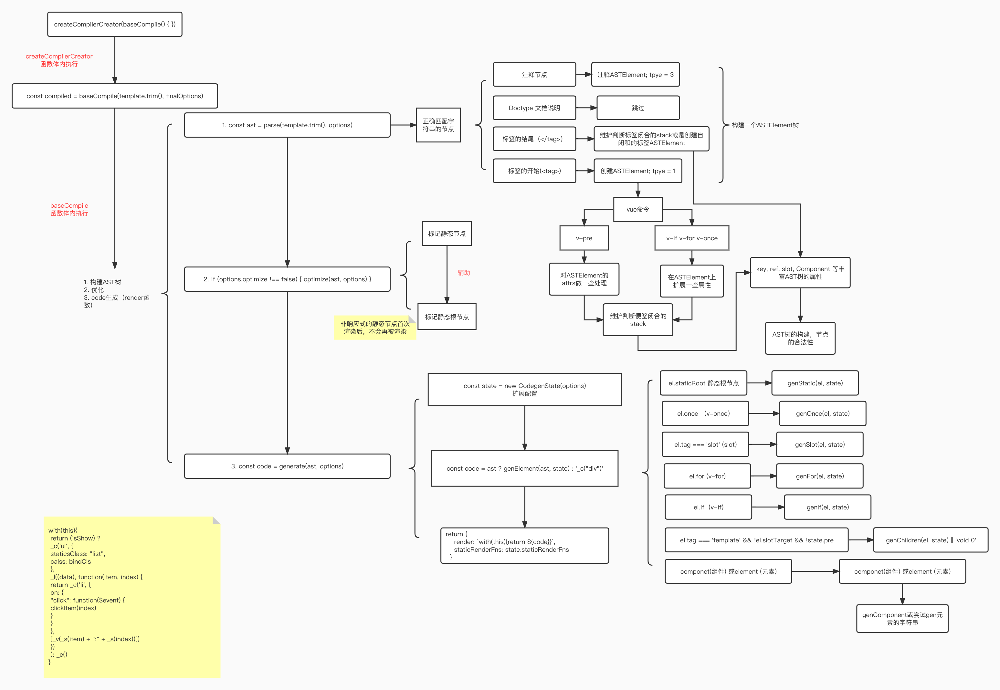

# 简介

前端学习小本本


除了图片包含的，还有网络，算法，设计模式等等一起学习！

<br/>

## 目录

- 一、网络
  - 1.1 OSI 七层模型和 TCP/IP 四层模型
  - 1.2 HTTP
    - 1.2.1 HTTP 0.9
    - 1.2.2 HTTP 1.0
    - 1.2.3 HTTP 1.1
  - 1.3 HTTP2.0 和 HTT3.0
    - 1.3.1 HTTP2.0
    - 1.3.2 二进制分帧
    - 1.3.3 HTTP3.0
  - 1.4 HTTPS
    - 1.4.1 HTTPS 链接过程
  - 1.5 HTTP 头
    - 1.5.1 状态码
    - 1.5.2 常用请求头
  - 1.6 TCP 和 UDP
    - 1.6.1 两者的区别
    - 1.6.2 TCP 三次握手和四次挥手
    - 1.6.3 TCP KeepAlive
    - 1.6.4 TCP 可靠性
  - 1.7 WebSocket
    - 1.7.1 连接过程
    - 1.7.2 WebSocket 与 HTTP 协议相比，
  - 1.8 DNS
    - 1.8.1 DNS 与 TCP 和 UDP
  - 1.9 CDN
    - 1.9.1 基础架构
    - 1.9.2 回源
- 二、Javascript
  - 2.1 基础类型和类型检测
  - 2.2 原型和原型链
    - 2.2.1 原型
    - 2.2.2 原型链
    - 2.2.3 手写 instanceof
  - 2.3 作用域
    - 2.3.1 全局，函数，块级作用域
    - 2.3.2 闭包
    - 2.3.3 变量提升
  - 2.4 JS 运算符
    - 2.4.1 位运算符
  - 2.5 this
    - 2.5.1 执行环境
    - 2.5.2 实现一个 bind
    - 2.5.3 实现一个 call
    - 2.5.4 实现一个 apply
  - 2.6 new 的原理
    - 2.6.1 实现一个 new 函数
  - 2.7 class 和继承
    - 2.7.1 class
    - 2.7.2 继承
    - 2.7.3 ES5-实现继承的几种方式
    - 2.7.4 实现一个继承 inherits 函数
  - 2.8 ES6/7
    - 2.8.1 let, const 和 var 的区别
    - 2.8.2 箭头函数
    - 2.8.3 Promise
    - 2.8.4 Set, Map, WeakSet, WeakMap
    - 2.8.5 Proxy 和 Reflect
  - 2.9 Number
    - 2.9.1 最大安全数
    - 2.9.2 浮点数计算精确度问题
    - 2.9.3 Number.isNaN 和 isNaN 的区别
    - 2.9.4 [1, 2, 3].map(parseInt)
    - 2.9.5 实现 (5).add(3).minus(2) 功能
  - 2.10 Array
    - 2.10.1 数组的常用方法
    - 2.10.2 map 和 forEach 的区别
    - 2.10.3 手写 reduce
  - 2.11 js 模块化方案
    - 2.11.1 AMD 和 CMD
    - 2.11.1 CommonJs
    - 2.11.2 ES6 Module
    - 2.11.3 CommonJS 和 ES6 模块的区别
    - 2.11.4 UMD
    - 2.11.5 模块化发展历程
  - 2.12 js 异步发展方案
    - 2.12.1 回调函数 callback
    - 2.12.2 Promise
    - 2.12.3 generator
    - 2.12.4 async/await
  - 2.13 script 的 jsonp、async 和 defer
  - 2.14 BigInt
- 三、Css
  - 3.1 优先级(权重)
    - 3.1.1 选择器
  - 3.2 单位
    - 3.2.1 为什么 padding/margin 的百分比单位基于父元素的宽度而不是高度
  - 3.3 盒子模型
  - 3.4 BFC
    - 3.4.1 特性和应用
  - 3.5 层叠上下文
  - 3.6 居中方案
    - 3.6.1 水平居中
    - 3.6.2 垂直居中
    - 3.6.3 水平垂直居中
  - 3.7 float
  - 3.8 position
  - 3.9 transition、animation 和 transform
    - 3.9.1 transition
    - 3.9.2 animation 和 keyframes
    - 3.9.3 transform
  - 3.10 一像素边框
  - 3.11 移动端点击 300ms 延迟
  - 3.12 css 应用
    - 3.12.1 绘制三角形
    - 3.12.2 绘制扇形
  - 3.13 flex
    - 3.13.1 主轴和交叉轴
    - 3.13.2 flex: 0 1 auto 的意思
  - 3.14 移动端适配方案
  - 3.15 css 模块化
- 四、Html 和浏览器
  - 4.1 块级，行内元素
  - 4.2 DOM
  - 4.3 事件捕获流，冒泡流和事件委托
    - 4.3.1 DOM 级别事件
  - 4.4 src 和 href 的区别
  - 4.5 跨 tab 通信
    - 4.5.1 同源页面下
    - 4.5.2 非同源
  - 4.6 hash 和 history 模式
    - 4.6.1 hash
    - 4.6.2 history
  - 4.7 在浏览器上输入 url 之后的流程
    - 4.7.1 回流和重绘
    - 4.7.2 合成
  - 4.8 跨域和跨站
    - 4.8.1 同源策略
    - 4.8.2 跨域处理方案
    - 4.8.3 跨域未携带 cookie 可能的原因
    - 4.8.4 跨站
  - 4.9 事件循环
    - 4.9.1 宏任务和微任务
    - 4.9.2 基本流程
    - 4.9.3 node 事件循环
    - 4.9.4 经典例子
  - 4.10 GC 垃圾回收机制
    - 4.10.1 标记清除
    - 4.10.2 引用计数
    - 4.10.3 V8-栈内存的回收
    - 4.10.4 V8-堆内存的回收
    - 4.10.5 内存泄漏
  - 4.11 缓存机制
  - 4.12 安全
    - 4.12.1 XSS 攻击全称跨站脚本攻击
    - 4.12.2 CSRF 跨站点请求伪造
  - 4.13 Cookie, Session, Token, SessionStorage、LocalStorage
    - 4.13.1 Cookie, Session
    - 4.13.2 Cookie, SessionStorage, LocalStorage
    - 4.13.3 Token
    - 4.13.4 限制 Cookies 访问
  - 4.14 Preload 和 Prefetch
    - 4.14.1 Preload
    - 4.14.2 Prefetch
    - 4.14.3 对比
  - 4.15 未归类
    - 4.15.1 options 预计请求
- - 五、Vue
  - 5.1 生命周期
    - 5.1.1 单个组件的生命周期
    - 5.1.2 父子组件的生命周期顺序
  - 5.2 数据绑定原理
    - 5.2.1 响应式原理
    - 5.2.2 响应式对象使用应该注意哪些点
    - 5.2.3 vue3.0 为什么使用 Proxy 实现响应式
    - 5.2.4 vue2.0 数组方法的响应式
    - 5.2.5 Watcher
  - 5.3 v-model 基本原理
    - 5.3.1 组件中使用 v-model
  - 5.4 vue 中通信方式
  - 5.5 computed 和 watcher
  - 5.6 nextTick 的原理
  - 5.7 Vue 指令
    - 5.7.1 全局指令和局部指令
    - 5.7.2 配置参数
  - 5.8 vue 的 diff 原理
    - 5.8.1 复杂度
  - 5.9 编译&渲染
    - 5.9.1 编译过程
    - 5.9.2 渲染过程
  - 5.10 内置组件
    - 5.10.1 slot
    - 5.10.2 keep-alive
    - 5.10.3 transition 和 transition-group
  - 5.11 函数式组件
  - 5.12 vue 事件机制
    - 5.12.1 dom 事件
    - 5.12.2 事件委托？
    - 5.12.3 eventsMixin
    - 5.12.4 自定义事件
  - 5.13 Vue-Router
    - 5.13.1 路由模式
    - 5.13.2 导航守卫
    - 5.13.3 导航守卫的顺序，导航解析流程
    - 5.13.4 vue-router 如何注入
    - 5.13.5 route 和 router
  - 5.14 Vuex
    - 5.14.1 核心概念
    - 5.14.2 Vuex 如何注入
    - 5.14.3 如何实现响应式
  - 5.15 Vue3.0
    - 5.15.1 Proxy
    - 5.15.2 setup
    - 5.15.3 Function_based API
  - 5.16 其他
    - 5.16.1 为什么 data 是一个函数
    - 5.16.2 虚拟 DOM
- 六、微信
  - 6.1 基本概念
    - 6.1.1 不同类型的 id
  - 6.2 小程序-WXML 语法
    - 6.2.1 数据绑定
    - 6.2.2 列表渲染
    - 6.2.3 条件渲染
    - 6.2.4 模板
  - 6.3 小程序-wxs
    - 6.3.1 声明和使用
    - 6.3.2 模块化
    - 6.3.3 基本类型
    - 6.3.4 js 支持情况
  - 6.4 小程序-事件系统
    - 6.4.1 事件和传参
    - 6.4.2 捕获，冒泡，互斥
    - 6.4.3 WXS 响应事件
  - 6.5 小程序-生命周期
    - 6.5.1 生命周期顺序
    - 6.5.2 App 生命周期
    - 6.5.3 页面生命周期
    - 6.5.4 组件生命周期
  - 6.6 小程序-授权
  - 6.7 小程序-原理
    - 6.7.1 渲染层和逻辑层
    - 6.7.2 运行环境
    - 6.7.3. 运行机制
    - 6.7.4 更新机制
    - 6.7.5 简诉原理
    - 6.7.6 优缺点
    - 6.7.7 小程序-问题
    - 6.7.8 兼容性问题
    - 6.7.9 小程序-优化
    - 6.7.10 代码体积优化
    - 6.7.11 代码注入优化
    - 6.7.12 首屏渲染优化
  - 6.8 小程序-其他
    - 6.8.1 rpx
    - 6.8.2 网络请求
    - 6.8.3 block 标签
    - 6.8.4 微信小程序是单页应用吗
    - 6.8.5 和 vue 的区别
  - 6.9 微信公众号
- 七、性能优化
  - 7.1 构建工具带来的
  - 7.2 浏览器相关
  - 7.3 js 相关
  - 7.4 css 相关
    - 7.4.1 动画相关
  - 7.5 transform 和 opacity
  - 7.6 Vue 相关
  - 7.7 React 相关
  - 7.8 Tree-Shaking

<br/>

# 一、网络

<br/>

## 1.1 OSI 七层模型和 TCP/IP 四层模型

<br/>

<table>
	<tr>
		<td>七层模型</td>
		<td>四层模型</td>
		<td>功能</td>
		<td>协议</td>
	</tr>
	<tr>
	 <td>应用层</td>
		<td rowspan="3">应用层</td>
		<td>文件传输，电子邮件，虚拟终端等</td>
		<td>HTTP, FTP, DNS域名系统等</td>
	</tr>
	<tr>
		<td>表示层</td>
		<td>数据格式化，代码转换，数据加密</td>
		<td>Telnet，SNMP</td>
	</tr>
	<tr>
		<td>会话层</td>
		<td>建立、维护和管理会话链接</td>
		<td>SMTP，DNS</td>
	</tr>
	<tr>
		<td>传输层</td>
		<td>传输层</td>
		<td>提供端对端的接口，数据传输</td>
		<td>TCP传输控制协议, UDP用户数据报协议，SSL安全套接字协议</td>
	</tr>
	<tr>
		<td>网络层</td>
		<td>网络层</td>
		<td>为数据包选择路由</td>
		<td>IP，ICMP, RIP等</td>
	</tr>
	<tr>
		<td>数据链路层</td>
		<td rowspan="2">数据链路层</td>
		<td>传输有地址的帧以及错误检测功能</td>
		<td>PPP，ARP, RARP等</td>
	</tr>
	<tr>
		<td>物理层</td>
		<td>以二进制形式在物理传输媒体上传输数据</td>
		<td>IEEE标准</td>
	</tr>
</table>

<br/>

MAC 地址在数据链路层：

- 定位数据包的路径，如发送者，接受者
- 即网卡地址，每个网卡都是独一无二的 12 个 16 进制数
- 前 6 个代表厂商，后 6 个表示流水号

IP 在网络层

- IPv4：32 个二进制，4 字节\*8 位，如 255.255.255.0
- IPv6：128 个二进制，8 字节\*16 位，如 2001:DB8:0:23:8:800:200C:417A

port 端口和 socket 在传输层

<br/>

## 1.2 HTTP

<br/>

超文本传输协议，是互联网上应用最为广泛的一种网络协议，是一个客户端和服务器端请求和响应的标准。

<br/>

### 1.2.1 HTTP 0.9

<br/>

传统的 request – response 的模式，只支持 GET 请求

<br/>

### 1.2.2 HTTP 1.0

<br/>

在 http 0.9 的基础上增加了几个变化：

- 在请求中加入了 HTTP 版本号
- HTTP 开始有 header 了
- 增加了 HTTP Status Code 标识相关的状态码。
- 还有 Content-Type 可以传输其它的文件了。

**_但是，HTTP1.0 性能上有一个很大的问题，那就是每请求一个资源都要新建一个 TCP 链接，而且是串行请求_**

<br/>

### 1.2.3 HTTP 1.1

<br/>

HTTP/1.1 主要解决了 HTTP 1.0 的网络性能的问题，以及增加了一些新的东西：

- 可以设置 keepalive 来让 HTTP 重用 TCP 链接
- 然后支持 pipeline 网络传输，只要第一个请求发出去了，不必等其回来，就可以发第二个请求出去，可以减少整体的响应时间。
- 支持 Chunked Responses ，也就是说，在 Response 的时候，不必说明 Content-Length。这样，客户端就不能断连接，直到收到服务端的 EOF 标识。
- 协议头注增加了 Language, Encoding, Type 等等头。
- 加入了一个很重要的头—— HOST。
- 加入了 OPTIONS 方法，其主要用于 CORS 应用。

<br/>

## 1.3 HTTP2.0 和 HTT3.0

<br/>

### 1.3.1 HTTP2.0

超文本传输协议 2.0，是下一代 HTTP 协议。在开放互联网上 HTTP2.0 将只用于 https 网址，而 http 网址将继续使用 HTTP/1。他有以下优点：

- 提升访问速度
- 允许多路复用：多路复用允许同时通过单一的 HTTP/2 连接发送多重请求-响应信息。改善了：在 http1.1 中，浏览器客户端在同一时间，针对同一域名下的请求有一定数量限制（连接数量），超过限制会被阻塞。(使用请求 ID 对应响应)
- 二进制分帧：HTTP2.0 会将所有的传输信息分割为更小的信息或者帧，并对他们进行二进制编码
- 首部压缩: HPACK（HTTP2 头部压缩算法）压缩格式对传输的 header 进行编码。并在两端建立索引表，进行缓存。下次发送只需发送索引。
- 服务器端推送

<br/>

### 1.3.2 二进制分帧

<br/>

- 帧(frame)包含部分：
  - 类型 Type
  - 长度 Length
  - 标记 Flags，如结束帧
  - 流标识 Stream，标识属于那个流
  - payload：数据
- 流是连接中的一个虚拟信道，可以承载双向消息传输。每个流有唯一整数标识符。为了防止两端流 ID 冲突，客户端发起的流具有奇数 ID，服务器端发起的流具有偶数 ID。

在 HTTP/2 中，有两个非常重要的概念，分别是帧（frame）和流（stream）。 帧代表着最小的数据单位，每个帧会标识出该帧属于哪个流，流也就是多个帧组成的数据流，在同一域名下所有请求都是基于流。 HTTP2 采用二进制数据帧传输，取代了 HTTP1.x 的文本格式，二进制格式解析更高效。 多路复用代替了 HTTP1.x 的序列和阻塞机制，所有的相同域名请求都通过同一个 TCP 连接并发完成。同一 Tcp 中可以发送多个请求，对端可以通过帧中的标识知道属于哪个请求。通过这个技术，可以避免 HTTP 旧版本中的队头阻塞问题（Pipelining），极大的提高传输性能。

<br/>

### 1.3.3 HTTP3.0

<br/>

HTTP2.0 虽然性能已经不错了，还有什么不足吗？

- 建立连接时间长(本质上是 TCP 的问题)
- 队头阻塞问题，队头阻塞问题可能存在于 HTTP 层和 TCP 层。HTTP2.0 协议的多路复用机制解决了 HTTP 层的队头阻塞问题，但是在 TCP 层仍然存在队头阻塞问题。TCP 协议在收到数据包之后，这部分数据可能是乱序到达的，但是 TCP 必须将所有数据收集排序整合后给上层使用，如果其中某个包丢失了，就必须等待重传，从而出现某个丢包数据阻塞整个连接的数据使用。
- 移动互联网领域表现不佳(弱网环境)，以及无法进行连接迁移，一条连接由一个四元组标识，在当今移动互联网的时代，如果一台手机从一个 wifi 环境切换到另一个 wifi 环境，ip 发生变化，那么连接必须重新建立，inflight 的包全部丢失。

HTTP3.0 又称为 HTTP Over QUIC，其弃用 TCP 协议，改为使用基于 UDP 协议的 QUIC 协议来实现。

<br/>

## 1.4 HTTPS

<br/>

是以安全为目标的 HTTP 通道，即 HTTP 下加入 SSL 层，SSL 加密是在传输层实现的。http 是明文传输，https 则是具有安全性的 ssl 加密传输协议

<br/>

### 1.4.1 HTTPS 链接过程

<br/>

1. 客户端发起 https 请求，并且携带自己支持的密钥算法和哈希算法
2. 服务端接收请求后，从中挑选出一套自己支持的加密算法和哈希算法，如果不支持则连接断开。 然后会把符合的算法和证书发给客户端，证书里包含了密钥的公钥。
3. 客户端检验证书的合法性，包括失效日期，网站地址，颁发的机构等。验证通过后，客户端会生成一个随机字符串，然后用服务端的公钥进行加密。再用这个随机字符串加密（握手信息+握手信息的 hash 值）。hash 主要来比对，防止篡改
4. 服务端通过私钥进行解密，并验证客户端的信息，随后使用同样的随机字符串加密握手信息和握手信息的 HASH 值发给客户端。
5. 客户端接收到服务端发回来的握手信息后，用一开始生成的随机字符串对密文进行解密，来对握手信息进行校验，校验通过后，握手完毕。
6. 从这里之后，客户端和服务端的通信就使用那串随机字符串进行 AES 对称加密通信。（SSL 加密建立）

<br/>

## 1.5 HTTP 头

<br/>

### 1.5.1 状态码

<br/>

1. 信息

- 100 Continue: 继续, 客户端应继续其请求
- 101 Switching Protocols: 切换协议
- 102 Processing: 处理将被继续执行

2. 成功

- <font color=#ff502c>200 OK</font>: 请求成功
- 201 Created: 请求已经被实现
- 202 Accepted: 服务器已接受请求，但尚未处理
- <font color=#ff502c>204 No Content</font>: 服务器成功处理，但未返回内容

3. 重定向

- 300 Multiple Choices: 被请求的资源有一系列可供选择的回馈信息， 用户或浏览器能够自行选择一个首选的地址进行重定向。
- <font color=#ff502c>301 Moved Permanently</font>: 被请求的资源已永久移动到新位置
- <font color=#ff502c>302 Move temporarily</font>: 请求的资源临时从不同的 URI 响应请求
- 303 See Other: 对应当前请求的响应可以在另一个 URI 上被找到，而且客户端应当采用 GET 的方式访问那个资源
- <font color=#ff502c>304 Not Modified</font>: 所请求的资源未修改，服务器返回此状态码时，不会返回任何资源
- 305 Use Proxy: 被请求的资源必须通过指定的代理才能被访问

4. 客户端错误

- <font color=#ff502c>400 Bad Request</font>: 语义有误，当前请求无法被服务器理解 | 请求参数有误
- <font color=#ff502c>401 Unauthorized</font>: 当前请求需要用户验证
- <font color=#ff502c>403 Forbidden</font>: 服务器已经理解请求，但是拒绝执行它
- <font color=#ff502c>404 Not Found</font>: 请求失败，请求所希望得到的资源未被在服务器上发现
- <font color=#ff502c>405 Method Not Allowed</font>: 请求行中指定的请求方法不能被用于请求相应的资源。例如使用服务端为未允许的 PUT，DELETE 请求。
- 408 Request Timeout: 请求超时
- 409 Conflict: 由于和被请求的资源的当前状态之间存在冲突，请求无法完成
- 410 Gone: 被请求的资源在服务器上已经不再可用，而且没有任何已知的转发地址
- 413 Request Entity Too Large: 服务器拒绝处理当前请求，因为该请求提交的实体数据大小超过了服务器愿意或者能够处理的范围
- 414 Request-URI Too Long: 请求的 URI 长度超过了服务器能够解释的长度，因此服务器拒绝对该请求提供服务（http 协议未规定长度，但是浏览器，nginx 会限制，Chrome:8182）
- <font color=#ff502c>415 Unsupported Media Type</font>: 对于当前请求的方法和所请求的资源，请求中提交的实体并不是服务器中所支持的格式，因此请求被拒绝

5. 服务端错误

- <font color=#ff502c>500 Internal Server Error</font>: 服务器遇到了一个未曾预料的状况，导致了它无法完成对请求的处理
- 501 Not Implemented: 服务器不支持当前请求所需要的某个功能
- <font color=#ff502c>502 Bad Gateway</font>: 作为网关或者代理工作的服务器尝试执行请求时，从上游服务器接收到无效的响应
- 503 Service Unavailable: 由于临时的服务器维护或者过载，服务器当前无法处理请求
- <font color=#ff502c>504 Gateway Timeout</font>: 作为网关或者代理工作的服务器尝试执行请求时，未能及时从上游服务器（URI 标识出的服务器，例如 HTTP、FTP、LDAP）或者辅助服务器（例如 DNS）收到响应
- 505 HTTP Version Not Supported: 服务器不支持，或者拒绝支持在请求中使用的 HTTP 版本

<br/>

### 1.5.2 常用请求头

<br/>

通用头部

- Cache-Control：指定请求和响应遵循的缓存机制。

  - public：表明响应可以被任何对象缓存，即使是通常不可缓存的内容。（例如：1.该响应没有 max-age 指令或 Expires 消息头；2. 该响应对应的请求方法是 POST 。）
  - private：表明响应只能被单个用户缓存，不能作为共享缓存（即代理服务器不能缓存它）
  - no-cache：在发布缓存副本之前，强制要求缓存把请求提交给原始服务器进行验证(协商缓存验证)。
  - no-store：缓存不应存储有关客户端请求或服务器响应的任何内容，即不使用任何缓存。
  - max-age：设置缓存存储的最大周期，超过这个时间缓存被认为过期(单位秒)。还是仍由缓存提供。若同时还发送了 max-stale 指令，则使用期可能会超过其过期时间。
  - s-maxage，max-stale，min-fresh 等

- Connection：连接管理

  - Close：在完成本次请求的响应后，断开连接。
  - Keepalive：在完成本次请求的响应后，保持连接，等待本次连接的后续请求。
  - Keep-Alive：如果浏览器请求保持连接，则该头部表明希望 WEB 服务器保持连接多长时间（秒），如 Keep-Alive：300。

- Date 消息发送的日期和时间，世界标准时。

- Transfor-Encoding 报文主体的传输编码格式

- Upgrade 升级协议。如 http1.0 升级到 http1.1，http 升级到 websocket

请求头部

- Host：请求资源所在的服务器 (唯一一个 HTTP/1.1 规范里要求必须出现的字段)
- Accept：客户端或者代理能够处理的媒体类型。还有 Accept-Charset，Accept-Encoding，Accept-Language
- If-Match：对象的 ETag 没有改变才执行请求的动作，去获取文档。
- If-None-Match：对象的 ETag 改变了，才执行请求的动作，去获取文档。
- If-Modified-Since：如果请求的对象在该头部指定的时间之后修改了，才执行请求的动作（比如返回对象），否则返回代码 304，告诉浏览器该对象没有修改。
- If-Unmodified-Since：如果请求的对象在该头部指定的时间之后没修改过，才执行请求的动作（比如返回对象）。
- Range：实体的字节范围请求。例如：Range: bytes=1173546
- Referer：表明自己是从哪个网页 URL 获得点击当前请求中的网址
- User-Agent：客户端信息

响应头部

- Location：重定向的 URI
- ETag：表示资源唯一资源的字符串
- Server：服务器的信息

实体头部

- Allow 资源可支持 HTTP 请求方法
- Last-Modified 资源最后修改时间
- Expires 实体主体过期时间
- Content-Language：实体资源语言
- Content-Encoding：实体编码格式
- Content-Length：实体大小，后端可知道 body 的大小
- Content-Range：实体传送的范围
- Content-Type：实体媒体类型
- Content-MD5：主体的 MD5 校验和

<br/>

## 1.6 TCP 和 UDP

<br/>

### 1.6.1 两者的区别

<br/>

UDP 协议全称是用户数据报协议

- 面向无连接： 首先 UDP 是不需要和 TCP 一样在发送数据前进行三次握手建立连接的，想发数据就可以开始发送了。并且也只是数据报文的搬运工，不会对数据报文进行任何拆分和拼接操作。
- 有单播，多播，广播的功能
- 不可靠性：这种不可靠性体现在无连接上
- 头部开销小，传输数据报文时是很高效的

<br/>

TCP 协议全称是传输控制协议是一种面向连接的、可靠的、基于字节流的传输层通信协议

- 面向连接：发送数据之前必须在两端建立连接。建立连接的方法是“三次握手”
- 仅支持单播传输：只能进行点对点的数据传输，不支持多播和广播传输方式
- 可靠传输：判断丢包，误码靠的是 TCP 的段编号以及确认号
- 提供拥塞控制：当网络出现拥塞的时候，TCP 能够减小向网络注入数据的速率和数量，缓解拥塞

<br/>

### 1.6.2 TCP 三次握手和四次挥手

<br/>

<font color=#ff502c>TCP 连接采用三次握手</font>

1. 客服端首先发送一个带有 SYN 标志地数据包给服务端。自身进入 sent 状态，等待服务端确认
2. 服务端接收后，回传一个带有 SYN/ACK 标志的数据包传递确认信息，表示我收到了，服务端进入 rcvd 收到状态。
3. 最后，客户端收到确认，再回传一个带有 ACK 标志的数据包，代表我知道了，表示"握手"结束，两端进入 established 确立状态。

为什么需要三次握手？可能有以下两种情况

- 客户端发出第一次挥手后就失效了，那么服务端接收后就产生 TCP 链接是无用的，需要第三次挥手确认
- 服务端发送的数据因为网络情况丢失了，客户端超时后重新发起了链接，那么上次的 TCP 链接服务端因为没有接受到回应而一直开着，造成了资源浪费

<font color=#ff502c>TCP 断开采用四次挥手</font>

1. 客户端发送一带有个 FIN 标志地数据包给服务端，用来关闭客户端到服务端的数据传送，客户端进入 FIN_WAIT_1 状态。
2. 服务端收到后，发送一个 ACK 数据包给客户端，自身进入 CLOSE_WAIT 状态。
3. 服务端发送一个 FIN，用来关闭服务端到客户端的数据传送，服务端进入 LAST_ACK 状态。
4. 客户端收到 FIN 后，进入 TIME_WAIT 状态，接着发送一个 ACK 给 服务端，服务端进入 CLOSED 状态，通信结束。

为什么中间服务端发送了两次？因为此时服务端可能还有数据没有发送完，所以并不会马上关闭 socket，而是等待数据发送后再发送 FIN 标志。


2MSL:

TCP 报文段最大生存时间(Maximum Segment Lifetime)。他是任何报文段被丢弃前在网络的最长时间。

当一个 tcp 执行一个主动关闭，并发回最后一个 ACK，该链接必须在 TIME_WATE 状态的停留时间为 2 倍的 MSL。这样可让 TCP 再次发送最后一个 ACK 以防这个 ACK 丢失（比如另一个端超时并重发最后的 FIN）。

这种 2MSL 等待的另一个结果是相同端口下的链接必须在 2MSL 结束后才能被使用。

拓展：

如果处于 2MSL 状态下的主机出现故障，他在 MSL 内重新启动，会使用故障前 2MSL 的端口建立一个新的链接么。如果重连是链接不了的。为了解决这个问题有了平静时间。

平静时间：TCP 在重启后的 MSL 时间内不能建立任何链接，这称为平静时间，但只有极少数主机准守，因为大部分重启时间大于 MSL.

<br/>

### 1.6.3 TCP KeepAlive

TCP 的保活定时器的提供了保活机制即 KeepAlive，保活机制默认是关闭的，TCP 连接的任何一方都可打开此功能。如果在一段时间内此连接都不活跃，开启保活功能的一端会向对端发送一个保活探测报文。

- 若对端正常存活，且连接有效，对端必然能收到探测报文并进行响应。此时，发送端收到响应报文则证明 TCP 连接正常，**重置保活时间计数器**即可。
- 若由于网络原因或其他原因导致，发送端无法正常收到保活探测报文的响应。那么在一定探测时间间隔后，将继续发送保活探测报文。直到收到对端的响应，或者达到配置的**探测循环次数上限**都没有收到对端响应，这时对端会被认为不可达，TCP 连接随存在但已失效，需要将连接做中断处理。
- 若对端主机崩溃且已经重启，那么重启后原连接失效，对方由于不认识原报文，会响应**复位报文段**，请求段将连接断开

<br/>

### 1.6.4 TCP 可靠性

<br/>

TCP 通过序列号、超时重传、检验和、流量控制、滑动窗口、拥塞控制实现可靠性。

- ACK 应答机制：发送的每一条消息，都需要对方发送一条消息来回复消息是否被收到。

- 序列号：TCP 对每个报文进行编号，这些编号就是序列号。而序列号有多种作用 a：保证可靠性，当接收到的数据失序时，就能立马知道 b：去除重复的报文，数据传输过程中的确认应答，重发控制，重复控制等功能都要依靠序列号来实先。 c：提高效率，可以实现多次发送，一次确认。

- 校验和：TCP 将保持它首部和数据的检验和

- 超时重传：当 TCP 发出一个段后，它启动一个定时器，等待目的端确认收到这个报文段。如果不能及时收到一个确认，将重发这个报文段。

- 流量控制：TCP 连接的每一方都有固定大小的缓冲空间，TCP 的接收端只允许发送端发送接收端缓冲区能接纳的我数据。当接收方来不及处理发送方的数据，能提示发送方降低发送的速率，防止包丢失。

- 拥塞控制：拥塞控制使得宏观网络中的资源能够合理的应用。实现的算法有四个，慢开始，拥塞避免，快速回复，和快速重传.

  - 慢开始，拥塞窗口大大小呈指数形式 2^n
  - 拥塞避免，当拥塞发生时，超时或收到重复确定

- 滑动窗口：（解决了快的发送方 -> 慢的接收方）TCP 建立连接的初始，接收端会告诉发送端自己的接收窗口大小。发送端构造自己的窗口，窗口内是可发送的数据，发送后会向右滑动。接收端接收能力会影响接收端窗口的大小。如果消息没被确认怎么办，假如 31，32，33，34，报文发送了，32，33，34 都被确认了，31 没被确认怎么办呢？这时就重新发送 31，并且 31 之后的数据报全部重新发送。 - 窗口左沿向右边靠近为窗口合拢。这种现象发生在数据被发送和确认时。 - 当窗口右边沿向右移动时将允许发送更多的数据，我们称之为窗口张开。这种现象发生在另一端的接收进程读取已经确认的数据并释放掉 TCP 的接收缓存时。 - 当接收方确认数据后，这个滑动窗口不时地向右移动。窗口两个边沿的相对运动增加或减少窗口的大小。（窗口的初始初始大小配置，一般为 4096 字节即 4kb）

<br/>

## 1.7 WebSocket

<br/>

WebSocket 是 HTML5 中的协议，支持持久连续，http 协议不支持持久性连接。Http1.0 和 HTTP1.1 都不支持持久性的链接，HTTP1.1 中的 keep-alive，将多个 http 请求合并为 1 个。但还是一一对应的，且服务端不能直接推送

<br/>

### 1.7.1 连接过程

<br/>

1. 发送一个 GET 请求，升级协议。（这里就需要三次握手协议）关键是请求头:

- Upgrade: websocket
- Connection: Upgrade

2. 服务器给客户端 switching protocol （状态码 101）
3. 接下来的通信都是 websocket，这样就很好的连接了

<br/>

### 1.7.2 WebSocket 与 HTTP 协议相比，

相同点主要有：

- 都是基于 TCP 的应用层协议；
- 都使用 Request/Response 模型进行连接的建立；
- 在连接的建立过程中对错误的处理方式相同，在这个阶段 WS 可能返回和 HTTP 相同的返回码；
- 都可以在网络中传输数据

不同之处在于：

- WS 使用 HTTP 来建立连接，但是定义了一系列新的 header 域，这些域在 HTTP 中并不会使用；
- WS 的连接不能通过中间人来转发，它必须是一个直接连接；
- WS 连接建立之后，通信双方都可以在任何时刻向另一方发送数据；
- WS 连接建立之后，数据的传输使用帧来传递，不再需要 Request 消息；
- WS 的数据帧有序。

<br/>

## 1.8 DNS

<br/>

域名：如 baidu.1com

IP：192.168.0.0

域名系统（服务）协议（DNS）是一种分布式网络目录服务，主要用于域名与 IP 地址的相互转换，以及控制因特网的电子邮件的发送。为了保证高可用、高并发和分布式，它设计成了树状的层次结构。由根 DNS 服务器、顶级域 DNS 服务器和权威 DNS 服务器组成。

解析顺序是首先从浏览器缓存、操作系统缓存以及本地 DNS 缓存 (/etc/hosts) 逐级查找，然后从本地 DNS 服务器、根 DNS、顶级 DNS 以及权威 DNS 层层递归查询。

还可以基于域名在内网、外网进行负载均衡。

不过传统的 DNS 有很多问题(解析慢、更新不及时)，还有域名劫持(解析到错误的 IP)。

HTTPDNS 通过客户端 SDK 和服务端配合，直接通过 HTTP 调用解析 DNS 的方式，可以绕过传统 DNS 这些缺点，实现智能调度.

HTTPNDS 不走传统的 DNS 解析，而是自己搭建基于 HTTP 协议的 DNS 服务器集群，分布在多个地点和多个运营商。当客户端需要 DNS 解析的时候，直接通过 HTTP 协议进行请求这个服务器集群，得到就近的地址。

在客户端的 SDK 里动态请求服务端，获取 HTTPDNS 服务器的 IP 列表，缓存到本地。随着不断地解析域名，SDK 也会在本地缓存 DNS 域名解析的结果。

当手机应用要访问一个地址的时候，首先看是否有本地的缓存，如果有就直接返回。这个缓存和本地 DNS 的缓存不一样的是，这个是手机应用自己做的，而非整个运营商统一做的。如何更新、何时更新，手机应用的客户端可以和服务器协调来做这件事情。

<br/>

### 1.8.1 DNS 与 TCP 和 UDP

<br/>

DNS 在区域传输的时候使用 TCP 协议，其他时候使用 UDP 协议。

- DNS 区域传输的时候使用 TCP 协议：

  1.辅域名服务器会定时（一般 3 小时）向主域名服务器进行查询以便了解数据是否有变动。如有变动，会执行一次区域传送，进行数据同步。区域传送使用 TCP 而不是 UDP，因为数据同步传送的数据量比一个请求应答的数据量要多得多。

  2.TCP 是一种可靠连接，保证了数据的准确性。

- 域名解析时使用 UDP 协议：

客户端向 DNS 服务器查询域名，一般返回的内容都不超过 512 字节，用 UDP 传输即可。不用经过三次握手，这样 DNS 服务器负载更低，响应更快。

<br/>

## 1.9 CDN

CDN 的全称是 Content Delivery Network，即内容分发网络。基本原理是在用户和服务器之间增加 Cache 层，主要是通过接管 DNS 实现，将用户的请求引导到 Cache 上获得源服务器的数据，从而降低网络的访问时间。CDN 的关键技术主要有负载均衡，内容存储和分发技术。

- 负载均衡：使用整体性的网络负载均衡技术，通过内容路由器中的重定向（DNS）机制，在多个远程 POP 上均衡用户的请求，以使用户请求得到最近内容源的响应。
- 内容分发：借助于建立索引、缓存、流分裂、组播（Multicast）等技术，将内容发布或投递到距离用户最近的远程服务点（POP）处。
- 内容存储：在功能上包括对各种内容格式的支持，对部分缓存的支持;在性能上包括支持的容量、多文件吞吐率、可靠性、稳定性，都是存储需要考虑的问题。

<br/>

### 1.9.1 基础架构

<br/>

最简单的 CDN 网络由一个 DNS 服务器和几台缓存服务器组成：

1. 当用户点击网站页面上的内容 URL，经过本地 DNS 系统解析，DNS 系统会最终将域名的解析权交给 CNAME 指向的 CDN 专用 DNS 服务器。
2. CDN 的 DNS 服务器将 CDN 的全局负载均衡设备 IP 地址返回给用户
3. 用户向 CDN 的全局负载均衡设备发起内容 URL 访问请求
4. CDN 全局负载均衡设备根据用户 IP 地址，以及用户请求的内容 URL，选择一台用户所属区域的区域负载均衡设备，告诉用户向这台设备发起请求
5. 区域负载均衡设备会为用户选择一台合适的缓存服务器提供服务，选择的依据包括：根据用户 IP 地址，判断哪一台服务器距用户最近；根据用户所请求的 URL 中携带的内容名称，判断哪一台服务器上有用户所需内容；查询各个服务器当前的负载情况，判断哪一台服务器尚有服务能力。基于以上这些条件的综合分析之后，区域负载均衡设备会向
6. 全局负载均衡设备返回一台缓存服务器的 IP 地址
7. 全局负载均衡设备把服务器的 IP 地址返回给用户用户向缓存服务器发起请求，缓存服务器响应用户请求，将用户所需内容传送到用户终端。如果这台缓存服务器上并没有用户想要的内容，而区域均衡设备依然将它分配给了用户，那么这台服务器就要向它的上一级缓存服务器请求内容，直至追溯到网站的源服务器将内容拉到本地

<br/>

### 1.9.2 回源

CDN 的核心点有两个，一个是缓存，一个是回源。

这两个概念都非常好理解。对标到上面描述的过程，“缓存”就是说我们把资源 copy 一份到 CDN 服务器上这个过程，“回源”就是说 CDN 发现自己没有这个资源（一般是缓存的数据过期了），转头向根服务器（或者它的上层服务器）去要这个资源的过程。

回源域名一般是 cdn 领域的专业术语，通常情况下，是直接用 ip 进行回源的，但是如果客户源站有多个 ip，并且 ip 地址会经常变化，对于 cdn 厂商来说，为了避免经常更改配置（回源 ip），会采用回源域名方式进行回源，这样即使源站的 ip 变化了，也不影响原有的配置。

<br/>
<br/>

# 二、Javascript

<br/>

JavaScript 一种直译式脚本语言，是一种

- 解释型： 不需要编译
- 动态类型: 运行的时候类型可变
- 弱类型：数据类型可以忽略，存在隐式转换
- 基于原型：原型继承

的语言。它的解释器被称为 JavaScript 引擎，为浏览器的一部分，广泛用于客户端的脚本语言，最早是在 HTML（标准通用标记语言下的一个应用）网页上使用，用来给 HTML 网页增加动态功能。

<br/>

## 2.1 基础类型和类型检测

<br/>

- 简单类型：Undefined, Null, boolean, number, string。 _存储结构-栈_
- 复杂类型：Object, Array, Date, Function, RegExp （Symbol， Set, Map）_存储结构-堆_
- 基本包装类型：Boolean, Number, String _存储结构-堆_

类型检测：

- typeof: 区分不了引用类型（typeof null === Object）
- instanceof: 区分不了普通类型
- constructor: 容易篡改
- Object.prototype.toString.call()： 完美(ES6 的也能区分)

```javascript
Object.prototype.toString.call('a') === [Object String]
Object.prototype.toString.call(Null) === [Object Null]
```

**async 函数**

```javascript
Object.prototype.toString.call(async function () {}) ===[object AsyncFunction]
```

如果经过编译后就可能需要判断内容

```javascript
export function isAsyncFunction(fn) {
  let fnStr = fn.toString();
  return (
    Object.prototype.toString.call(fn) === '[object AsyncFunction]' ||
    fnStr.includes('return _regenerator.default.async(function')
  );
}
```

<br/>

## 2.2 原型和原型链

<br/>

### 2.2.1 原型

<br/>

每一个 JavaScript 对象(null 除外)在创建的时候就会关联另一个对象，这个对象就是我们所说的原型，每一个对象都会从原型"继承"属性和方法。

- \_\_proto\_\_ 是对象实例才有的属性，指向对象的原型。
- prototype 是构造函数才有的属性，该属性指向了一个对象，这个对象正是调用该构造函数而创建的实例的原型
- 实例的**proto**属性 和 构造函数的 prototype 都指向该对象原型
- Function 的 prototype 和**proto**属性都指向 f () 匿名函数
- Object 作为构造函数时，他的 prototype 指向 Object.prototype 对象原型，作为实例时，他的**proto**指向匿名函数。我们可以认为 Function 实例和 Object 实例都是继承于该匿名函数。
- 匿名函数作为“顶级构造函数”，他不需要 prototype 属性，即 prototype=undefined，当作为对象时，他的对象原型是 Object.prototype。
- Object.prototype 作为“顶级构造对象”，他的**proto**等于 null，表示继承于一个空的对象。没有 prototype 属性。

送大家一张我自己刻脑子里的图：


<br/>

### 2.2.2 原型链

<br/>

用 proto 链接的这条就是我们的原型链。原型链用于查找对象上的属性，当属性未从当前的对象上获取到的时候会从该原型链上查找，直到查到相应的属性。

原型链的顶层指向 window，严格模式下不会指向 window 而是 undefined

<br/>

### 2.2.3 手写 instanceof

<br/>

```javascript
// 对象 instanceof 函数   [] instanceof Array
function instance_of(child, Par) {
  const baseType = ['string', 'number', 'boolean', 'undefined', 'symbol'];
  if (baseType.includes(typeof child)) {
    return false;
  }

  let RP = Par.prototype; //取 Par 的显示原型
  child = child.__proto__; //取 child 的隐式原型
  while (true) {
    if (child === null) {
      return false;
    }
    if (child === RP) {
      return true;
    }
    child = child.__proto__;
  }
}
```

<br/>

## 2.3 作用域

<br/>

作用域是指程序源代码中定义变量的区域。

作用域规定了如何查找变量，也就是确定当前执行代码对变量的访问权限。

JavaScript 采用词法作用域(lexical scoping)，也就是静态作用域。

静态作用域与动态作用域因为 JavaScript 采用的是词法作用域，函数的作用域在函数定义的时候就决定了。

而与词法作用域相对的是动态作用域，函数的作用域是在函数调用的时候才决定的

<br/>

### 2.3.1 全局，函数，块级作用域

<br/>

1.全局作用域：页面打开时创建，关闭时销毁；全局对象 window 表示浏览器窗口，可以直接使用，全局作用域中创建的对象都会作为 window 对象的属性保存。

2.函数作用域：调用函数时创建函数作用域，执行完后作用域销毁；每调用 1 次，就创建一个新的函数作用域，他们之间相互独立。

3.块级作用域：由 { } 包括，if 语句和 for 语句里面的{ }也属于块作用域。如果没有块级作用域

- 在 if 或者 for 循环中声明的变量会泄露成全局变量
- 内层变量可能会覆盖外层变量

<br/>

### 2.3.2 闭包

<br/>

MDN 对闭包的定义为：闭包是指那些能够访问自由变量的函数。

那什么是自由变量呢？自由变量是指在函数中使用的，但既不是函数参数也不是函数的局部变量的变量。

闭包是函数和声明该函数的词法环境的组合，这个环境包含了这个闭包创建时所能访问的所有局部变量

可能产生闭包的二种情况：

- 函数作为返回值，
- 函数作为参数传递

优点:

- 可以读取函数内部的变量
- 另一个就是让这些变量的值始终保持在内存中，不会在函数调用后被自动清除，同时这也算是个缺点。（在函数中 return 一个函数出来）
- 可用于模拟私有变量和方法

缺点:

- 消耗内存，影响网页性能
- 可能会引起内存泄漏（不再用到的内存，但是没有及时释放，就叫做内存泄漏）

<br/>

### 2.3.3 变量提升

<br/>

JavaScript 中，函数及变量的声明都将被提升到函数的最顶部。

JavaScript 中，变量可以在使用后声明，也就是变量可以先使用再声明。

```javascript
a = 1;
// 或
var a = 1;
```

=>

```javascript
var a;

a = 1;
```

<br/>


<br/>

## 2.4 JS 运算符

<br/>

### 2.4.1 位运算符

<br/>

**位运算中，数值 1 表示 true，0 表示 false**

- 逻辑位运算符：
  - 按位与（&）奇数 & 1 = 1，偶数 & 1 = 0
  - 按位或（|）
  - 按位异或（^）两个值不相同，结果为 1。两个值相同，结果为 0。
  - 按位非（~）： 位非运算实际上就是对数字进行取负运算，再减 1。
- 移位运算符：
  - 左移（<<）
  - 右移（>>）
  - 无符号右移（>>>）：连符号位都给他移动了，1 为负，0 为正

<br/>

## 2.5 this

<br/>

- this 指的是当前的执行环境
- 一般时指向 window, 严格模式下 this 绑定到 undefined
- 对象调用函数的情况下，指向调用者
- 构造函数下，指向实例
- bind call apply with 函数可以绑定 this 的指向
  - call: call(this, arg1, arg2, ...)。会执行该函数
  - apply: apply(this, firstArg | argArray[]) 多个参数可使用参数数组，会执行该函数
  - bind: bind(this, firstArg | argArray[]) 返回一个函数，函数内的 this 指向传入的 this。多次 bind 只有第一次有效。
  - with: with (expression) { statement } // with'语句將某个对象添加到作用域链的顶部(window 之下，没有切断作用域链，在 expression 中找不到定义的，仍会往 window 上寻找)，在严格模式该标签禁止使用

<br/>

### 2.5.1 执行环境

<br/>

执行环境( execution context,为简单起见,有时也称为“环境”)是 JavaScript 中最为重要的一个概念。执行环境定义了变量或函数有权访问的其他数据,决定了它们各自的行为。每个执行环境都有一个与之关联的变量对象( variable object),环境中定义的所有变量和函数都保存在这个对象中。虽然我们编写的代码无法访问这个对象,但解析器在处理数据时会在后台使用它。

```javascript
var name = 'zty';

var obj = {
  name: '124'
  getName: function () {
    var self = this;
    return function () {
      console.log('name', this.name); //  zty
      console.log('name', self.name); // 124
    };
  }
};

obj.getName()();
```

<br/>

### 2.5.2 实现一个 bind

<br/>

```javascript
Function.prototype._bind = function (context, ...args) {
  context = context || window;
  const fnSymbol = Symbol('fn');
  context[fnSymbol] = this;

  return function (..._args) {
    args = args.concat(_args);

    context[fnSymbol](...args);
    delete context[fnSymbol];
  };
};
```

<br/>

### 2.5.3 实现一个 call

<br/>

```javascript
Function.prototype._call = function (context, ...args) {
  context = context || window;

  const fnSymbol = Symbol('fn');
  context[fnSymbol] = this; // 这个this 就是这个函数实例了

  context[fnSymbol](...args);
  delete context[fnSymbol];
};
```

<br/>

### 2.5.4 实现一个 apply

<br/>

```javascript
Function.prototype._apply = function (context, argsArr) {
  context = context || window;

  const fnSymbol = Symbol('fn');
  context[fnSymbol] = this;

  context[fnSymbol](...argsArr);
  delete context[fnSymbol];
};
```

<br/>

## 2.6 new 的原理

<br/>

1. 创建一个空对象，构造函数中的 this 指向这个空对象
2. 这个新对象的**proto**设置为即构造函数的 prototype
3. 执行构造函数方法，属性和方法被添加到 this 引用的对象中
4. 如果构造函数中没有返回其它对象，那么返回 this，即创建的这个的新对象，否则，返回构造函数中返回的对象。

<br/>

### 2.6.1 实现一个 new 函数

<br/>

```javascript
let _new = function (factory, ...rest) {
  let o = {
    __proto__: factory.prototype
  };
  let res = factory.apply(o, rest);
  return typeof res === 'object' ? res : o;
};
```

<br/>

## 2.7 class 和继承

<br/>

### 2.7.1 class

<br/>

ES6 之前实例化对象是通过构造函数实现的，ES6 后可以通过关键字 class 创建类（可以认为是一种语法糖）

- class 中的 constructor 就是在实例化对象调用的构造函数，该构造函数可不写。
- 实例对象必须使用 new 关键字生成
- class 不可以当做函数执行
- class 不存在变量提升
- class 中定义的属性和方法都挂在原型上，所有的实例对象都有这些属性和方法。构造函数中定义的是实例的属性和方法。
- class 中可以通过 static 定义静态方法，静态变量需在类外声明（calss.staticName==staticValue）。静态属性和方法只可以通过 class 来调用，实例不可调用

<br/>

### 2.7.2 继承

<br/>

继承属性，方法，静态方法

- ES6 继承: 通过 extends 关键字
- ES5 继承: 通过修改原型链实现继承

本质：

- ES5 的继承，实质是先创造子类的实例对象 this，然后再将父类的方法添加到 this 上面（Parent.call(this)）。
- ES6 的继承机制完全不同，实质是先将父类实例对象的属性和方法，加到 this 上面（所以必须先调用 super 方法），然后再用子类的构造函数修改 this。

<br/>

### 2.7.3 ES5-实现继承的几种方式

<br/>

1. 原型链继承：替换子类型的原型

```javascript
function superClass(name) {
  this.name = name;
}
function subClass(sex) {
  this.sex = sex;
}

// 继承了superClass
subClass.prototype = new superClass();
```

缺点：

- 包含引用类型的原型属性会被所有实例共享
- 在创建子类型的实例时，不能向超类型的构造函数中传递参数

<br/>

2. 经典继承（借用构造函数）：为了避免实例共享原型属性而带来的技术

```javascript
function subClass(name, sex) {
  // 继承了superClass的属性
  superClass.call(this, name);
  this.sex = sex;
}
```

缺点:

- 无法做到函数复用
- 不能继承超类型在原型上定义的方法

<br/>

3. 组合继承：融合了原型链继承和经典继承，避免了他们的缺陷

```javascript
function subClass(name, sex) {
  // 继承了superClass的属性
  superClass.call(this, name); // 第一次调用
  this.sex = sex;
}
// 继承方法
subClass.prototype = new superClass(); // 第二次调用
subClass.prototype.constructor = subClass;
```

缺点:

- 需要调用两次超类型的构造函数

<br/>

4. 原型继承：基于已有的对象创建新的对象

```javascript
// 以一个对象作为实例的原型对象
function object(o) {
  function F() {}
  F.prototype = o;
  return new F();
}

// 在ES5 规范化了该继承
Object.create();
```

缺点：

- 包含引用类型的原型属性会被所有实例共享

<br/>

5. 寄生式继承：思路和工厂模式类似，即创建一个仅用于继承过程的函数

```javascript
function createAnother(o) {
  // 创建新对象
  var clone = Object.create(o);
  // 增强这个对象
  o.say = function () {};
  return o;
}
```

缺点：

- 无法做到函数复用

<br/>

6. 寄生式组合继承：通过构造函数来继承属性，通过原型链的混成形式来继承方法

```javascript
function inheritsPrototype(subClass, superClass) {
  var prototype = Object.create(superClass.prototype);
  prototype.constructor = subClass;
  subClass.prototype = prototype;
}
```

集寄生式继承和组合继承的优点于一身，是实现基于类型继承的最有效方式

<br/>

### 2.7.4 实现一个继承 inherits 函数

<br/>

使用上面所述的寄生组合式继承

```javascript
function inherits(subClass, superClass) {
  // ... 省略参数校验
  subClass.prototype = Object.create(superClass.prototype, {
    constructor: { value: subClass, writable: true, configurable: true }
  });
}


<!-- 使用 -->
function superClass(name) {
  this.name = name
}

superClass.prototype.say = function() {
  console.log(`hello my name is ${this.name}`)
}

function subClass(sex) {
  this.sex = sex
}

_inherits(subClass, superClass)
```

<br/>

## 2.8 ES6/7

<br/>

### 2.8.1 let, const 和 var 的区别

<br/>

- let 和 var 都用于声明变量，而 const 必须初始化，且用于声明常量，这个常量指的是普通类型的值不变和复杂类型的内存地址不变。
- var 存在变量提升，而 let，const 存在“暂时性死区”，即在变量声明之前就访问变量的话，会直接提示 ReferenceError，而不像 var 那样使用默认值 undefined
- let,const 只有块级作用域，而 var 只有全局作用域和函数作用域概念
- 在全局作用域中，用 let 和 const 声明的全局变量并没有在全局对象中，只是一个块级作用域（Script）中。获取时，直接获取即可


<br/>

### 2.8.2 箭头函数

<br/>

- 更简化的代码语法
- 不绑定 this， 这也意味着使用 call 和 apply 是无法传递 this，第一个参数就是需要传递的参数
- arguments，即没有函数的参数 arguments，但可以使用剩余参数...args 替代

```JavaScript
function foo(arg1,arg2) {
    var f = (...args) => args[1];
    return f(arg1,arg2);
}
foo(1,2);  // 2
```

- 不能使用 new 关键字，因为箭头函数不是一个构造函数
- 没有 prototype 属性
- yield 关键字通常不能在箭头函数中使用（除非是嵌套在允许使用的函数内）。因此，箭头函数不能用作生成器。
- 如果需要放回对象字面量，可以

```
var func = () => ({foo: 1})
// 或
var func = () => {return {foo:1}}
```

<br/>

### 2.8.3 Promise

<br/>

所谓 Promise，简单说就是一个容器，里面保存着某个未来才会结束的事件（通常是一个异步操作）的结果。

Promise 是异步编程的一种解决方案，比传统的解决方案——回调函数和事件——更合理和更强大。清晰的代码结构。避免出现回调地狱

Promise 具有三种状态，分别是初始化的 pending 状态，resolve 后的 fulfilled 状态，rejecte 后的 rejected 状态。

常用方法:

then 和 catch 实际上是注册异步操作成功或失败的回调函数

- Promise.prototype.then() ： 可以有两个参数，第一个是 resolve 的回调，第二个是 reject 的回调
- Promise.prototype.catch()： 相当于.then(null, rejectFun)
- Promise.prototype.finally() 【ES8】
- Promise.all(): 只有所有都变成 fulfilled 状态，包装实例才会变成 fulfilled 状态；如果有一个实例变成 rejected 状态，包装实例就会变成 rejected 状态。
- Promise.allSettled(): 等到所有这些参数实例都返回结果，不管是 fulfilled 还是 rejected，包装实例才会结束。该方法由【ES2020】引入。
- Promise.any(): 只要实例有一个变成 fulfilled 状态，包装实例就会变成 fulfilled 状态；如果所有参数实例都变成 rejected 状态，包装实例就会变成 rejected 状态。该方法目前是一个第三阶段的提案 。
- Promise.race(): 异步操作竞赛，只返回最快的一个
- Promise.resolve()
- Promise.reject()
- Promise.try(): 同步操作也可以像异步一样执行

<br/>

### 2.8.4 Set, Map, WeakSet, WeakMap

<br/>

Set：

- 类似数组，成员唯一、无序且不重复。
- [value, value]，键值与键名是一致的（或者说只有键值，没有键名）。
- 可以遍历，方法有：add、delete、has 等。
- 数组排重[...new Set(array)]

WeakSet：

- 成员都是对象。
- 成员都是弱引用，可以被垃圾回收机制回收，可以用来保存 DOM 节点，不容易造成内存泄漏。
- 不能遍历，方法有 add、delete、has。

Map：

- 本质上是键值对的集合，类似集合。
- 可以遍历，方法很多可以跟各种数据格式转换。

WeakMap：

- 只接受对象作为键名（null 除外），不接受其他类型的值作为键名。
- 键名是弱引用，键值可以是任意的，键名所指向的对象可以被垃圾回收，此时键名是无效的。
- 不能遍历，方法有 get、set、has、delete。

（可以遍历，遍历的方法有 keys, values(), entires(), forEach((value, key) => {} , this)）

```javascript
let s = new Set();
let obj = { a: 1 };
s.add(a);

// 弱引用下, 那么 这个obj的内存会被释放 WeakMap/WeakSet也不会阻止对象从内存移除，
// 但是垃圾回收器并没有指定什么时候移除，可能马上移除，
// 也可能等待更多时批量移除，所以WeakMap, WeakSet元素的个数并不确定。
// 所以两者没有部署Iterator接口，不能用for...of遍历。
obj = null;
```

<br/>

### 2.8.5 Proxy 和 Reflect

<br/>

```javascript
const proxyObj = new Proxy(obj, {
  get: function (target, propKey, receiver) {
    console.log('this = ', this); // 指向这个handler
    console.log('target = ', target);
    console.log('propKey = ', propKey);
    console.log('receiver = ', receiver);
    return Reflect.get(target, propKey, receiver);
  },
  set: function (target, propKey, value, receiver) {
    console.log(`setting ${propKey}!`);
    return Reflect.set(target, propKey, value, receiver);
  },
  // 影响 a in obj 但不影响for in
  has: function (target, propKey) {
    console.log('has propKey = ', propKey);
    if (propKey === 'name') {
      return false;
    }
    return true;
  },
  // 影响for in, Object.keys getOwnPropertyNames等
  ownKeys(target) {
    // console.log('ownKeys this = ', this);
    // return Reflect.ownKeys(target);
    return ['info'];
  }
});

// proxyObj.name;
// console.log('in = ', 'name' in proxyObj);
// for (let k in proxyObj) {
//   console.log('k = ', k);
// }
// console.log('keys = ', Object.keys(proxyObj));

function sum(a, b) {
  return a + b;
}
const proxySum = new Proxy(sum, {
  apply(target, ctx, arg) {
    console.log('target = ', target);
    console.log('ctx = ', ctx); // 指向调用者
    console.log('arg = ', arg);
    return Reflect.apply(target, ctx, arg);
  },
  construct(target, arg, newTarget) {
    return Reflect.construct(target, arg, newTarget);
  }
});
console.log('proxySum = ', proxySum(1, 2));
console.log('new proxySum = ', new proxySum(1, 2));

// 调用 revokeFun() 可以取消代理
let { proxyObj1, revokeFun } = Proxy.revocable({}, {});
```

- 将 Object 对象的一些明显属于语言内部的方法（比如 Object.defineProperty），放到 Reflect 对象上。
- 修改某些 Object 方法的返回结果，让其变得更合理。比如，Object.defineProperty(obj, name, desc)在无法定义属性时，会抛出一个错误，而 Reflect.defineProperty(obj, name, desc)则会返回 false。
- 让 Object 操作都变成函数行为。
- Reflect 对象的方法与 Proxy 对象的方法一一对应,完成默认行为，作为修改行为的基础

<br/>

## 2.9 Number

<br/>

### 2.9.1 最大安全数

<br/>

js 使用 8 位浮动数存储数字，范围是-2^63 ~ 2^63 - 1。但是在超过一定的值后执行加减法就不正确了，这个值叫做最大安全值。

最大安全值为 2^53-1 最大安全值为-2^53+1

js 中 Number 的存储结构是：

- 1 位符号位
- 11 位指数位
- 52 位尾数位

浮点数在保存数字的时候做了规格化处理，对于二进制来说， 小数点前保留一位， 规格化后始终是 1.\*\*\*, 节省了 1 bit，这个 1 并不需要保存。所以是 52+1=53。

可以使用第三方库如 bignum, bigInt 等处理

<br/>

### 2.9.2 浮点数计算精确度问题

<br/>

因为浮点数在计算机内是以二进制存储和计算的，所以在浮点数上计算会存在精度问题如：

```javascript
0.1 + 0.2 = 0.30000000000000004
1.0 - 0.9 = 0.09999999999999998
```

- 使用 toFixed 进行“四舍五入”
- 将数扩大至整数，再进行计算
- 使用例如 number-precision 等第三库进行计算

**值得注意的是**

toFixed 并不是真正的四舍五入。而是使用更公平的银行家舍入法。具体规则是：

> 四舍六入五考虑，五后非零就进一 \
> 五后为零看奇偶，五前为偶应舍去，五前为奇要进一

<br/>

### 2.9.3 Number.isNaN 和 isNaN 的区别

<br/>

Number.isNaN 是判断该值严格等于 NaN，而 isNaN 则是经过类型转换后是否是一个数字。

```javaScript
NaN !== NaN
```

<br/>

### 2.9.4 123-map-parseInt

<br/>

```javascript
// map(item, index, array)
// parseInt(num, radix) radix进制  区间范围介于2~36之间；
// 0则为10  表示把前面的数当成几进制的数来转换

// [1,2,3].map(parseInt) => [1, NaN, NaN] // (1)10 => 1 (2)1 => NaN (3)2 => NaN (2 进制数中没有 3)
```

<br/>

### 2.9.5 实现 (5).add(3).minus(2) 功能

<br/>

```javascript
Number.prototype.add = function (number) {
  if (typeof number !== 'number') {
    throw new Error('请输入数字～');
  }
  return this.valueOf() + number;
};
Number.prototype.minus = function (number) {
  if (typeof number !== 'number') {
    throw new Error('请输入数字～');
  }
  return this.valueOf() - number;
};
```

<br/>

## 2.10 Array

<br/>

### 2.10.1 数组的常用方法

<br/>

**_改变原数组_**:

- pop(), push(),shift(),unshift()
- reverse(),sort()
- forEach
- splice(index, howMany, newAddItem1, newAddItem2, ...) .. 删除项

```
index:必要  表示删除（添加）的开始位置
howmany:必要 表示删除的个数
element1,,,elementx:表示添加的元素
```

其他：

- map, filter, every, some
- find, findIndex
- reduce
- join
- concat

<br/>

### 2.10.2 map 和 forEach 的区别

<br/>

- 都支持三个参数，参数分别为 item（当前每一项），index（索引值），arr（原数组）
- forEach 允许 callback 更改原始数组的元素，无返回值。map 则返回新的数组，表现上可认为是浅拷贝后进行操作。

<br/>

### 2.10.3 手写 reduce

<br/>

```javascript
// array.reduce(function(total, currentValue, currentIndex, arr), initialValue)
Array.prototype._reduce = function (callback, prev) {
  for (let i = 0; i < this.length; i++) {
    //判断有没有设置初始值
    if (typeof prev === 'undefined') {
      //没有初始值，则调用callback,转入当前值，下一个值，当前index为下一个,当前数组
      prev = callback(this[i], this[i + 1], i + 1, this);
    } else {
      //有初始值，则调用callback，传入prev为第一个值，第二个为当前的i,当前index为i,当前数组
      prev = callback(prev, this[i], i, this);
    }
  }
  return prev;
};
```

<br/>

## 2.11 js 模块化方案

<br/>

### 2.11.1 AMD 和 CMD

<br/>

- AMD 是 RequireJS 在推广过程中对模块定义的规范化而产出的。
- CMD 是 SeaJS 在推广过程中对模块定义的规范化而产出的。
- 对于依赖的模块，AMD 可以提前执行，也可以延迟执行，CMD 则是延迟执行。
- AMD 推崇依赖前置，CMD 则推崇就近依赖。（可以说，CMD 就是个"懒人"）
- AMD 支持全局 require、局部 require，但是 CMD 则不支持全局 require，所以 CMD 没有全局 API 而 AMD 有。

```Javascript
// AMD  依赖前置
define(['./zty', './ty'], function(zty, ty) {
  zty.sayName()
  ty.sayName()
})

// CMD
define(function(require, exprots, module) {
  var zty = require('./zty')
  zty.sayName()
  // 需要的时候才去require
  var ty = require('./ty')
  ty.sayName()
})
```

<br/>

### 2.11.1 CommonJs

<br/>

CommonJS 是为服务器提供的一种模块形式的优化，CommonJS 模块建议指定一个简单的用于声明模块服务器端的 API，并且不像 AMD 那样尝试去广泛的操心诸如 io，文件系统，约定以及更多的一揽子问题。它有以下特点：

- 主要运用在服务端 js，如 node
- 全局对象：global
- 一个文件就是一个模块，拥有单独的作用域，所有代码都运行在模块作用域，不会污染全局作用域；模块可以多次加载，但只会在第一次加载的时候运行一次，然后运行结果就被缓存了，以后再加载，就直接读取缓存结果；(你可以暴露一个时间戳来测试)
- 模块的加载顺序，按照代码的出现顺序，
- 同步加载
- 通过 require 来加载模块：require 基本功能：读取并执行一个 JS 文件，然后返回该模块的 module.exports 对象，如果没有发现指定模块会报错
- 通过 exports 和 module.exports 来暴露模块中的内容

那么 exports 和 module.exports 有什么区别呢?

- 模块内的 exports：为了方便，node 为每个模块提供一个 exports 变量，其指向 module.exports，相当于在模块头部加了这句话：var exports = module.exports，在对外输出时，可以给 module.exports 对象添加方法

- module.exports 方法还可以单独返回一个数据类型(String、Number、Object...)，而 exports 只能返回一个 Object 对象。所有的 exports 对象最终都是通过 module.exports 传递执行，因此可以更确切地说，exports 是给 module.exports 添加属性和方法。
- 如果同时存在 exports 和 module.exports 那么 exports 是无效的。exports 仅仅是 module.exports 的一个地址引用。nodejs 只会导出 module.exports 的指向

<br/>

### 2.11.2 ES6 Module

<br/>

ES6 模块化规范是 ES6 在语言标准的层面上，实现了模块功能，而且实现得相当简单，其设计思想是尽量的静态化，使得编译时就能确定模块的依赖关系，以及输入和输出的变量。并且 ES6 的模块自动采用严格模式，无论我们是否添加了在模块头部加上 "use strict" 。

ES6 Module 常见的有四个命令，分别是

- 导出 export
- 默认导出 export default
- 导入 import
- 重命名 as

**export：**

- export 导出应该是一种接口或是理解为一种定义，而不应该是值
- export 导出的接口，与其对应的值是动态绑定关系，即通过该接口，可以取到模块内部实时的值。
- export 命令可以出现在模块的任何位置，只要处于模块顶层就可以。如果处于块级作用域内，就会报错，下面的 import 命令也是如此。这是因为处于条件代码块之中，就没法做静态优化了，违背了 ES6 模块的设计初衷。

**export default：**

本质上，export default 就是在 Module 上输出一个叫做 default 的变量或方法，和 export 完全不同，所以它后面不能跟变量声明语句，但表达式，function，class 除外。

**import：**

- import 命令输入的变量都是只读的，因为它的本质是输入接口。也就是说，不允许在加载模块的脚本里面，改写接口。
- 对于 export 导出的接口应该使用 import { interface1 } 的方式
- 对于 export default 导出的变量应该使用 import interface1 的方式
- import 命令具有提升效果，会提升到整个模块的头部，首先执行。
- 如果多次重复执行同一句 import 语句，那么只会执行一次，而不会执行多次。

<br/>

### 2.11.3 CommonJS 和 ES6 模块的区别

<br/>

- CommonJS 模块是运行时加载，ES6 Modules 是编译时输出接口
- CommonJS 输出是值的拷贝；ES6 Modules 输出的是值的引用，**被输出模块的内部的改变会影响引用的改变**
- CommonJs 导入的模块路径可以是一个表达式，因为它使用的是 require()方法；而 ES6 - Modules 只能是字符串
- CommonJS this 指向当前模块，ES6 Modules this 指向 undefined
- 且 ES6 Modules 中没有这些顶层变量：arguments、require、module、exports、**filename、**dirname

<br/>

### 2.11.4 UMD

<br/>

UMD 是为了让同一个代码模块在使用 CommonJs、CMD 甚至是 AMD 的项目中运行。为了实现兼容，所以有点“丑陋”。

```Javascript
(function (global, factory) {
    if (typeof define === 'function' && define.amd) {
        // AMD
        define(['jquery'], factory);
    } else if (typeof exports === 'object') {
        // Node, CommonJS-like
        module.exports = factory(require('jquery'));
    } else {
        global.returnExports = factory(global.jQuery);
    }
}(typeof window !== "undefined" ? window : this, function( window, noGlobal ) {
   // methods
      ...
   return {...}
}))
```

<br/>

### 2.11.5 模块化发展历程

<br/>

- IIFE： 使用自执行函数来编写模块化，特点：在一个单独的函数作用域中执行代码，避免变量冲突。
- AMD： 使用 requireJS 来编写模块化，特点：依赖必须提前声明好。
- CMD： 使用 seaJS 来编写模块化，特点：支持动态引入依赖文件。
- CommonJS： nodejs 中自带的模块化。
- UMD：兼容 AMD，CommonJS 模块化语法。
- ES Modules： ES6 引入的模块化，支持 import 来引入另一个 js 。

<br/>

## 2.12 js 异步发展方案

<br/>

### 2.12.1 回调函数 callback

<br/>

- 优点：解决了同步的问题
- 缺点：
  - 回调地狱
  - 异步回调无法使用 try-catch 捕获
  - 不能 return

<br/>

### 2.12.2 Promise

<br/>

- 优点：链式调用，解决了回调地狱的问题
- 缺点：不能取消

<br/>

### 2.12.3 generator

<br/>

函数外面用\*，内部异步用 yield 特点：可以控制函数的执行

<br/>

### 2.12.4 async/await

<br/>

- 优点是：代码清晰，不用像 Promise 写一大堆 then 链，处理了回调地狱的问题
- 缺点：await 将异步代码改造成同步代码，如果多个异步操作没有依赖性而使用 await 会导致性能上的降低。

<br/>

## 2.13 script 的 jsonp、async 和 defer

<br/>

- 动态添加 script 标签
- defer 属性，如果 script 标签设置了该属性，则浏览器会异步的下载该文件并且不会影响到后续 DOM 的渲染； 如果有多个设置了 defer 的 script 标签存在，则会按照顺序执行所有的 script； defer 脚本会在文档渲染完毕后，DOMContentLoaded 事件调用前执行。
- async 属性：相当于异步回调，加载完后立即执行。它们将在 onload 事件之前完成。

1、当 onload 事件触发时，页面上所有的 DOM，样式表，脚本，图片，flash 都已经加载完成了。

2、当 DOMContentLoaded 事件触发时，仅当 DOM 加载完成，不包括样式表，图片，flash。

介绍一下 JSONP:

JSONP: 利用 html 的 script 标签，img 标签，iframe 标签，可以请求第三方的资源（不受同源策略影响）的作用做跨域请求。script 的 url 实际就是一个 get 请求，返回的内容会被当成 js 执行

<br/>

## 2.14 BigInt

<br/>

BigInt 类型虽然和 Number 很像，可以做各种数学运算，但是在运算过程中要注意两点: BigInt 类型不能用 Math 对象中的方法。不能和 Number 示例混合运算。因为 JavaScript 在处理不同类型的运算时，会把他们先转换为同一类型，而 BigInt 类型变量在被隐式转换为 Number 类型时，可能会丢失精度，或者直接报错。

当 BigInt 使用/操作符时，带小数的运算会被取整。

```javascript
const expected = 4n / 2n; //2n
const rounded = 5n / 2n; //2n, not 2.5n
```

因为 BigInt 都是有符号的, >>> （无符号右移）不能用于 BigInt

```javascript
typeof a;
('bigint');
Object.prototype.toString.call(a);
('[object BigInt]');
```

此外，出于兼容性原因，不允许在 BigInt 上使用一元加号（+）运算符。 (这个编译器可以将 C / C++ 代码编译成 JS 代码，但不是普通的 JS，而是一种叫做 asm.js 的 JavaScript 变体。不支持一元加号（+）运算符的原因是某些程序可能依赖于+始终生成 Number 的不变量，或者抛出异常。 更改+的行为也会破坏 asm.js 代码。 asm.js 的类型声明有固定写法，变量 | 0 表示整数，+变量表示浮点数。)

不幸的是，转换 BigInt 是一个极其复杂的过程，这会导致严重的运行时性能损失。直接 polyfill BigInt 也是不可能的，因为该提议改变了几个现有操作符的行为。目前，更好的选择是使用 JSBI 库，它是 BigInt 提案的纯 JS 实现。

<br/>
<br/>

# 三、Css

<br/>

## 3.1 优先级(权重)

<br/>

权重越高，优先级越高；同一权重内，!import 优先级最高； :not 不参与优先级计算

- !import: 10000
- 内联样式: 1000
- id 选择器: 100
- class 选择器,属性选择器，伪类等:10
- 标签选择器和伪元素: 1

<br/>

### 3.1.1 选择器

<br/>

- 元素/选择器：如 html
- 类选择器：如.btn
- ID 选择器：如#btn
- 通用选择器：\*
- 属性选择器：如[attr], [attr=val]
- 伪类：如:active，:any
- 伪元素：如::after，::before

伪类与伪元素之差别：书写上：伪元素最大程度可使用双冒号，伪类使用但冒号；运用上：每个选择器最多只能使用一个伪元素，每个选择器可以使用多个伪类；

<br/>

## 3.2 单位

<br/>

- %：
  - margin,padding 是相对父元素的宽度计算的
  - top,left,bottom,right 是相对于父元素的高度计算的
  - translate 是相对自身元素来算的
- px：像素点
- em：1em 等于当前元素的 font-size(浏览器默认 16px，可继承，em 可以省略)
- rem：1rem 等于 html 元素的 font-size
- vw,vh：视口宽度被均分成 100vw,视口高度被均分成 100vh。视口宽高是页面的可视区域，如键盘弹起安卓的视口宽高发生变化，但 iPhone 不会。（安卓 4.4，iOS6 以上支持）
- vmax, vmin：
  - vmax = max(vw,vh)（vmax 安卓 4.4，iOS8 以上支持）
  - vmin = min(vw,vh)（vmin 安卓 4.4，iOS6 以上支持）
- ex 和 ch：
  - ex 以字符"x"的高度为基准；例如 1ex 表示和字符"x"一样长。
  - ch 以数字"0"的宽度为基准；例如 2ch 表示和 2 个数字"0"一样长。

<br/>

### 3.2.1 为什么 padding/margin 的百分比单位基于父元素的宽度而不是高度

<br/>

W3C 规范中提出：

padding/margin 使用%单位是规定基于父元素的宽度的百分比的内外边距。

一种说法是：当使用类似 margin: 20% 这样的简写的时候，为了不造成歧义，所以干脆就将定义垂直距离的 margin/padding-top/bottom 也都按父元素的宽度计算。

第二种说法是：因为父元素的高度往往由子元素来决定，所以如果 margin/padding-top/bottom 按照父元素高度来决定，容易造成高度计算逻辑混乱

<br/>

## 3.3 盒子模型

<br/>

&emsp;&emsp; 一个盒子模型可分成 margin(外边距), border(边框), padding(内边距), content(内容)， 四部分组成。

盒子模型分为标准盒子模型和 IE 盒子模型。区别是:

- 标准盒子模型中，width 和 height 指的是内容区域的宽度和高度。增加内边距、边框和外边距不会影响内容区域的尺寸，但是会增加元素框的总尺寸。
- IE 盒子模型中，width 和 height 指的是内容区域+padding+border 的宽度和高度。
- box-sizing: content-box|border-box|inherit;
  - content-box: 使用标准盒子模型
  - border-box: 使用 IE 盒子模型

<br/>

## 3.4 BFC

<br/>

Formatting context(格式化上下文) 是 W3C CSS2.1 规范中的一个概念。它是页面中的一块渲染区域，并且有一套渲染规则，它决定了其子元素将如何定位，以及和其他元素的关系和相互作用。

块级格式化上下文 (Block Fromatting Context)

为了便于理解，我们换一种方式来重新定义 BFC。一个 HTML 元素要创建 BFC，则满足下列的任意一个或多个条件即可：

- 根元素
- float 的值不是 none。
- position 的值不是 static 或者 relative。
- display 的值是 inline-block、table-cell、flex、table-caption 或者 inline-flex
- overflow 的值不是 visible

BFC 是一个独立的布局环境，其中的元素布局是不受外界的影响，并且在一个 BFC 中，块盒与行盒（行盒由一行中所有的内联元素所组成）都会垂直的沿着其父元素的边框排列。

特性:

- 内部的 Box 会在垂直方向，一个接一个地放置。
- Box 垂直方向的距离由 margin 决定。属于同一个 BFC 的两个相邻 Box 的 margin 会发生重叠 <font color=#ff502c>（margin 坍塌）</font>
- 每个元素的 margin box 的左边， 与包含块 border box 的左边相接触(对于从左往右的格式化，否则相反)。即使存在浮动也是如此。
- BFC 的区域不会与 float box 重叠。
- 计算 BFC 的高度时，浮动元素也参与计算
- BFC 就是页面上的一个隔离的独立容器，容器里面的子元素不会影响到外面的元素。反之也如此。

<br/>

### 3.4.1 特性和应用

<br/>

1. margin 坍塌

同一个 BFC 下两个容器，第一个容器的下边距和第二个容器的上边距发生了重叠


解决方法是让两个盒子在两个 bfc

```html
<div class="box"></div>
<div class="box"></div>

<div style="overflow: hidden">
  <div class="box"></div>
</div>
<div style="overflow: hidden">
  <div class="box"></div>
</div>
```

2. BFC 可以包含浮动的元素（清除浮动）


```html
<div style="border: 1px solid #000;overflow: hidden">
  <div style="width: 100px;height: 100px;background: #eee;float: left;"></div>
</div>

<div style="border: 1px solid #000;">
  <div style="width: 100px;height: 100px;background: #eee;float: left;"></div>
</div>
```

3. BFC 可以阻止元素被浮动元素覆盖


```html
<div style="height: 100px; width: 100px; float: left; background: lightblue">左浮动的元素</div>
<div style="width: 200px; height: 200px; background: #eee">
  没有浮动, 也没有触发 BFC 元素, 1111111111111111111111111111
</div>

<div class="h" style="height: 20px"></div>

<div style="height: 100px; width: 100px; float: left; background: lightblue">左浮动的元素</div>
<div style="width: 200px; height: 200px; background: #eee; overflow: hidden">
  没有浮动, 触发 BFC 元素, 1111111111111111111111111111
</div>
```

<br/>

## 3.5 层叠上下文

<br/>

MDN 文档中给出的解释是：我们假定用户正面向（浏览器）视窗或网页，而 HTML 元素沿着其相对于用户的一条虚构的 z 轴排开，层叠上下文就是对这些 HTML 元素的一个三维构想。众 HTML 元素基于其元素属性按照优先级顺序占据这个空间。

表现：

- z-index：auto 不产生层叠上下文
- z-index：0 和 z-index：auto 是完全不一样的。
- z-index 高的层级高
- 父容器 z-index 不为 auto 时，子容器对外表现为父容器的 z-index
- 每个层叠上下文都完全独立于它的兄弟元素，当处理层叠时只考虑其子元素。每个层叠上下文都是自包含的：当一个元素的内容发生层叠后，该元素将被作为整体在父级层叠上下文中按顺序进行层叠。

如何创建？

- 文档根元素（\<html>）；
- position 值为 absolute（绝对定位）或 relative（相对定位）且 z-index 值不为 auto 的元素； position 值为 fixed（固定定位）或 sticky（粘滞定位）的元素（沾滞定位适配所有移动设备上的浏览器，但老的桌面浏览器不支持）；
- flex (flexbox) 容器的子元素，且 z-index 值不为 auto；
- grid (grid) 容器的子元素，且 z-index 值不为 auto；
- opacity 属性值小于 1 的元素
- 应用了特殊 css 的元素 filter 值不是 none， transform 值不是 none 等的元素

<br/>

## 3.6 居中方案

<br/>

### 3.6.1 水平居中

<br/>

- 行内元素: text-align: center;
- 设置宽度 + margin: xxx auto;
- flex 的 justify-content: center;
- grid 的 justify-items: center;
- 父元素相对定位，子元素绝对定位，left:50%。 如果子元素宽度已知，使用 margin-left: -子元素宽度/2; 宽度未知，则使用 transformX(-50%);

<br/>

### 3.6.2 垂直居中

<br/>

- 行内元素: padding-top = padding-bottom
- 行内元素: line-height = height
- 父元素 display:table; 子元素 display:table-cell; vertical-align: middle;
- flex 的 align-items: center;
- grid 的 align-items: center;
- 父元素相对定位，子元素绝对定位，top:50%。 如果子元素高度已知，使用 margin-top: -子元素高度/2; 宽度未知，则使用 transformY(-50%);
- 父元素相对定位，子元素绝对定位。 子元素 height: xxx; top: 0; bottom: 0; margin: auto xxx;

<br/>

### 3.6.3 水平垂直居中

<br/>

- 已知高宽，使用负边距法
- 未知，使用 grid, flex 或 transfrom

<br/>

## 3.7 float

<br/>

- 脱离文档流的控制
- 只有左浮动或右浮动
- 行内元素浮动后，元素的 display 会赋值为 block，且拥有浮动特性，原留白也会消失。但是不会继承父元素的宽高
- 页面的表现形式为: 浮动的元素会尽量向左或向右移动，直到它的外边缘碰到包含框或另一个浮动框的边框为止。浮动元素之后的元素将围绕它。浮动元素之前的元素将不会受到影响。
- 尽量靠上
- 尽量靠左
- 尽量一个挨着一个
- 行内元素绕着浮动元素摆放：左浮动元素的右边和右浮动元素的左边会出浮动元素

如何清除浮动：

```css
/* 清除浮动 */
.clear-f::after {
  display: block;
  height: 0;
  content: '';
  clear: both;
  visibility: hidden;
}
```

<br/>

## 3.8 position

<br/>

- absolute
  - 脱离文档流，通过 top,bottom,left,right 定位。选取其最近一个最有定位设置的父级对象进行绝对定位，如果对象的父级没有设置定位属性，absolute 元素将以 body 坐标原点进行定位，可以通过 z-index 进行层次分级。
- fixed
  - 生成固定定位的元素，相对于浏览器窗口进行定位。元素的位置通过 "left", "top", "right" 以及 "bottom" 属性进行定位。
- relative
  - 对象不可层叠、不脱离文档流。生成相对定位的元素，相对于其正常位置进行定位。因此，"left:20" 会向元素的 LEFT 位置添加 20 像素。
- static
  - 默认值。没有定位，元素出现在正常的流中（忽略 top, bottom, left, right 或者 z-index 声明）。
- sticky
  - 粘性定位，该定位基于用户滚动的位置。它的行为就像 position:relative;而当页面滚动超出目标区域时，它的表现就像 position:fixed;，它会固定在目标位置。**注意**: Internet Explorer, Edge 15 及更早 IE 版本不支持 sticky 定位。 Safari 需要使用 -webkit-
- inherit
  - 从父元素继承 position 属性的值
- initial
  - 设置该属性为默认值

<br>

<br/>

## 3.9 transition、animation 和 transform

<br/>

### 3.9.1 transition

<br/>

```css
transition: all 0 ease 0;
```

- transition-property: 规定设置过渡效果的 CSS 属性的名称
- transition-duration: 规定完成过渡效果需要多少秒或毫秒
- transition-timing-function: 规定速度效果的速度曲线
- transition-delay: 定义过渡效果何时开始

js 函数： ontransitionstart, ontransitionend

<br/>

### 3.9.2 animation 和 keyframes

<br/>

```css
animation: none 0 ease 0 1 normal;
```

- animation-name: 规定需要绑定到选择器的 keyframe 名称。。
- animation-duration: 规定完成动画所花费的时间，以秒或毫秒计。
- animation-timing-function: 规定动画的速度曲线。
- animation-delay: 规定在动画开始之前的延迟。
- animation-iteration-count: 规定动画应该播放的次数。
- animation-direction: 规定是否应该轮流反向播放动画。

@keyframes animation-name {keyframes-selector {css-styles;}}

- animationname: 必需的,定义 animation 的名称。
- keyframes-selector: 必需的,动画持续时间的百分比。合法值：0-100% ; from (和 0%相同) ; to (和 100%相同) 注意： 您可以用一个动画 keyframes-selectors。
- css-styles 必需的。一个或多个合法的 CSS 样式属性

<br/>

### 3.9.3 transform

<br/>

transform 属性向元素应用 2D 或 3D 转换。该属性允许我们对元素进行旋转、缩放、移动或倾斜。

- matrix 矩阵变换
- translate 位移
- scale 缩放
- rotate 旋转
- skew 倾斜
- perspective 透视

<br/>

## 3.10 一像素边框

<br/>

- 媒体查询，写具体数值

```css
.border {
  border: 1px solid #999;
}
@media screen and (-webkit-min-device-pixel-ratio: 2) {
  .border {
    border: 0.5px solid #999;
  }
}
```

- 设置 border-image 方案

```css
.border-image-1px {
  border-width: 1px 0px;
  -webkit-border-image: url('border.png') 2 0 stretch;
  border-image: url('border.png') 2 0 stretch;
}
```

- box-shadow 方案, box-shadow: h-shadow v-shadow [blur] [spread] [color] [inset]; 分别是水平阴影位置，垂直阴影位置，模糊距离， 阴影尺寸，阴影颜色，将外部阴影改为内部阴影

```css
box-shadow: 0 1px 1px -1px rgba(0, 0, 0, 0.5);
```

- 伪元素 + transform + 媒体查询

```css
<!-- ratio 2 -- > border-1px {
  position: relative;
}
.border-1px::after {
  display: block;
  content: '';
  position: absolute;
  top: 0;
  left: 0;
  pointer-events: none;
  transform-origin: center top;
  -webkit-transform-origin: center top;
  border-top: 1px solid #e6e6e6;
  width: 100%;
  height: 200%;
  transform: scaleY(0.5);
  -webkit-transform: scaleY(0.5);
}
```

<br/>

## 3.11 移动端点击 300ms 延迟

<br/>

300 毫秒延迟的主要原因是解决双击缩放(double tap to zoom)。

双击事件的顺序：touchstart -> mouseover -> mousemove -> mousedown -> mouseup -> click -> touchend

解决方案

- meta 禁用缩放或固定视口宽度

```html
<meta name="viewport" content="width=device-width,initial-scale=1,minimum-scale=1,maximum-scale=1,user-scalable=no" />
```

- fastclick
  - FastClick 的实现原理是在检测到 touchend 事件的时候，会通过 DOM 自定义事件立即出发模拟一个 click 事件，并把浏览器在 300ms 之后的 click 事件阻止掉。
  - 脚本相对较大
  - fastclick 在 ios 上可能会影响元素自动触发，比如 直接 click()；会拦截第一次，需要执行两次 click()；才会触发；安卓上不需要；
- tap 事件
  - 在 touchstart 时会记录一个值 x1，y1，在 touchend 时会记录 x2，y2，通过对比这几个值，判断用户是否是点击事件，而不是滑动事件，然后直接触发事件
  - tap 事件存在"点透"的情况

<br/>

## 3.12 css 应用

<br/>

### 3.12.1 绘制三角形

<br/>

1. border 法：原理是基于盒模型，将一边的 border 宽度设为 0，其他两边 border 的颜色设为透明.


```css
<!-- 向上 -- > .triangle-1 {
  width: 0;
  height: 0;
  border-left: 50px solid transparent;
  border-right: 50px solid transparent;
  border-bottom: 100px solid red;
}
```

2. svg：三点绘制一个三角形

```html
<svg height="250" width="250">
  <polygon points="100,10 150,180 50,180" style="fill:lime;stroke:purple;stroke-width:1" />
</svg>
```

<br/>

### 3.12.2 绘制扇形

<br/>

1. 圆切割法：圆任意不重合的半径和圆弧组成的就是一个扇形。绘制一个圆形的父元素，通过 overflow 切割矩形或三角形的子元素。如图所示：


```html
<!-- html -->
<div class="circle">
  <div class="rect"></div>
</div>
```

```css
<!-- css -- > .circle {
  position: relative;
  width: 80px;
  height: 80px;
  background: red;
  border-radius: 80px;
  overflow: hidden;
}
.rect {
  position: absolute;
  top: 50%;
  left: 50%;
  width: 60px;
  height: 60px;
  background-color: yellow;
  display: block;
  transform: skew(30deg);
  transform-origin: left top;
}
```

2. 两半圆法: 一个圆的两个半圆经中心旋转缓缓打开的部分也是一个扇形。如图所示：


```html
<!-- html 绘制一个60度扇形 -->
<div class="circle">
  <div class="cir cir1"></div>
  <div class="cir cir2"></div>
</div>
```

```css
.circle {
  position: relative;
  width: 200px;
  height: 200px;
  border-radius: 100px;
  background-color: yellow;
}
.cir {
  position: absolute;
  width: 200px;
  height: 200px;
  transform: rotate(30deg);
  clip: rect(0px, 100px, 200px, 0px);
  border-radius: 100px;
  background-color: red;
}
.cir2 {
  transform: rotate(-90deg);
}
```

3. svg：使用 path 绘制扇形，绘制两边和圆弧


```html
<svg height="160" width="160">
  <path fill="red" d="M 20 20 H 120 A 100 100 0 0 1 70 106.602 Z" />
</svg>
```

<br/>

## 3.13 flex

<br/>

### 3.13.1 主轴和交叉轴

<br/>


容器默认存在两根轴：水平的主轴（main axis）和垂直的交叉轴（cross axis）。主轴的开始位置（与边框的交叉点）叫做 main start，结束位置叫做 main end；交叉轴的开始位置叫做 cross start，结束位置叫做 cross end。

项目默认沿主轴排列。单个项目占据的主轴空间叫做 main size，占据的交叉轴空间叫做 cross size。

<br/>

### 3.13.2 flex: 0 1 auto 的意思

<br/>

```css
flex: flex-grow flex-shrink flex-basis; /*的简写，默认值为0 1 auto。后两个属性可选。*/
```

- flex-grow：属性定义项目的放大比例，默认为 0，即如果存在剩余空间，也不放大。如果所有项目的 flex-grow 属性都为 1，则它们将等分剩余空间（如果有的话）。如果一个项目的 flex-grow 属性为 2，其他项目都为 1，则前者占据的剩余空间将比其他项多一倍。

- flex-shrink：属性定义了项目的缩小比例，默认为 1，即如果空间不足，该项目将缩小。 如果所有项目的 flex-shrink 属性都为 1，当空间不足时，都将等比例缩小。如果一个项目的 flex-shrink 属性为 0，其他项目都为 1，则空间不足时，前者不缩小。

- flex-basis 属性定义了在分配多余空间之前，项目占据的主轴空间（main size）。浏览器根据这个属性，计算主轴是否有多余空间。它的默认值为 auto，即项目的本来大小。

参考：

- 属性介绍：https://blog.csdn.net/domunweb/article/details/95064383
- 总体介绍：http://www.ruanyifeng.com/blog/2015/07/flex-grammar.html

<br/>

## 3.14 移动端适配方案

<br/>

- css 的 1px 代理逻辑像素
- 屏幕上的 2px 表示物理像素
- 像素比 = 物理像素/逻辑像素（iphone6-2 倍屏）

meta: viewport

- width：控制 viewport 的大小，可以指定的一个值，如果 600，或者特殊的值，如 device-width 为设备的宽度（单位为缩放为 100% 时的 CSS 的像素）。
- height：和 width 相对应，指定高度。
- initial-scale：初始缩放比例，也即是当页面第一次 load 的时候缩放比例。
- maximum-scale：允许用户缩放到的最大比例。
- minimum-scale：允许用户缩放到的最小比例。
- user-scalable：用户是否可以手动缩放

- layout viewport 布局视口， 网页在移动端浏览器上的默认 viewport，通常为 980ox，可以通过 document.documentElement.clientWidth 来获取。
- visual viewport 视觉视口，顾名思义指浏览器可视区域，即我们在移动端设备上看到的区域。网页的实际绘制区域视口大小 layout viewport 比我们在手机上可以看到的大小要大，所以我们手机端视觉视口会出现横向滚动条。visual viewport 的宽度可以通过 window.innerWidth 来获取。
- ideal viewport 理想视口，即页面绘制区域可以完美适配设备宽度的视口大小，不需要出现滚动条即可正常查看网站的所有内容，且文字图片清晰。

该 meta 标签的作用是让当前 viewport 的宽度等于设备的宽度。width 和 initial-scale=1 同时出现，并且还出现了冲突时，取最大值，但要注意的是，在 iphone 和 ipad 上，无论是竖屏还是横屏，宽度都是竖屏时 ideal viewport 的宽度。

(innerWidth 是网页的宽度，screen.width 是屏幕的宽度，如果无右侧的开发者工具，那么两者宽度一样)

- 静态布局：通过 js 动态修改标签的 initial-scale 使得页面等比缩放，刚好占满整个屏幕。如 375 的屏幕 meta name="viewport" content="width=750, initial-scale=0.5, maximum-scale=0.5, minimum-scale=0.5">
  - 采用 px 为单位，这种方案实现简单，不存在兼容性问题
  - 但用户体验很不友好。

```javascript
const WIDTH = 750;
const mobileAdapter = () => {
  let scale = screen.width / WIDTH;
  let content = `width=${WIDTH}, initial-scale=${scale}, maximum-scale=${scale}, minimum-scale=${scale}`;
  let meta = document.querySelector('meta[name=viewport]');
  if (!meta) {
    meta = document.createElement('meta');
    meta.setAttribute('name', 'viewport');
    document.head.appendChild(meta);
  }
  meta.setAttribute('content', content);
};
```

- 百分比方案：使用 百分比% 定义 宽度，高度 用 px 固定，根据可视区域实时尺寸进行调整，尽可能适应各种分辨率，通常使用 max-width/min-width 控制尺寸范围过大或者过小。
  - 原理简单，不存在兼容性问题
  - 如果屏幕尺度跨度太大，相对设计稿过大或者过小的屏幕不能正常显示，在大屏手机或横竖屏切换场景下可能会导致页面元素被拉伸变形，字体大小无法随屏幕大小发生变化;设置盒模型的不同属性时，其百分比设置的参考元素不唯一，容易使布局问题变得复杂
- rem 方案：相对于根元素 font-size 计算值的倍数。根据 屏幕宽度 设置 html 标签的 font-size，在布局时使用 rem 单位布局，达到自适应的目的，是 弹性布局 的一种实现方式。
  - 兼容性好，相较于之前的静态布局和百分比方案，页面不会因为伸缩发生变形，自适应效果更佳。
  - 不是纯 css 移动适配方案，需要引入 js 脚本；小数像素问题

```javascript
export function setRem(pageSize) {
  let wWidth = window.innerWidth || document.body.clientWidth || document.documentElement.clientWidth;
  document.getElementsByTagName('html')[0].style.fontSize = (wWidth / pageSize) * 100 + 'px';
}
```

- vh/vw 方案：将布局视口划分成 100 份
  - 纯 css 移动端适配方案，不存在脚本依赖问题。相对于 rem 以根元素字体大小的倍数 定义 元素大小，逻辑清晰简单，
  - 存在一些兼容性问题
- 媒体查询方案： @media
  - 能够使网页在不同设备、不同分辨率屏幕上呈现合理布局，不仅仅是样式伸缩变换
  - 要匹配足够多的设备与屏幕，一个 web 页面需要多个设计方案，工作量比较大;通过媒体查询技术需要设置一定量的断点，到达某个断点前后的页面发生显著变化，用户体验不太友好

<br/>

## 3.15 css 模块化

<br/>

- css modules

和 css 一样书写，只不过变成了模块化引入；提供 css 作用域，避免冲突，如 Hash 值难以和外部样式进行复用(在你的 css 名后面加 hash 值)。js 中需要 import 进来使用

```jsx
import * as styles from '../index.module.less';

<div className={styles.colTime}></div>;
```

- css in js

完全在 js 中写 css 提供 css 作用域，避免冲突，能够使用 js 变量，比较高效违背了 js css 分离的原则，不能使用预处理器.

例如 style-components

```jsx
import styled from 'styled-components'
import AreaChart from '@/components/AreaChart'
const WrapSpan = styled.span`
  font-weight: 500;
  margin-left: 4px;
  /* color: ${({ theme }) => theme.colors.blue}; */
`

<WrapSpan></WrapSpan>
```

<br/>
<br/>

# 四、Html 和浏览器

<br/>

## 4.1 块级，行内元素

<br/>

常见的

行内元素有： a, span, label, strong, em, br, img, input, select, textarea, cite,

块级元素： div, h1~h6, p, form, ul, li, ol, dl, address, hr, menu, table, fieldset

可变元素，根据上下文语境决定该元素为块元素或者行内元素： button，iframe，object，iframe 等

在标准文档流里面，块级元素具有以下特点：

- 总是在新行上开始，占据一整行；
- 高度，行高以及外边距和内边距都可控制；
- 宽带始终是与浏览器宽度一样，与内容无关；
- 它可以容纳内联元素和其他块元素。

行内元素的特点：

- 和其他元素都在一行上；
- 高，行高及外边距和内边距部分可改变；
- 宽度只与内容有关；
- 行内元素只能容纳文本或者其他行内元素。不可以设置宽高，其宽度随着内容增加，高度随字体大小而改变，内联元素可以设置外边界，但是外边界不对上下起作用，只能对左右起作用，也可以设置内边界，但是内边界在 ie6 中不对上下起作用，只能对左右起作用

<br/>

## 4.2 DOM

<br/>

从网络传给渲染引擎的 HTML 文件字节流是无法直接被渲染引擎理解的，所以要将其转化为渲染引擎能够理解的内部结构，这个结构就是 DOM。DOM 提供了对 HTML 文档结构化的表述。在渲染引擎中，DOM 有三个层面的作用

- 从页面的视角来看，DOM 是生成页面的基础数据结构。
- 从 JavaScript 脚本视角来看，DOM 提供给 JavaScript 脚本操作的接口，通过这套接口，JavaScript 可以对 DOM 结构进行访问，从而改变文档的结构、样式和内容。
- 从安全视角来看，DOM 是一道安全防护线，一些不安全的内容在 DOM 解析阶段就被拒之门外了。

简言之，DOM 是表述 HTML 的内部数据结构，它会将 Web 页面和 JavaScript 脚本连接起来，并过滤一些不安全的内容。

<br/>

## 4.3 事件捕获流，冒泡流和事件委托

<br/>

- 事件流描述的是从页面中接收事件的顺序。
- 类型
  - 事件冒泡流：事件的传播是从最特定的事件目标到最不特定的事件目标。即从 DOM 树的叶子到根。（IE）
  - 事件捕获流：事件的传播是从最不特定的事件目标到最特定的事件目标。即从 DOM 树的根到叶子。（网景公司）
- DOM 标准规定事件流包括三个阶段：事件捕获阶段、处于目标阶段和事件冒泡阶段。
  - 事件捕获阶段：实际目标（<text>）在捕获阶段不会接收事件。也就是在捕获阶段，事件从(window ->)document 到<html>再到<body>就停止了。
  - 处于目标阶段：事件在<text>上发生并处理。但是事件处理会被看成是冒泡阶段的一部分。
  - 冒泡阶段：事件又传播回文档。
- 事件委托又叫事件代理，是根据事件冒泡流，让父元素代理响应函数减少 DOM 的访问
  - target：触发事件的 DOM
  - currentTarget：绑定事件的 DOM

**_注意以下事件不支持冒泡_**：

- blur
- focus
- load
- unload
- 以及自定义的事件。

原因是在于：这些事件仅发生于自身上，而它的任何父节点上的事件都不会产生，所有不会冒泡

如何阻止事件捕获或冒泡

- 阻止冒泡

```javascript
e.stopPropagation() || return false。

window.e.cancelBubble=true; // IE
```

- 阻止捕获

```javascript
e.stopImmediatePropagation(); // 阻止捕获和其他事件
```

- 阻止默认事件: 事件处理过程中，不阻击事件冒泡，但阻击默认行为

```javascript
e.preventDefault()

window.e.returnValue=false; || return false;// IE
```

<br/>

### 4.3.1 DOM 级别事件

<br/>

```javascript
// DOM-1 on-xx 只能绑定一个
window.onload = function () {};
// DOM-2 可以绑定多个
window.addEventListener(
  'load',
  (e) => {},
  true ||
    false || {
      capture: '是否在捕获阶段触发',
      once: '是否只执行一次',
      passive: '函数不会调用 preventDefault()'
    }
);
// dom-3新增了许多其他事件
```

<br/>

## 4.4 src 和 href 的区别

<br/>

- href：Hypertext Reference 的缩写，超文本引用，它指向一些网络资源，建立和当前元素或者说是本文档的链接关系。

```html
<a href="https://www.aaa.com"></a>

<link type="text/css" rel="stylesheet" href="aaa.css" />
```

- src：source 的所写，表示的是对资源的引用，它指向的内容会嵌入到当前标签所在的位置。

```html


<iframe src="aaa.html">

<script src="aaa.js">
```

**_区别_**

- src 用于替代这个元素，而 href 用于建立这个标签与外部资源之间的关系。
- 浏览器需要加载完毕 src 的内容才会继续往下走。而遇到 href，页面会并行加载后续内容。

<br/>

## 4.5 跨 tab 通信

<br/>

### 4.5.1 同源页面下

<br/>

- BroadCast Channel

```javascript
const bc = new BroadcastChannel('BC');
bc.onmessage = function (e) {};
bc.postMessage(mydata);
```

- Service Worker 是一个可以长期运行在后台的 Worker，能够实现与页面的双向通信。 message 和 postmessage

- LocalStorage, 同源的其他页面可以监听到

```
window.addEventListener('storage', function (e) {})
```

- Shared Worker 是 Worker 家族的另一个成员。普通的 Worker 之间是独立运行、数据互不相通；而多个 Tab 注册的 Shared Worker 则可以实现数据共享。

- IndexedDB 也一样，但和 Shared Worker 一样需要轮询获取数据

<br/>

### 4.5.2 非同源

<br/>

iframe 不受同源的影响，做中间页面

<br/>

## 4.6 hash 和 history 模式

<br/>

### 4.6.1 hash

<br/>

- 使用 window.location.hash 属性及窗口的 onhashchange 事件，可以实现监听浏览器地址 hash 值变化，执行相应的 js 切换网页。下面具体介绍几个使用过程中必须理解的要点：

- hash 指的是地址中#号以及后面的字符，也称为散列值。hash 也称作锚点，本身是用来做页面跳转定位的。如 http://localhost/index.html#abc，这里的#abc 就是 hash；散列值是不会随请求发送到服务器端的，所以改变 hash，不会重新加载页面；
- 监听 window 的 hashchange 事件，当散列值改变时，可以通过 location.hash 来获取和设置 hash 值；
- location.hash 值的变化会直接反应到浏览器地址栏；

<br/>

### 4.6.2 history

<br/>

- window.history 属性指向 History 对象，它表示当前窗口的浏览历史。当发生改变时，只会改变页面的路径，不会刷新页面。
- History 对象保存了当前窗口访问过的所有页面网址。通过 history.length 可以得出当前窗口一共访问过几个网址。
- 由于安全原因，浏览器不允许脚本读取这些地址，但是允许在地址之间导航。
- 浏览器工具栏的“前进”和“后退”按钮，其实就是对 History 对象进行操作。

```javascript
History.pushState()
History.replaceState()
window.addEventListener('popstate', function(e) {}
```

- 仅仅调用 pushState()方法或 replaceState()方法 ，并不会触发该事件;
- 只有用户点击浏览器倒退按钮和前进按钮，或者使用 JavaScript 调用 History.back()、History.forward()、History.go()方法时才会触发。 -m 另外，该事件只针对同一个文档，如果浏览历史的切换，导致加载不同的文档，该事件也不会触发。
- 页面第一次加载的时候，浏览器不会触发 popstate 事件。

<br/>

## 4.7 在浏览器上输入 url 之后的流程

<br/>

1. 查找 url 对应服务器的 IP, 如果没有在缓存中找到，则通过 DNS 服务器进行解析
2. 发起 TCP 的 3 次握手
3. 建立 TCP 连接后发起 http 请求
4. 服务器响应 http 请求，返回相应的 html 给浏览器
5. 浏览器逐行解析 html，加载外部文件
6. 生成 css 树和 dom 树（互不影响），但 script 标签的加载阻塞 dom 树的构建
7. attachment，将 css 树和 dom 树结合，进行 layout 构建出渲染树。css 文件则会阻塞渲染树的构建
8. paint 渲染，呈现页面
9. composite：浏览器会将各层的信息发送给 GPU，GPU 会将各层合成（composite），显示在屏幕上。（类似 ps 的图层）

<br/>

### 4.7.1 回流和重绘

<br/>

- reflow（回流）：当浏览器发现某个部分发生了点变化影响了布局，需要倒回去重新渲染，这个回退的过程叫 reflow。reflow 会从 <html> 这个 root/frame 开始递归往下，依次计算所有的结点几何尺寸和位置

- repaint（重绘）：改变某个元素的背景色、文字颜色、边框颜色等等不影响它周围或内部布局的属性时，屏幕的一部分要重画，但是元素的几何尺寸没有变。

<br/>

### 4.7.2 合成

<br/>

Composite（渲染层合并）：对页面中 DOM 元素的绘制是在多个层上进行的。在每个层上完成绘制过程之后，浏览器会将所有层按照合理的顺序合并成一个图层，然后显示在屏幕上。

如何变成合成层？

- 3D 或透视变换(perspective transform) CSS 属性
- 使用加速视频解码的 video 元素 拥有 3D
- (WebGL) 上下文或加速的 2D 上下文的 canvas 元素
- 混合插件(如 Flash)
- 对自己的 opacity 做 CSS 动画或使用一个动画变换的元素
- 拥有加速 CSS 过滤器的元素
- 元素有一个包含复合层的后代节点(换句话说，就是一个元素拥有一个子元素，该子元素在自己的层里)
- 元素有一个 z-index 较低且包含一个复合层的兄弟元素(换句话说就是该元素在复合层上面渲染)

合成层就会有自己的绘图上下文，并且会开启硬件加速，有利于性能提升：

- 合成层的位图，会交由 GPU 合成，比 CPU 处理要快
- 当需要 repaint 时，只需要 repaint 本身，不会影响到其他的层
- 对于 transform 和 opacity 效果，不会触发 layout 和 paint

劣处：

- 合成层会占用系统内存与 GPU(在移动设备上尤其有限)的内存，并且拥有大量的合成层会因为记录哪些是可见的而引入额外的开销。
- 层爆炸，由于某些原因可能导致产生大量不在预期内的合成层。简单直接的方式：使用 3D 硬件加速提升动画性能时，最好给元素增加一个 z-index 属性，人为干扰合成的排序，可以有效减少 chrome 创建不必要的合成层，提升渲染性能，移动端优化效果尤为明显。

<br/>

## 4.8 跨域和跨站

<br/>

### 4.8.1 同源策略

<br/>

&emsp;&emsp; 同源策略是浏览器最核心也最基本的安全功能，如果缺少了同源策略，浏览器很容易受到 XSS、CSFR 等攻击。所谓同源是指"协议+域名+端口"三者相同，即便两个不同的域名指向同一个 ip 地址，也非同源。

同源策略限制以下几种行为：

- Cookie、LocalStorage 和 IndexDB 无法读取
- DOM 和 Js 对象无法获得
- AJAX 请求不能发送

<br/>

### 4.8.2 跨域处理方案

<br/>

- Jsonp：网页通过动态添加一个 script 元素，向服务器请求数据; 服务器收到请求后，将数据放在一个指定名字的回调函数里传回来。但只支持 get 请求。
- 设置 document.domain: 此方案仅限主域相同，子域不同的跨域应用场景
- 通过更改中间页面的 hash 值或是 window.name 属性。
- PostMessage 跨域 API
- 设置跨域资源共享（CORS），需要浏览器和服务器同时支持。
  - Access-Control-Allow-Origin
  - Access-Control-Allow-Methods
  - Access-Control-Allow-Headers
  - Access-Control-Allow-Credentials
  - Access-Control-Max-Age
- Nginx 反向代理
- Node 中间件代理
- Websock：因为有了 Origin（请求源）这个字段，所以 WebSocket 才没有实行同源政策。因为服务器可以根据这个字段，判断是否许可本次通信。

<br/>

### 4.8.3 跨域未携带 cookie 可能的原因

<br/>

- 未设置 withCredentials：axios, $.ajax, xhr 未设置 withCredentials 的请求头
- CORS 的 Access-Control-Allow-Credentials 未设置成 true

<br/>

### 4.8.4 跨站

<br/>

Cookie 中的「同站」判断就比较宽松：只要两个 URL 的 eTLD+1 相同即可，不需要考虑协议和端口。其中，eTLD 表示有效顶级域名，注册于 Mozilla 维护的公共后缀列表（Public Suffix List）中，例如，.com、.http://co.uk、.http://github.io 等。eTLD+1 则表示，有效顶级域名+二级域名，例如 taobao.com 等。

举几个例子，www.taobao.com 和 www.baidu.com 是跨站，www.a.taobao.com 和 www.b.taobao.com 是同站，a.github.io 和 b.github.io 是跨站(注意是跨站)。

schemeful/协议 同站则还需要判断协议是否相同

<br/>

## 4.9 事件循环

<br/>

### 4.9.1 宏任务和微任务

<br/>

首先来了解下宏任务和微任务，异步任务分为 task（宏任务，也可称为 macroTask）和 microtask（微任务，也叫 jobs）两类。

Task:

- setTimeout
- setInterval
- setImmediate (Node 独有)
- requestAnimationFrame (浏览器独有)
- I/O
- UI rendering (浏览器独有)
- script 标签

MicroTask:

- process.nextTick (Node 独有)
- Promise
- MutationObserver

当满足执行条件时，task 和 microtask 会被放入各自的队列中，等待放入执行线程执行，我们把这两个队列称为 Task Queue(也叫 Macrotask Queue)和 Microtask Queue。

<br/>

### 4.9.2 基本流程

<br/>

1. 从任务队列 task queue 选择中最先进入的任务执行，如果队列为空，则执行 microtask queue。
2. 检查该 task 是否注册了 microtask queue，如果有，则按注册顺序依次执行 microtask。如果没有则继续下一步。
3. 一些其他操作，例如界面渲染。
4. 重复以上步骤。

<br/>

### 4.9.3 node 事件循环

<br/>

1. timers：执行满足条件的 setTimeout、setInterval 回调。 [uv__run_timers 函数]
2. I/O callbacks：是否有已完成的 I/O 操作的回调函数，来自上一轮的 poll 残留。[uv__run_pending 函数]
3. idle，prepare：node 内部特定的阶段，在 I/O 轮询开始前做一些特定的回调，可忽略 [uv__run_idle, uv__run_prepare 函数]
4. poll：轮询，等待还没完成的 I/O 事件，会因 timers 和超时时间等结束等待。[uv__io_poll(loop, timeout)函数]
5. check：执行 setImmediate 的回调。[uv__run_check 函数]
6. close callbacks：关闭所有的 closing handles，一些 onclose 事件，例如 socket.on("close",func)。[ uv__run_closing_handles(loop)函数]
7. 重复以上步骤。

<br/>

### 4.9.4 经典例子

<br/>

```javascript
setTimeout(() => {
  console.log('timer1');
  Promise.resolve().then(function () {
    console.log('promise1');
  });
}, 0);
setTimeout(() => {
  console.log('timer2');
  Promise.resolve().then(function () {
    console.log('promise2');
  });
}, 0);
```

结果如下：

- 浏览器环境：time1，promise1，time2，promise2
- node11 以下：time1，time2，promise1，promise2
- node11 及以上：time1，promise1，time2，promise2

在 node 11 版本中，node 下 Event Loop 已经与浏览器趋于相同。我们可以用浏览器的微任务和宏任务解释，11 版本前的 timer，由于到期时间相近，会在 timer 阶段合并执行。所以打出 time1 后，打印 time2。

<br/>

## 4.10 GC 垃圾回收机制

<br/>

&emsp;&emsp; 垃圾回收机制(GC:Garbage Collection),执行环境负责管理代码执行过程中使用的内存。浏览器会在浏览器渲染的空闲时间内清除内存。

&emsp;&emsp; 现在各大浏览器通常用采用的垃圾回收有两种方法：标记清除、引用计数。

<br/>

### 4.10.1 标记清除

<br/>

现代浏览器大多数采用这种方式：当变量进入环境时，将变量标记"进入环境"，当变量离开环境时，标记为：“离开环境”。某一个时刻，垃圾回收器会过滤掉环境中的变量，以及被环境变量引用的变量，剩下的就是被视为准备回收的变量。

<br/>

### 4.10.2 引用计数

<br/>

引用计数的含义是跟踪记录每个值被引用的次数。当声明了一个变量并将一个引用类型赋值给该变量时，则这个值的引用次数就是 1。相反，如果包含对这个值引用的变量又取得了另外一个值，则这个值的引用次数就减 1。当这个引用次数变成 0 时，则说明没有办法再访问这个值了，因而就可以将其所占的内存空间给收回来。

因为存在循环引用的情况会导致内存无法释放，需要手动值为 null，因此大多数的浏览器已经放弃这种回收方式。

在 V8 中，主要将内存分为新生代和老生代，新生代的对象为存活时间较短的对象，老生代中的对象为存活时间较长或常驻内存的对象。

<br/>

### 4.10.3 V8-栈内存的回收

<br/>

栈内存在调用栈上下文切换后就会被回收。

<br/>

### 4.10.4 V8-堆内存的回收

<br/>

- **新生代**内存回收机制：新生代内存容量小，默认下，64 位系统下仅有 32M。

使用<font color=#ff502c>cheney 算法</font>将新生代内存分为 From、To 两部分，处于使用状态的称为 From 空间，处于闲置状态的称为 To 空间。进行垃圾回收时，将 From 中的存活对象复制到 To，然后将非存活对象回收，之后调换 From/To。

- **晋升**：如果新生代的变量经过复制依然依然存活时，那么就会被放入老生代内存中。晋升有两个条件：

  - 是否经历过新生代的回收
  - To 空间内存占比超过限制

- **老生代**内存回收机制

V8 在老生代中主要采用 Mark-Sweep 和 Mark-Compact 相结合的方式进行垃圾回收。主要使用 Mark-Sweep，在空间不足以对新生代中晋升过来的对象进行分配是才使用 Mark-Compact。

- <font color=#ff502c>Mark-Sweep</font>： 在标记阶段遍历所有堆中的所有对象，并标记活着的对象，在清除阶段清除没有标记的对象。
- <font color=#ff502c>Mark-Compact</font>： 在 Mark-Sweep 的基础上演变而来，差别在于在标记死亡后，在整理过程中会将或者的对象往一端移动，移动后，直接清理掉边界外的内存，解决 Mark-Sweep 的内存碎片问题。

一般浏览器要求最高 60fps，算下来每帧 16.6ms。Chrome 为了缩短 GC 时间，它尝试将工作分摊到每个空闲时间。它将检查每个帧时间（16.6 ms）的剩余时间，并尝试为 GC 做一些工作。原文

- 如果垃圾收集事件可能很快发生，V8 GC 将检查每 n 个分配或 m 个时间单位。V8 GC 在任务调度程序中为事件注册空闲任务。
- 任务调度程序将调度空闲任务并使用可用空闲时间调用给定的回调。V8 GC 将检查任务是否仍处于待处理状态，以及是否有足够的空闲时间来处理任务。
- 因此，为了减少垃圾回收带来的停顿时间，V8 引擎又引入了 Incremental Marking(增量标记)的概念，即将原本需要一次性遍历堆内存的操作改为增量标记的方式，先标记堆内存中的一部分对象，然后暂停，将执行权重新交给 JS 主线程，待主线程任务执行完毕后再从原来暂停标记的地方继续标记，直到标记完整个堆内存。这个理念其实有点像 React 框架中的 Fiber 架构，只有在浏览器的空闲时间才会去遍历 Fiber Tree 执行对应的任务，否则延迟执行，尽可能少地影响主线程的任务，避免应用卡顿，提升应用性能。
- 得益于增量标记的好处，V8 引擎后续继续引入了延迟清理(lazy sweeping)和增量式整理(incremental compaction)，让清理和整理的过程也变成增量式的。同时为了充分利用多核 CPU 的性能，也将引入并行标记和并行清理，进一步地减少垃圾回收对主线程的影响，为应用提升更多的性能。

<br/>

### 4.10.5 内存泄漏

<br/>

- 意外的全局变量
- 闭包引起
- 没有清理的 DOM 元素
- 被遗忘的定时器或者回调
- 子元素存在引用引起的内存泄露（引用计数策略）

如何定位内存泄漏？

1. 先用 Performance。 当我们怀疑页面发生了内存泄漏的时候，可以先用 Performance 录制一段时间内页面的性能变化。如果录制结束后，看到内存的下限在不断升高的话，你就要注意了 —— 这里有可能发生了内存泄漏。
2. 通过 Memory 面板定位内存。

- 打开 DevTools, 切换至 Memory 面板
- 先记录一个堆内存快照（占大内存的对象是怀疑对象）
- 在你的页面上执行可能发生泄漏的操作
- 再记录一个堆内存快照
- 重复执行多几遍步骤 3
- 最后记录一个堆内存快照
- 选择最后一个堆内存快照，找到顶栏的“All objects”, 切换至”Objects allocated between snapshots 1 and 2”（也可以对 2，3 执行同样的操作）

<br/>

## 4.11 缓存机制

<br/>

浏览器会拷贝一份已经请求过的 web 资源在内存或硬盘中。当下一个请求到来的时候，如果是相同的 URL，浏览器会根据缓存机制决定是直接使用副本响应访问请求还是向源服务器再次发起请求。使用缓存有以下的优点：

- 减少网络带宽消耗
- 降低服务器压力
- 减少网络延迟

浏览器的缓存分成强缓存和协商缓存两种。对应的字段有

- 强缓存：Expires 和 Cache-Control。
- 协商缓存：Last-Modified / If-Modified-Since 和 Etag / If-None-Match，其中 Etag / If-None-Match 的优先级比 Last-Modified / If-Modified-Since 高。

浏览器再向服务器请求资源时,首先会判断是否命中强缓存,再判断是否命中协商缓存。简单的流程图如下：


<br/>

## 4.12 安全

<br/>

### 4.12.1 XSS 攻击全称跨站脚本攻击

<br/>

- XSS 根源就是没完全过滤客户端提交的数据
- 预防：
  - 使用 HttpOnly 的 cookies: response.addHeader("Set-Cookie", "HttpOnly"); js 脚本将访问不了 cookies
  - Java 有个开源项目 Anti-Samy
  - 输入输出检测
  - 字符实体转义

<br/>

### 4.12.2 CSRF 跨站点请求伪造

<br/>

- 攻击者盗用了你的身份，以你的名义发送恶意的请求

- 例子：

```
某电商网站A，你购买时候支付的操作是：http://www.market.com/Transfer.php?bankId=11&money=1000;
某危险网站B，他有段代码是 
```

你在访问 A 网站进行支付操作时，A 网站保存了你的 cookie 信息，如果 B 网站拿到了你的 cookie 或者他伪造的数据刚好就是 cookie 里的，就能伪造你的请求，进行同样的支付操作。，那么银行卡就多扣了 1000 块钱

- 预防
  - 验证码(用户体验)
  - HTTP 头 referer check（并非所有请求都有 referer，比如 https 跳转 http，页面第一次打开）
  - 参数加密。http://host/path/delete?username=md5(salt+abc) 缺点：数据分析困难，salt 改变无法被用户收藏。
  - Anti sCSRF Token： 请求携带 token，服务端校验

<br/>

## 4.13 Cookie, Session, Token, SessionStorage、LocalStorage

<br/>

### 4.13.1 Cookie, Session

<br/>

1. cookie 数据存放在客户的浏览器上，session 数据放在服务器上。
2. cookie 不是很安全，别人可以分析存放在本地的 COOKIE 并进行 COOKIE 欺骗考虑到安全应当使用 session。
3. session 会在一定时间内保存在服务器上。当访问增多，会比较占用你服务器的性能考虑到减轻服务器性能方面，应当使用 COOKIE。
4. 单个 cookie 保存的数据不能超过 4K，很多浏览器都限制一个站点最多保存 20 个 cookie。
5. 一般会在 cookies 存储 session id

<br/>

### 4.13.2 Cookie, SessionStorage, LocalStorage

<br/>

- cookie 在浏览器和服务器间来回传递，cookie 数据还有路径（path）的概念，可以限制。cookie 只属于某个路径下

- 存储大小：cookie 数据不能超过 4K，webStorage 可以达到 5M 或更大

- 数据的有效期不同：sessionStorage：仅在当前的浏览器窗口关闭有效；localStorage：始终有效，窗口或浏览器关闭也一直保存，因此用作持久数据；cookie：只在设置的 cookie 过期时间之前一直有效，即使窗口和浏览器关闭

- 作用域不同：sessionStorage：不在不同的浏览器窗口中共享，即使是同一个页面；localStorage：在所有同源窗口都是共享的；cookie：也是在所有同源窗口中共享的

<br/>

### 4.13.3 Token

<br/>

随着 Web，移动端的兴起，基于服务器验证的方式逐渐暴露出了问题。尤其在可拓展性方面。

1. Session 存储在服务端上，越来越多的用户加剧了服务端内存的开销，还需要考虑分布式一致性的问题。
2. CROS 跨域资源共享，会出现禁止请求的情况
3. CSRF 跨站请求伪造

在这样的情况下，token 诞生了。基本思路如下：

1. 用户登录校验，检验成功后就返回 token 给客户端
2. 客户端存储 token，每次请求时携带 token 到服务端
3. 服务端对 token 进行校验，成功则返回数据，失败则返回错误码

token 在服务端一般会使用 SHA256 算法和密钥加密用户的信息，有时还会拼接上固定的字符串。在客户端上一般会放在请求头上（Authorization 字段）或者 cookie 里

token 的优势在于：

- 无状态的，可扩展的
- 安全性，在请求中发送 token 而不是发送 cookie 能够防止 CSPF，且 token 是有时效性的
- 多平台跨域，需要设置 CORS 请求头：Access-Control-Allow-Origin: \*

<br/>

### 4.13.4 限制 Cookies 访问

<br/>

- httponly: 在 Cookie 中包含 httponly 属性时为 true，表示这个 cookie 不允许通过 JS 来读写；
- secureonly: 在 Cookie 中包含 secure 属性时为 true，表示这个 cookie 仅在 https 环境下才能使用；
- hostonly: 获取 Cookie 时，首先要检查 Domain 匹配性，其次才检查 path、secure、httponly 等属性的匹配性。如果 host- only-flag 为 true 时，只有当前域名与该 Cookie 的 Domain 属性完全相等才可以进入后续流程；host-only-flag 为 false 时，符合域规则（domain-matches）的域名都可以进入后续流程。

<br/>

## 4.14 Preload 和 Prefetch

<br/>

### 4.14.1 Preload

<br/>

```html
<link rel="“preload”" />

// 资源加载完毕后的回调函数
<link rel="preload" href="..." as="..." onload="preloadFinished()" />

// 使用preload的样式表立即生效
<link rel="preload" href="style.css" onload="this.rel=stylesheet" />

// 对跨域的文件进行preload时，必须加上 crossorigin 属性
<link rel="preload" as="font" crossorigin href="s.woff" />
```

preload 提供了一种声明式的命令，让浏览器提前加载指定资源(加载后并不执行)，需要执行时再执行

这样做的好处在于： 1、将加载和执行分离开，不阻塞渲染和 document 的 onload 事件 2、提前加载指定资源，不再出现依赖的 font 字体隔了一段时间才刷出的情况

【as 属性】

Preload 有 as 属性，浏览器可以设置正确的资源加载优先级，这种方式可以确保资源根据其重要性依次加载， 所以，Preload 既不会影响重要资源的加载，又不会让次要资源影响自身的加载；浏览器能根据 as 的值发送适当的 Accept 头部信息；浏览器通过 as 值能得知资源类型，因此当获取的资源相同时，浏览器能够判断前面获取的资源是否能重用

如果忽略 as 属性，或者错误的 as 属性会使 preload 等同于 XHR 请求，浏览器不知道加载的是什么，因此会赋予此类资源非常低的加载优先级

【二次获取】

1、不使用 as 属性

如果对所 preload 的资源不使用明确的 “as”属性，将会导致二次获取

2、字体文件

preload 字体不带 crossorigin 会二次获取！ 确保对 preload 的字体添加 crossorigin 属性，否则字体文件会被下载两次，这个请求使用匿名的跨域模式。这个建议也适用于字体文件在相同域名下，也适用于其他域名的获取(比如说默认的异步获取)

<br/>

### 4.14.2 Prefetch

<br/>

```html
<link rel="“prefetch”" />
```

告诉浏览器加载下一页面可能会用到的资源，在浏览器空闲时间加载。并且，当页面跳转时，未完成的 prefetch 请求不会被中断；

<br/>

### 4.14.3 对比

<br/>

- Chrome 有四种缓存：http cache、memory cache、Service Worker cache 和 Push cache。在 preload 或 prefetch 的资源加载时，两者均存储在 http cache。当资源加载完成后，如果资源是可以被缓存的，那么其被存储在 http cache 中等待后续使用；如果资源不可被缓存，那么其在被使用前均存储在 memory cache；？？？（http cache 是啥）
- preload 和 prefetch 都没有同域名的限制；
- preload 主要用于预加载当前页面需要的资源；而 prefetch 主要用于加载将来页面可能需要的资源；
- 不论资源是否可以缓存，prefecth 会存储在 net-stack cache 中至少 5 分钟；
- preload 需要使用 as 属性指定特定的资源类型以便浏览器为其分配一定的优先级，并能够正确加载资源；
- prefetch，preload 同一个请求，会请求两次

<br/>

## 4.15 未归类

<br/>

### 4.15.1 options 预计请求

<br/>

浏览器对复杂跨域请求在真正发送请求之前,会先进行一次预请求,就是参数为 OPTIONS 的第一次请求,他的作用是用于试探性的服务器响应是否正确,即是否能接受真正的请求,如果在 options 请求之后获取到的响应是拒绝性质的,例如 500 等 http 状态,那么它就会停止第二次的真正请求的访问。

同时满足下列以下条件，就属于简单请求，否则属于非简单请求（参考 HTTP 访问控制（CORS））

- 请求方式只能是：GET、POST、HEAD
- HTTP 请求头限制这几种字段（不得人为设置该集合之外的其他首部字段）： Accept、Accept-Language、Content-Language、Content-Type（需要注意额外的限制）、DPR、Downlink、Save-Data、Viewport-Width、Width
- Content-type 只能取：application/x-www-form-urlencoded、multipart/form-data、text/plain

option 请求：

- Access-Control-Request-Method: 该字段的值对应当前请求类型，例如 GET、POST、PUT 等等。浏览器会自动处理。
- Access-Control-Request-Headers: 该字段的值对应当前请求可能会携带的额外的自定义 header 字段名，多个字段用逗号分割。

option 响应：

对于 OPTIONS 请求，按照规范实现的服务端会响应一组 HTTP header，但不会返回任何实体内容。如果服务端支持该跨域请求，建议返回 204 状态码（返回 200 也可以）；如果不支持，建议返回 403 状态码（返回 404 或其他错误状态码也可以）。

- Access-Control-Allow-Origin: 允许哪些域被允许跨域，例如 http://qq.com 或 https://qq.com，或者设置为 \* ，即允许所有域访问
- Access-Control-Allow-Credentials: 是否携带票据访问(对应 fetch 方法中 credentials)，当该值为 true 时，Access-Control-Allow-Origin 不允许设置为\*
- Access-Control-Allow-Methods: 标识该资源支持哪些方法，例如：POST, GET, PUT, DELETE
- Access-Control-Allow-Headers: 标识允许哪些额外的自定义 header 字段和非简单值的字段
- Access-Control-Max-Age: 表示可以缓存 Access-Control-Allow-Methods 和 Access-Control-

如何避免？

通过服务器端设置 Access-Control-Max-Age 字段针对这一个请求 URL 和相同的 header 的下一次请求可不用发预检请求

<br/>

<br/>

# 五、Vue

<br/>

## 5.1 生命周期

<br/>

### 5.1.1 单个组件的生命周期

<br/>

按创建，激活到更新，停止, 最后销毁的顺序。

1. beforeCreated:
2. created
3. beforeMounted
4. mounted
5. activated
6. beforeUpdated
7. updated
8. deactivated
9. beforeDestory
10. destoryed

如果有两行代码同时进行了停止和更新，无论代码顺序，生命周期的顺序都将是 deactivated -> beforeUpdate -> updated

其他：

- 错误捕获 errorCaptured 错误捕获

<br/>

### 5.1.2 父子组件的生命周期顺序

<br/>

父 beforeCreated -> 父 created -> 父 beforeMounted -> 子 beforeCreated -> 子 created -> 子 beforeMounted -> 子 mounted -> 父 mounted

接着是下面的三种情况：

- 更新： - 只更新父或子: 局部更新，父或子 beforeUpdate -> updated - 同时更新父和子: 父 beforeUpdate -> 子 beforeUpdate -> 子 updated -> 父 updated
- 销毁父组件

父 beforeDestroy -> 子 beforeDestroy -> 子 destroyed -> 父 destroyed

- 激活父组件

子 activated -> 父 activated -> 停止 -> 子 deactivated -> 父 deactivated

<br/>

## 5.2 数据绑定原理

<br/>

### 5.2.1 响应式原理

<br/>

使用 defineReactive 函数将深度遍历一个对象（或循环遍历数组），将对象构建成响应式式对象。 明显的标志就是 **ob** 属性实质是通过 Object.defineProperty 对属性（深度遍历）进行 setter 和 getter 拦截。

- get 中主要做依赖收集 dep.depend() 【子属性也收集该依赖】
- set 中主要做派发更新 （新的值才更新） dep.notify() 调用 dep 数组中每个渲染 watcher 的 update 方法更新 DOM
- Array 型数据没有 setter，所以重写了操作数组的一些方法，当数组实例使用操作数组方法时，其实使用的是拦截器中重写的方法。以及

```javascript
observeArray (items: Array<any>) {
    for (let i = 0, l = items.length; i < l; i++) {
      observe(items[i])
    }
}
```

<br/>

### 5.2.2 响应式对象使用应该注意哪些点

<br/>

- 对象的新增属性，数组的新增元素，因为不是响应式的，所以不会触发视图渲染。 此时应该使用 $set
- 改变某一下标的元素，因为 Vue 未实现监听，所以不会触发视图渲染。 此时应该使用 $set
- 删除对象的属性，数组下标的某一元素，确保删除属性能触发视图渲染。此时应该使用 $delete

```javascript
$set(target, [index | property], value);
$delete(target, [index | property]);
```

Object.defineProperty 本身是可以监控到数组下标的变化的，但是在 Vue 中，从性能/体验的性价比考虑，尤大大就弃用了这个特性。简单说就是假设元素内容只有 4 个有意义的值，但是长度确实 1000，我们不可能为 1000 个元素做检测操作。

<br/>

### 5.2.3 vue3.0 为什么使用 Proxy 实现响应式

<br/>

Vue3.0 的响应式 Proxy

- Proxy 可以劫持整个对象，并返回一个新的对象。
- Proxy 不仅可以代理对象，还可以代理数组。还可以代理动态增加的属性。

缺点：（代理模式）

- 虽然降低了系统的耦合度，但增加了系统的复杂度，掩盖或推荐了对象的行为和逻辑

<br/>

### 5.2.4 vue2.0 数组方法的响应式

<br/>

```javascript
const methodsToPatch = ['push', 'pop', 'shift', 'unshift', 'splice', 'sort', 'reverse'];

/**
 * Intercept mutating methods and emit events
 */
methodsToPatch.forEach(function (method) {
  // cache original method
  const original = arrayProto[method];
  def(arrayMethods, method, function mutator(...args) {
    const result = original.apply(this, args);
    const ob = this.__ob__;
    let inserted;
    switch (method) {
      case 'push':
      case 'unshift':
        inserted = args;
        break;
      case 'splice':
        inserted = args.slice(2);
        break;
    }
    if (inserted) ob.observeArray(inserted);
    // notify change
    ob.dep.notify();
    return result;
  });
});
```

<br/>

### 5.2.5 Watcher

<br/>

Watcher 先把自己设置到全局唯一的指定位置（window.target），然后读取数据。因为读取了数据，所以会触发这个数据的 getter。接着，在 getter 中就会从全局唯一的那个位置读取当前正在读取数据的 Watcher，并把这个 watcher 收集到 Dep 中去。收集好之后，当数据发生变化时，会向 Dep 中的每个 Watcher 发送通知。通过这样的方式，Watcher 可以主动去订阅任意一个数据的变化。

<br/>

## 5.3 v-model 基本原理

<br/>

1. 首先在编译阶段，v-model 被当成普通指令解析到 el.directives，然后在解析 v-model 的时候，会根据节点的不同请求去执行不同的逻辑。
   - 如果节点是 select、checkbox, radio，则监听的是 change 事件
   - 如果节点是 input，textarea，则监听一般是 input 事件，在.lazy 下的情况下是 change 事件。
   - 如果节点是组件，则是使用自定义的回调函数
2. 在运行的时候，通过相应事件的监听函数去更改数据。

v-model 实质是一种语法糖，换成模板写法如下：

```html
<input :value="sth" @input="sth = $event.target.value" />
```

<br/>

### 5.3.1 组件中使用 v-model

<br/>

允许一个自定义组件在使用 v-model 时定制 prop 和 event。**默认情况下，一个组件上的 v-model 会把 value 用作 prop 且把 input 用作 event**，但是一些输入类型比如单选框和复选框按钮可能想使用 value prop 来达到不同的目的。使用 model 选项可以回避这些情况产生的冲突。

```javascript
// 默认value
export default {
  props: {
    value: String
  },
  methods: {
    add() {
      this.$emit('input', 'hello');
    }
  }
}

// 自定义名
export default {
  model: {
    prop: 'num', // 自定义属性名
    event: 'addNum' // 自定义事件名
  },
  props: {
    num: Number,
  },

  methods: {
    add() {
      this.$emit('addNum', this.num + 1)
    }
  }
}
```

<br/>

## 5.4 vue 中通信方式

<br/>

- props 和 $emit
- $parent 和 $children
- ref 和 refs
- $attr 和 $listener: v-bind="$attrs" v-on="$listeners"
- provide 和 inject: 实质就是递归父组件帮你寻找对应的 provider  
  provide 和 inject 绑定并不是可响应的。这是刻意为之的。然而，如果你传入了一个可监听的对象，那么其对象的属性还是可响应的。
- vueBus: 中央事务总线，一个发布订阅中心
- vuex：状态树管理

<br/>

## 5.5 computed 和 watcher

<br/>

- computed 是计算属性，依赖其他属性计算，并且 computed 的值有缓存，只有当计算值发生变化才会返回内容。适合简单的逻辑。
- 相比于 methods，computed 是基于响应性依赖来进行缓存的。只有在响应式依赖发生改变时它们才会重新求值。具有缓存功能。具有 set/get。

**注意** computed 里无法使用非纯函数来响应，例如 Date.now()

- watch 主要用于监控 vue 实例的变化，它监控的变量当然必须在 data 里面声明才可以，它可以监控一个变量，也可以是一个对象。比较适合的场景是一个数据影响多个数据。
- watch 支持异步。

<br/>

## 5.6 nextTick 的原理

<br/>

- Vue.nextTick 是在下次 DOM 更新循环结束之后执行延迟回调。在修改数据之后立即使用这个方法，获取更新后的 DOM
- 浏览器为了能够使得 JS 内部 task 与 DOM 任务能够有序的执行，会在一个 task 执行结束后，在下一个 task 执行开始前，对页面进行重新渲染 （task->渲染->task->...）
- Vue.nextTikc 的降级顺序（优先使用） Promise.then(microtask) , MutationObserver(microtask) , setImmediate(task) , setTimeout(fn, 0)(task)

nextTick 回去执行 vue 的 Watcher 队列

```javascript
nextTick(flushSchedulerQueue);
```

flushSchedulerQueue 函数会遍历 queue 调用 watch.run 方法。（每个 watch 通过 has 来进行拍重） nextTick 会在队列的末尾添加上面的（Promise.then 方法）。所以能确保渲染执行完后拿到真实 dom

<br/>

## 5.7 Vue 指令

<br/>

### 5.7.1 全局指令和局部指令

<br/>

```javascript
// 全局
Vue.directive('my-click', config）

// 局部
new Vue({
    directives:{
        focus: config // v-focus
    }
}})
```

<br/>

### 5.7.2 配置参数

<br/>

一个指令定义对象可以提供如下几个钩子函数 (均为可选)：

- bind：只调用一次，指令第一次绑定到元素时调用。在这里可以进行一次性的初始化设置。
- inserted：被绑定元素插入父节点时调用 (仅保证父节点存在，但不一定已被插入文档中)。
- update：所在组件的 VNode 更新时调用，但是可能发生在其子 VNode 更新之前。指令的值可能发生了改变，也可能没有。但是你可以通过比较更新前后的值来忽略不必要的模板更新。
- componentUpdated：指令所在组件的 VNode 及其子 VNode 全部更新后调用。
- unbind：只调用一次，指令与元素解绑时调用。

每个钩子函数都有四个参数 el、binding、vnode 和 oldVnode

<br/>

## 5.8 vue 的 diff 原理

<br/>

```javascript
// componentInstance上 是vue组件实例
// elm是DOM节点
function patchVnode(oldVnode, vnode, insertedVnodeQueue, ownerArray, index, removeOnly) {
  // 只讲如何对比
}
```

1. 如果 ldVnode === vnode，则认为没有变化 return
2. 如果 oldVnode 跟 vnode 都是静态节点(实例不会发生变化)，且具有相同的 key，并且当 vnode 是克隆节点或是 v-once 指令控制的节点时，则把 oldVnode.componentInstance 赋值到 vnode.componentInstance 上
3. 如果 vnode 是文本节点但是 vnode.text != oldVnode.text 时只需要更新 vnode.elm 的文本内容就可以。
4. 如果 vnode 不是文本节点或注释节点
   1. 如果 vnode 和 oldVnode 都有子节点并且两者的子节点不一致时，就调用 updateChildren 更新子节点
   2. 如果只有 vnode 有子节点，则调用 addVnodes 创建子节点
   3. 如果只有 oldVnode 有子节点，则调用 removeVnodes 把这些子节点都删除
   4. 如果 vnode 文本为 undefined，则清空 vnode.elm 文

```javascript
function updateChildren(parentElm, oldCh, newCh, insertedVnodeQueue, removeOnly) {
  while (oldStartIdx <= oldEndIdx && newStartIdx <= newEndIdx) {
    // 对比
  }
  // 删除多余节点或新增节点
}

function sameVnode(a, b) {
  return (
    a.key === b.key &&
    ((a.tag === b.tag &&
      a.isComment === b.isComment && // 是否为注释节点
      isDef(a.data) === isDef(b.data) &&
      sameInputType(a, b)) || // 当标签是<input>的时候，type必须相同
      (isTrue(a.isAsyncPlaceholder) && a.asyncFactory === b.asyncFactory && isUndef(b.asyncFactory.error)))
  );
}
```

思路是同层比较和首尾两端对比：

1. 使用 sameVnode 函数判断两个节点是否值得比较，值得比较则使用 patchVnode 进行对比。
2. 从 vnode 的首尾子节点和 oldVnode 的首尾子节点进行交叉比较。比较通过则移动下标，继续进行比较
   1. newStart vs oldStart;
   2. newEnd vs oldEnd;
   3. oldStart vs newEnd;
   4. newStart vs oldEnd;
3. 如果 newStart 设置了 key 值，则尝试去 oldChild 寻找相同 key 值的节点。
   1. 如果未找到该节点，如果未找到则新建一个节点
   2. 如果找到了且是相同类型的节点则进行 patchVnode。否则也是新建节点
4. while 遍历结束后，删除或新增剩余多余的节点。

在做对比中 key 的作用 主要是

- 决定节点是否可以复用
- 建立 key-index 的索引,主要是替代遍历，提升性能

<br/>

### 5.8.1 复杂度

<br/>

原算法：将两颗树中所有的节点一一对比需要 O(n^2)的复杂度，在对比过程中发现旧节点在新的树中未找到，那么就需要把旧节点删除，删除一棵树的一个节点(找到一个合适的节点放到被删除的位置)的时间复杂度为 O(n),同理添加新节点的复杂度也是 O(n),合起来 diff 两个树的复杂度就是 O(n^3)

<br/>

## 5.9 编译&渲染

<br/>

### 5.9.1 编译过程

<br/>

parse:

合并传入时的配置( 不同平台传入不同，如 weex ) 和基本的配置,根据配置将 HTML 模板解析成 AST 抽象语法树 ( 解析过程会使用大量的正则表达式来解析 HTML 字符串，来构造 AST 树 )

optimize:

遍历 AST 树，标记静态节点和静态根节点。静态节点就是非响应式的节点，标记静态节点用于辅助标记静态根节点，静态根节点在首次渲染后不会发生变化。

code-gen：

深度遍历 AST 树，根据静态节点，v-命令，插槽，组件等将 AST 代码转换成代码字符串。最后生成又由 with(this) {return ${code}的模板字符串，也就是 render 函数

<br/>



<br/>

### 5.9.2 渲染过程

<br/>

- new Vue() init 初始化
- $mount 挂载，compiler 将模板解析成 render 函数
- render,使用 vm 个$creamElement 返回 vnode
- patch 操作，会调用\_update 函数生成真实的节点


<br/>

## 5.10 内置组件

<br/>

### 5.10.1 slot

<br/>

普通插槽：

在父组件编译和渲染阶段生成 vnodes, 所以数据的作用域都是父组件实例，子组件渲染的时候直接拿到这样渲染好的 vnodes

作用域插槽:

父组件在编译和渲染阶段并不会直接生成 vnodes，而是在父节点 Vnode 的 data 中保留一个 scopedSlots 对象，存储值不同名称的插槽以及它们对应的渲染函数，只用在子组件渲染阶段才会执行这个渲染函数生成 vnodes

<br/>

### 5.10.2 keep-alive

<br/>

1. ⾸次渲染⽽⾔，除了在<keep-alive> 中建⽴缓存，和普通组件渲染没什么区别
2. 缓存渲染，把缓存的 DOM 对象直接插⼊到⽬标元素中，这样就完成了在数据更新的情况下的渲染过程，且再次渲染的时候就不会执⾏ created 、 mounted 等钩⼦函数，

cache 缓存对象的 key 值生成规则

1. 组件的 name
2. 组件的 key
3. componentOptions.Ctor.cid + (componentOptions.tag ? `::${componentOptions.tag}` : '')

<br/>

### 5.10.3 transition 和 transition-group

<br/>

transition 抽象组件而 transition-group 渲染真实节点 4 种情况

- v-show
- v-if
- component is
- 组件根节点

总结起来，Vue 的过渡实现分为以下⼏个步骤：

1. ⾃动嗅探⽬标元素是否应⽤了 CSS 过渡或动画，如果是，在恰当的时机添加/删除 CSS 类名。
2. 如果过渡组件提供了 JavaScript 钩⼦函数，这些钩⼦函数将在恰当的时机被调⽤。
3. 如果没有找到 JavaScript 钩⼦并且也没有检测到 CSS 过渡/动画，DOM 操作 (插⼊/删除) 在下⼀帧中⽴即执

<br/>

## 5.11 函数式组件

<br/>

不管理任何状态，也没有监听任何传递给它的状态，也没有生命周期方法，watch 等。实际上，它只是一个接受一些 prop 的函数。在这样的场景下，我们可以将组件标记为 functional，这意味它无状态 (没有响应式数据)，也没有实例 (没有 this 上下文)。组件需要的一切都是通过 context 参数传递，相当于组件的 this.

- 优点：渲染开销低，因为函数式组件只是函数

- 在 Vue.component 使用

```javascript
Vue.component('my-component', {
  functional: true,
  // Props 是可选的
  props: {
    // ...
  },
  // 为了弥补缺少的实例
  // 提供第二个参数作为上下文
  render: function (createElement, context) {}
});
```

- 在 template 文件中使用

```javascript
<\template functional>
<\/template>

export default {
    render: function (createElement, context){}
}
```

<br/>

## 5.12 vue 事件机制

<br/>

### 5.12.1 dom 事件

<br/>

编译阶段 parse

调用 processAttrs(el)， parseModifiers 使用正则匹配事件 v-on 和@xxx。最后添加到 el.events 和 el.nativeEvents

- 编译阶段 codeGen

codeGen 阶段、执行的 genElement 中的 genData() 生成虚拟渲染函数

- 挂载后

虚拟 dom 转化到实际 dom，并调用原生 addEventListener 绑定事件

.native - 监听组件根元素的原生事件。例如

```html
<comp @click.native=""></comp>
```

如果子组件不 emit click 事件，那么跟组件可以通过.native 监听点击事件

<br/>

### 5.12.2 事件委托？

<br/>

vue 在处理大列表绑定事件的时候，是有一定的性能问题的，框架内部没有把事件提到父节点上来做事件委托，唯一优化的是列表之间绑定的事件指向的函数都是同一个引用，且在 dom 销毁的时候能主动销毁事件，所以能负载一定的数据量，如果业务里的确存在非常大量的数据，建议还是自己在父节点上进行事件绑定，或者改变交互，进行分页。

<br/>

### 5.12.3 eventsMixin

<br/>

在 vue 实例上绑定了$on, $emit, $off, $once, 作为一个事件中心

emit 其实是触发自身的事件 因为 event 属性是绑在子组件上的 虽然回调函数是定义在父组件上的

<br/>

### 5.12.4 自定义事件

<br/>

对于自定义事件时间，会在组件初始化节点通过 initEvents 创建 (放在子组件的$listener 对象 和 \_events 对象上，但 \_events 上的回调 bind 的是父组件的 this) 原生 DOM 事件和自定义事件主要的区别就在于添加和删除事件的方式不一样，并且自定义事件的派发是往当前实例上派发，但是可以利用在父组件环境定义回调函数来实现父子组件的通讯

<br/>

## 5.13 Vue-Router

<br/>

### 5.13.1 路由模式

<br/>

- HashHistory 模式：实质是监听 onhashchange 事件 （window.location API - location.hash）
- HTML5History 模式：实质是使用 h5 的 window.history API, 监听 popstate 事件（pushState, replaceState）。**_使用该模式，服务器和前端需要做好页面 404 的处理_**
- AbstractHistory 模式：在不支持上面两种方式的环境下使用，如 node 环境，实际是使用数组模拟路由历史栈

<br/>

### 5.13.2 导航守卫

<br/>

- 全局守卫

  - router.beforeEach((to, from, next) => {})
  - router.afterEach((to, from) => {})
  - router.beforeResolve((to, from) => {}) 。与 afterEach 类似, 区别是在导航被确认之前，同时在所有组件内守卫和异步路由组件被解析之后，解析守卫就被调用

- 路由独享守卫(router 文件内)

  - beforeEnter: (to, from, next) => {}

- 组件内守卫 - beforeRouteEnter (to, from, next) { // 在渲染该组件的对应路由被 confirm 前调用 // 不！能！获取组件实例 `this` // 因为当守卫执行前，组件实例还没被创建 }, - beforeRouteUpdate (to, from, next) { // 在当前路由改变，但是该组件被复用时调用 // 举例来说，对于一个带有动态参数的路径 /foo/:id，在 /foo/1 和 /foo/2 之间跳转的时候， // 由于会渲染同样的 Foo 组件，因此组件实例会被复用。而这个钩子就会在这个情况下被调用。 // 可以访问组件实例 `this` }, - beforeRouteLeave (to, from, next) { // 导航离开该组件的对应路由时调用 // 可以访问组件实例 `this` } }

<br/>

### 5.13.3 导航守卫的顺序，导航解析流程

<br/>

1. 导航被触发。
2. 在失活的组件里调用 beforeRouteLeave 守卫。
3. 调用全局的 beforeEach 守卫。
4. 在重用的组件里调用 beforeRouteUpdate 守卫 (2.2+)。
5. 在路由配置里调用 beforeEnter。
6. 解析异步路由组件。
7. 在被激活的组件里调用 beforeRouteEnter。
8. 调用全局的 beforeResolve 守卫 (2.5+)。
9. 导航被确认。
10. 调用全局的 afterEach 钩子。
11. 触发 DOM 更新。
12. 调用 beforeRouteEnter 守卫中传给 next 的回调函数，创建好的组件实例会作为回调函数的参数传入。

导航守卫如何按顺序执行和 next 的实现

```javascript
// 顺序执行
export function runQueue(queue: Array<?NavigationGuard>, fn: Function, cb: Function) {
  const step = (index) => {
    if (index >= queue.length) {
      cb();
    } else {
      if (queue[index]) {
        fn(queue[index], () => {
          step(index + 1);
        });
      } else {
        step(index + 1);
      }
    }
  };
  step(0);
}

// 上面的fn会传入下面的函数
const iterator = (hook: NavigationGuard, next) => {
  if (this.pending !== route) {
    return abort(createNavigationCancelledError(current, route));
  }
  try {
    hook(route, current, (to: any) => {
      if (to === false) {
        // next(false) -> abort navigation, ensure current URL
        this.ensureURL(true);
        abort(createNavigationAbortedError(current, route));
      } else if (isError(to)) {
        this.ensureURL(true);
        abort(to);
      } else if (
        typeof to === 'string' ||
        (typeof to === 'object' && (typeof to.path === 'string' || typeof to.name === 'string'))
      ) {
        // next('/') or next({ path: '/' }) -> redirect
        abort(createNavigationRedirectedError(current, route));
        if (typeof to === 'object' && to.replace) {
          this.replace(to);
        } else {
          this.push(to);
        }
      } else {
        // confirm transition and pass on the value
        next(to);
      }
    });
  } catch (e) {
    abort(e);
  }
};
```

<br/>

### 5.13.4 vue-router 如何注入

<br/>

- 基于 vue 的插件机制，全局混入 beforeCreated 和 destroyed 的生命钩子
- 查找根实例上的 route，注入到每个组件上，监听 current 变化

```javascript
Vue.mixin({
  beforeCreate() {
    if (isDef(this.$options.router)) {
      this._routerRoot = this;
      this._router = this.$options.router;
      this._router.init(this);
      Vue.util.defineReactive(this, '_route', this._router.history.current);
    } else {
      this._routerRoot = (this.$parent && this.$parent._routerRoot) || this;
    }
    registerInstance(this, this);
  },
  destroyed() {
    registerInstance(this);
  }
});
```

- vue 原型上添加两个属性$router和$route, 拦截 get 操作，限制 set 操作

```javascript
Object.defineProperty(Vue.prototype, '$router', {
  get() {
    return this._routerRoot._router;
  }
});
```

- 注册全局组件 RouterView 和 RouterLink

<br/>

### 5.13.5 route 和 router

<br/>

- router 是 VueRouter 的一个对象，通过 Vue.use(VueRouter)和 VueRouter 构造函数得到一个 router 的实例对象，这个对象中是一个全局的对象，他包含了所有的路由包含了许多关键的对象和属性。

- route 是一个跳转的路由对象，每一个路由都会有一个 route 对象，是一个局部的对象，可以获取对应的 name,path,params,query 等

<br/>

## 5.14 Vuex

<br/>

### 5.14.1 核心概念

<br/>

- state 数据
- getter 可看成数据的计算属性
- mutation 唯一更改数据的方法 通过 store.commit 使用相应的 mutation 方法
- Action 支持异步的提交 mutation 通过 store.dispatch 使用相应的 Action 方法
- module 数据分模块。如 moduleA.xx

- Getters：(state, getters, rootState, rootGetters) => {}

- Mutations：(state, payload) => {}

- Actions：({commit, dispatch, state, getters, rootState, rootGetters}, payload) => {}

- module： { moduleA }

**_数据流_** 

<br/>

### 5.14.2 Vuex 如何注入

<br/>

在使用 Vue.use(vuex) 的时候会执行 install 方法在（vue 插件机制）。这个方法会混入一个 minxin：根实例的$store 会挂在每个组件上

```javascript
Vue.mixin({
  beforeCreate() {
    const options = this.$options;
    // store injection
    // 非根组件指向其父组件的$store，使得所有组件的实例，都指向根的store对象
    if (options.store) {
      this.$store = typeof options.store === 'function' ? options.store() : options.store;
    } else if (options.parent && options.parent.$store) {
      this.$store = options.parent.$store;
    }
  }
});
```

<br/>

### 5.14.3 如何实现响应式

<br/>

通过添加到 data 中实现响应式

```javascript
store._vm = new Vue({
  data: {
    $$state: state
  },
  computed // 这里是store的getter
});
```

> 源码路径：src/store.js resetStoreVM 函数

<br/>

## 5.15 Vue3.0

<br/>

### 5.15.1 Proxy

<br/>

Object.defineProperty 是一个相对比较昂贵的操作，因为它直接操作对象的属性，颗粒度比较小。将它替换为 es6 的 Proxy，在目标对象之上架了一层拦截，代理的是对象而不是对象的属性。这样可以将原本对对象属性的操作变为对整个对象的操作，颗粒度变大。

javascript 引擎在解析的时候希望对象的结构越稳定越好，如果对象一直在变，可优化性降低，proxy 不需要对原始对象做太多操作。

<br/>

### 5.15.2 setup

<br/>

1. vue3.0 将组件的逻辑都写在了函数内部，setup()会取代 vue2.x 的 data()函数，返回一个对象，暴露给模板，而且只在初始化的时候调用一次。此时未创建组件实例，不能访问 this

2. 新的函数 api：const count = ref(0) ref 是一个 wrapper，是一个包装对象，会包含数字 0，可以用 count.value 来获取这个值。在函数返回的时候会关心是 value wrapper，一旦返回给模版，就不用关心了。对象使用 reactive()

优点：即使 count 包含的是基本类型，例如数字和字符串，也可以在函数之间来回传递，当用 count.value 取值的时候会触发依赖，改值的时候会触发更新。

计算属性返回的也是这个值的包装。

3. onMounted 生命周期函数直接注入。

```javascript
import { ref, reactive, toRefs, nextTick } from 'vue';
import { useRouter, useRoute } from 'vue-router';
import { useStore } from 'vuex';
const step = ref(0); // 基本类型也能实现响应式 理解为{value: 0}
const data = reactive({
  count: 0
});
export default {
  name: 'HelloWorld',
  props: {
    msg: String
  },
  // 类似data
  setup(props, context) {
    const router = useRouter();
    const route = useRoute();
    const store = useStore();

    function addStep(e) {
      step.value++;
      nextTick(() => {
        console.log('step= ', step);
      });
    }

    return {
      step,
      addStep,
      ...toRefs(data) // 使得data的每个属性都变成响应式，否则更改数据不会触发视图渲染
    };
  }
};
```

<br/>

### 5.15.3 Function_based API

<br/>

为什么撤销 Class API ?

1，更好地支持 TypeScript

- Props 和其它需要注入到 this 的属性导致类型声明依然存在问题
- Decorators 提案的严重不稳定使得依赖它的方案具有重大风险

2，除了类型支持以外 Class API 并不带来任何新的优势

3，vue 中的 UI 组件很少用到继承，一般都是组合，可以用 Function-based API

4，静态的 import 和 export 是 treeshaking 的前提，Function-based API 中的方法都是从全局的 vue 中 import 进来的。

5，函数内部的变量名和函数名都可以被压缩为单个字母，但是对象和类的属性和方法名默认不被压缩（为了防止引用出错）。

6，更灵活的逻辑复用。

<br/>

## 5.16 其他

<br/>

### 5.16.1 为什么 data 是一个函数

<br/>

Object 是引用数据类型，如果不用 function 返回，每个组件的 data 都是内存的同一个地址，一个数据改变了其他也改变了；

JavaScript 只有函数构成作用域(注意理解作用域，只有函数{}构成作用域,对象的{}以及 if(){}都不构成作用域),data 是一个函数时，每个组件实例都有自己的作用域，每个实例相互独立，不会相互影响

<br/>

### 5.16.2 虚拟 DOM

<br/>

用 JS 模拟出一个 DOM 节点，称之为虚拟 DOM 节点。当数据发生变化时，我们对比变化前后的虚拟 DOM 节点，通过 DOM-Diff 算法计算出需要更新的地方，然后去更新需要更新的视图。这就是虚拟 DOM 产生的原因以及最大的用途。

在 vue 中表现为 VNode 类

- 注释节点：(node.isComment = true)
- 文本节点
- 元素节点
- 组件节点：组件节点除了有元素节点具有的属性之外，它还有两个特有的属性：
  - componentOptions :组件的 option 选项，如组件的 props 等
  - componentInstance :当前组件节点对应的 Vue 实例
- 函数式组件节点：函数式组件节点相较于组件节点，它又有两个特有的属性：
  - fnContext:函数式组件对应的 Vue 实例
  - fnOptions: 组件的 option 选项
- 克隆节点：(cloned.isCloned = true)

<br/>
<br/>

# 六、微信

## 6.1 基本概念

### 6.1.1 不同类型的 id

AppID

- AppID 是不同类型的产品的帐号 ID ,是帐号的唯一标识符。 |
- 例如公众号的 AppID、小程序的 AppID、开放平台的 AppID、第三方平台的 AppID、移动应用的 AppID、网站应用的 AppID、小商店的 AppID 等等。 |

openid

- openid 是微信用户在不同类型的产品的身份 ID。微信用户访问公众号、小程序、移动应用、网站应用、小商店等都会有唯一的 openid，但同一个微信用户访问不同的产品生成的 openid 也是不一样的。
- 例如，对于不同公众号，同一用户的 openid 不同；同理，对于不同的小程序，同一用户的 openid 也是不同的 |

unionid

- unionid 是微信用户在同一个开放平台下的产品的身份 ID。
- 如果开发者拥有多个移动应用、网站应用、和公众帐号（即公众号和小程序），可通过 UnionID 来区分用户的唯一性，因为只要是同一个微信开放平台帐号下的移动应用、网站应用和公众帐号，用户的 UnionID 是唯一的。即，同一用户，对同一个微信开放平台下的不同应用，UnionID 是相同的。

<br/>

## 6.2 小程序-WXML 语法

### 6.2.1 数据绑定

```html
<view>{{message}}</view>
```

```javascript
Page({
  data: {
    message: 'Hello MINA!'
  }
});
```

### 6.2.2 列表渲染

- 注意 for 要带{{}}，后面的不需要
- 列表渲染默认的 index 是“index”，默认的 item=“item”
- \*this 表示遍历的项本事，也可以用其他 unique 的属性代替

```html
<view wx:for="{{array}}" wx:for-index="idx" wx:for-item="itemName" wx:key="*this">{{idx}}: {{itemName.message}}</view>
```

```javascript
Page({
  data: {
    array: [
      {
        message: 'one'
      },
      {
        message: 'two'
      },
      {
        message: 'three'
      }
    ]
  }
});
```

### 6.2.3 条件渲染

- 注意条件判断需要{{}}
- 注意 elif 的写法

```html
<view wx:if="{{n % 3 === 0}}">3倍</view>
<view wx:elif="{{n%2 === 0}}">2倍</view>
<view wx:else>其他倍数</view>
```

```javascript
Page({
  data: {
    array: [
      {
        message: 'one'
      },
      {
        message: 'two'
      },
      {
        message: 'three'
      }
    ]
  }
});
```

### 6.2.4 模板

- 模板：WXML 提供模板（template），可以在模板中定义代码片段，然后在不同的地方调用。模板可以在同一代码文件，也可在其他文件

- 定义模板：使用 name 属性，作为模板的名字。然后在 template 内定义代码片

- 使用模：使用 is 属性，声明需要的使用的模板，然后将模板所需要的 data 传入

- 模板的作用域：模板拥有自己的作用域，只能使用 data 传入的数据以及模板定义文件中定义的 <wxs 模块

- import：import 可以在该文件中使用目标文件定义的 template

- import 的作用域：import 有作用域的概念，即只会 import 目标文件中定义的 template，而不会 import 目标文件 import 的 template

- include：include 可以将目标文件除了 template， wxs 外的整个代码引入，相当于是拷贝到 include 位置

```html
<!-- 模板 msg.wxml -->
<template name="msgItem">
  <view>模板msg: {{msg}}</view>
</template>
```

```html
<!-- 模板 A.wxml -->
<view>include A Template</view>
```

```html
<import src="msg.wxml"></import>

<template is="msgItem" data="{{msg: '传入的msg'}}"></template>
<include src="A.wxml"></include>
```

<br/>

## 6.3 小程序-wxs

WXS（WeiXin Script）是小程序的一套脚本语言，结合 WXML，可以构建出页面的结构。

WXS 与 JavaScript 是不同的语言，有自己的语法，与 js 类似，但不完全一致。

**注意事项**

- WXS 不依赖于运行时的基础库版本，可以在所有版本的小程序中运行。
- WXS 与 JavaScript 是不同的语言，有自己的语法，并不和 JavaScript 一致。
- WXS 的运行环境和其他 JavaScript 代码是隔离的，WXS 中不能调用其他 JavaScript 文件中定义的函数，也不能调用小程序提供的 API。
- **WXS 函数不能作为组件的事件回调**。
- 由于运行环境的差异，在 iOS 设备上小程序内的 WXS 会比 JavaScript 代码快 2 ~ 20 倍。在 android 设备上二者运行效率无差异。

### 6.3.1 声明和使用

使用 wxs 标签声明文件或者单独一个文件

module 属性是当前 wxs 标签的模块名。在单个 wxml 文件内，建议其值唯一。有重复模块名则按照先后顺序覆盖（后者覆盖前者）。不同文件之间的 wxs 模块名不会相互覆盖。

module 属性值的命名必须符合下面两个规则：

- 首字符必须是：字母（a-zA-Z），下划线（\_）
- 剩余字符可以是：字母（a-zA-Z），下划线（\_）， 数字（0-9）

使用 wxs 标签带 src 属性引入 wxs 脚本

src 属性可以用来引用其他的 wxs 文件模块。

引用的时候，要注意如下几点（require 同下）：

- 只能引用 .wxs 文件模块，且必须使用相对路径。
- wxs 模块均为单例，wxs 模块在第一次被引用时，会自动初始化为**单例对象。多个页面，多个地方，多次引用，使用的都是同一个 wxs 模块对象**。
- 如果一个 wxs 模块在定义之后，一直没有被引用，则该模块不会被解析与运行。
- 使用 src 属性后，标签内不能有任何的文本，类似 script 标签

```javascript
// a.wxs
var m1 = require('./foo.wxs');
var msg = 'msg in a.wxs';

module.exports = {
  msg: msg,
  foo: m1.foo
};
```

```html
<wxs src="a.wxs" module="tools" />
<wxs module="m2">var msg = "hello world"; module.exports.message = msg;</wxs>

<view class="page">
  <view class="z_block">
    <view class="title">使用内部WXS</view>
    <view class="ctx">{{m2.message}}</view>
  </view>
  <view class="z_block">
    <view class="title">使用外部WXS</view>
    <view class="ctx">
      <view>{{tools.msg}}</view>
      <view>{{tools.foo()}}</view>
    </view>
  </view>
</view>
```

**注意事项**

- **wxs 模块只能在定义模块的 WXML 文件中被访问到**。使用 include 或 import 时，wxs 模块不会被引入到对应的 WXML 文件中。
- templat> 标签中，只能使用定义该 template 的 WXML 文件中定义的 wxs 模块。

### 6.3.2 模块化

WXS 代码可以编写在 wxml 文件中的 wxs 标签内，或以 .wxs 为后缀名的文件内。每一个 .wxs 文件和 wxs 标签都是一个单独的模块。每个模块都自己独立的作用域。即在一个模块里面定义的变量与函数，默认为私有的，对其他模块不可见。一个模块要想对外暴露其内部的私有变量与函数，只能通过 module.exports 实现。

- 模块使用 require 和 module.exports，没有 cjs 的 exports
- 模块引用后成为单例，和 cjs 的模块拷贝不同

### 6.3.3 基本类型

- WXS 中的变量均为值的引用。
- 没有声明的变量直接赋值使用，会被定义为全局变量。
- 如果只声明变量而不赋值，则默认值为 undefined。
- var 表现与 javascript 一致，会有变量提升。

变量命名必须符合下面两个规则：

- 首字符必须是：字母（a-zA-Z），下划线（\_）
- 剩余字符可以是：字母（a-zA-Z），下划线（\_）， 数字（0-9）

WXS 语言目前共有以下几种数据类型, 区分类型可以使用 constructor 属性 或 typeof

- number ： 数值
- string ：字符串
- boolean：布尔值
- object：对象
- function：函数
- array : 数组
- date：日期
- regexp：正则

|   类型   |  描述  | constructor |  typeof  |
| :------: | :----: | :---------: | :------: |
|  number  |  数值  |   Number    |  number  |
|  string  | 字符串 |   String    |  string  |
| boolean  | 布尔值 |   Boolean   | boolean  |
|  object  |  对象  |   Object    |  object  |
| function |  函数  |  Function   | function |
|  array   |  数组  |    Array    |  object  |
|   date   |  日期  |    Date     |  object  |
|  regexp  |  正则  |   RegExp    |  object  |

注意：

- 生成 date 对象需要使用 getDate 函数， 直接使用，不需要 new
- 生成 regexp 对象需要使用 getRegExp 函数， 直接使用，不需要 new

```javascript
var date = getDate(); //返回当前时间对象
var regexp = getRegExp('x', 'img');
```

### 6.3.4 js 支持情况

- for 循环只有 for i
- 基于安全考虑，小程序中不支持动态执行 JS 代码，即：
- 不支持使用 eval 执行 JS 代码
- 不支持使用 new Function 创建函数, new Function('return this') 除外
- 小程序的 JS 执行环境 在不同平台上的执行环境存在差异，因此导致不同平台对 ECMAScript 标准的支持存在差异。小程序基础库为了尽量抹平这些差异，内置了一份 core-js Polyfill。core-js 可以将平台环境缺失的标准 API 补齐。需要注意的是，平台对 ECMAScript 语法的支持差异无法抹平，当你需要使用一些高级语法时（如 async/await 时，则需要借助代码转换工具来支持这些语法。无法被 Polyfill 的 API, Proxy 对象在部分低版本客户端中无法使用，请注意尽量避免使用

注意：

- wxs 的 js 版本表现为为 ES5，开发工具的 js 转 ES5 只对 js 文件有效

<br/>

## 6.4 小程序-事件系统

### 6.4.1 事件和传参

```html
<view id="outer" mark:outer="1" data-outer="1" class="outer-box" bindtap="handleMPOuter">
  outer view
  <view id="inner" mark:inner="2" data-inner="1" class="inner-box" bindtap="handleMPInner">inner view</view>
</view>
```

```javascript
Page({
  handleMPOuter(e) {
    console.log('-- outer -- ', e)
    const douter = e.currentTarget.dataset.outer
    const mouter = e.mark.outer
  },,
  handleMPInner() {
    console.log('-- inner -- ')
  }
})
```

mark 和 dataset 很相似，主要区别在于： mark 会包含从触发事件的节点到根节点上所有的 mark: 属性值；而 dataset 仅包含一个节点的 data- 属性值。

细节注意事项：

- 如果存在同名的 mark ，父节点的 mark 会被子节点覆盖。
- 在自定义组件中接收事件时， mark 不包含自定义组件外的节点的 mark 。
- 不同于 dataset ，节点的 mark 不会做连字符和大小写转换。

**Event 对象**

重要的几个：

- type：代表事件的类型如 tap
- detail：自定义事件所携带的数据，如表单组件的提交事件会携带用户的输入
- mark：当事件触发时，事件冒泡路径上所有的 mark 会被合并，并返回给事件回调函数。（即使事件不是冒泡事件，也会 mark 。
- currentTarget：事件绑定的当前组件
- target：触发事件的源组件

### 6.4.2 捕获，冒泡，互斥

冒泡事件列表

|        类型        |                                         触发条件                                          |
| :----------------: | :---------------------------------------------------------------------------------------: |
|     touchstart     |                                     手指触摸动作开始                                      |
|     touchmove      |                                      手指触摸后移动                                       |
|    touchcancel     |                           手指触摸动作被打断，如来电提醒，弹窗                            |
|      touchend      |                                     手指触摸动作结束                                      |
|        tap         |                                    手指触摸后马上离开                                     |
|     longpress      | 手指触摸后，超过 350ms 再离开，如果指定了事件回调函数并触发了这个事件，tap 事件将不被触发 |
|      longtap       |               手指触摸后，超过 350ms 再离开（推荐使用 longpress 事件代替）                |
|   transitionend    |                 会在 WXSS transition 或 wx.createAnimation 动画结束后触发                 |
|   animationstart   |                          会在一个 WXSS animation 动画开始时触发                           |
| animationiteration |                        会在一个 WXSS animation 一次迭代结束时触发                         |
|    animationend    |                          会在一个 WXSS animation 动画完成时触发                           |
|  touchforcechange  |                       在支持 3D Touch 的 iPhone 设备，重按时会触发                        |

### 6.4.3 WXS 响应事件

有频繁用户交互的效果在小程序上表现是比较卡顿的，例如页面有 2 个元素 A 和 B，用户在 A 上做 touchmove 手势，要求 B 也跟随移动，movable-view 就是一个典型的例子。一次 touchmove 事件的响应过程为：

1. touchmove 事件从视图层（Webview）抛到逻辑层（App Service）
2. 逻辑层（App Service）处理 touchmove 事件，再通过 setData 来改变 B 的位置

一次 touchmove 的响应需要经过 2 次的逻辑层和渲染层的通信以及一次渲染，通信的耗时比较大。此外 setData 渲染也会阻塞其它脚本执行，导致了整个用户交互的动画过程会有延迟。

使用 wxs 响应事件的思路是减少通信的次数，让事件在视图层（Webview）响应。小程序的框架分为视图层（Webview）和逻辑层（App Service），这样分层的目的是管控，开发者的代码只能运行在逻辑层（App Service），而这个思路就必须要让开发者的代码运行在视图层（Webview）

使用 WXS 函数用来响应小程序事件，目前只能响应内置组件的事件，不支持自定义组件事件。WXS 函数的除了纯逻辑的运算，还可以通过封装好的 ComponentDescriptor 实例来访问以及设置组件的 class 和样式，对于交互动画，设置 style 和 class 足够了。

```javascript
var wxsFunction = function(event, ownerInstance) {
    var instance = ownerInstance.selectComponent('.classSelector') // 返回组件的实例
    instance.setStyle({
        "font-size": "14px" // 支持rpx
    })
    instance.getDataset()
    instance.setClass(className)
    instance.callMethod(funcName:string, args:object) // 调用当前组件/页面在逻辑层（App Service）定义的函数
    // ...
    return false // 不往上冒泡，相当于调用了同时调用了 stopPropagation 和preventDefault
}
```

注意：

- WXS 函数必须用{{}}括起来。当 prop 的值被设置 WXS 函数就会触发，而不只是值发生改变，所以在页面初始化的时候会调用一次函数
- 目前还不支持原生组件的事件、input 和 textarea 组件的 bindinput 事件

<br/>

## 6.5 小程序-生命周期

### 6.5.1 生命周期顺序

1. App onLaunch 监听小程序初始化
2. App onShow 监听小程序启动或切前台
3. Compnent created 组件实例刚刚被创建
4. Compnent attached 组件实例进入页面节点树
5. Page onLoad 监听页面加载
6. pageLifetimes show 组件所在的页面被展示
7. Page onShow 监听页面显示
8. Compnent ready 组件在视图层布局完成
9. Page onReady 监听页面初次渲染完成

- 切换后台，再切回来

10. pageLifetimes hide 组件所在的页面被隐藏
11. Page onHide 监听页面隐藏
12. App onHide 监听小程序切后台
13. App onShow 监听小程序启动或切前台
14. pageLifetimes show 组件所在的页面被展示
15. Page onShow 监听页面显示

- 路由跳转

10. pageLifetimes hide 组件所在的页面被隐藏
11. Page onHide 监听页面隐藏

- 从路由栈销毁（switchTo, back 等）

10. Page onUnload 监听页面卸载
11. Compnent detached 组件实例被从页面节点树移除

- 规律

- 组件的页面周期要先于当前页面的同一个生命周期
- 创建时组件的生命周期快于页面，销毁时慢于页面

### 6.5.2 App 生命周期

- onLaunch 监听小程序初始化
- onShow 监听小程序启动或切前台
- onHide 监听小程序切后台
- onError 错误监听函数
- onPageNotFound 页面不存在监听函数
- onUnhandledRejection 未处理的 Promise 拒绝事件监听函数
- onThemeChange 监听系统主题变化

### 6.5.3 页面生命周期

- onLoad 监听页面加载
- onReady 监听页面初次渲染完成
- onShow 监听页面显示
- onHide 监听页面隐藏
- onUnload 监听页面卸载
- onPullDownRefresh 监听用户下拉动作
- onReachBottom 页面上拉触底事件的处理函数
- onShareAppMessage 用户点击右上角分享

### 6.5.4 组件生命周期

- created 组件实例刚刚被创建 这里不能调用 setData
- attached 组件实例进入页面节点树 这里可以调用了
- ready 组件在视图层布局完成
- moved 组件实例被移动到节点树另一个位置
- detached 组件实例被从页面节点树移除
- error 每当组件方法抛出错误时执行

组件所在页面的生命周期

- show 组件所在的页面被展示
- hide 组件所在的页面被隐藏
- resize 组件所在的页面尺寸变化

<br/>

## 6.6 小程序-授权

部分接口需要经过用户授权同意才能调用。

授权在代码上可分成两种：

- 通过 button 和 open-type 来获取，比如用户信息，手机号通过回调获取数据（加密数据），或者打开某页面
- 通过 wx.authorize 后调用对应接口，比如地理位置，麦克风等

一旦用户明确同意或拒绝过授权，其授权关系会记录在后台，直到用户主动删除小程序。用户可以在小程序设置界面中控制对该小程序的授权状态。

<br/>

## 6.7 小程序-原理

### 6.7.1 渲染层和逻辑层

首先，我们来简单了解下小程序的运行环境。小程序的运行环境分成渲染层和逻辑层，其中 WXML 模板和 WXSS 样式（还有 WXS）工作在渲染层，JS 脚本工作在逻辑层。

小程序的渲染层和逻辑层分别由 2 个线程管理：渲染层的界面使用了 WebView 进行渲染；逻辑层采用 JsCore 线程运行 JS 脚本。一个小程序存在多个界面，所以渲染层存在多个 WebView 线程，这两个线程的通信会经由微信客户端（下文中也会采用 Native 来代指微信客户端）做中转，逻辑层发送网络请求也经由 Native 转发，小程序的通信模型下图所示。

逻辑层在 JavaScript 的基础上，我们增加了一些功能如 APP, Page 方法，微信用户数据等特有能力，以方便小程序的开发，但小程序框架的逻辑层并非运行在浏览器中，因此 JavaScript 在 web 中一些能力都无法使用，如 window，document 等

### 6.7.2 运行环境

|   平台   |   逻辑层内核   |                  视图层内核                   |
| :------: | :------------: | :-------------------------------------------: |
|   IOS    | JavaScriptCore |                   WKWebView                   |
| Android  |       V8       | 基于 Mobile Chromium 内核的微信自研 XWeb 引擎 |
| Windows  | Chromium 内核  |                 Chromium 内核                 |
| 开发工具 |     NW.js      |               Chromium Webview                |

### 6.7.3. 运行机制

小程序启动：

- 冷启动：如果用户首次打开，或小程序销毁后被用户再次打开，此时小程序需要重新加载启动，即冷启动。
- 热启动：如果用户已经打开过某小程序，然后在一定时间内再次打开该小程序，此时小程序并未被销毁，只是从后台状态进入前台状态，这个过程就是热启动

小程序进入「后台」状态一段时间后（目前是 5 秒），微信会停止小程序 JS 线程的执行，小程序进入「挂起」状态。此时小程序的内存状态会被保留，但开发者代码执行会停止，事件和接口回调会在小程序再次进入「前台」时触发。

如果用户很久没有使用小程序，或者系统资源紧张，小程序会被「销毁」，即完全终止运行。具体而言包括以下几种情形：

- 当小程序进入后台并被「挂起」后，如果很长时间（目前是 30 分钟）都未再次进入前台，小程序会被销毁。
- 当小程序占用系统资源过高，可能会被系统销毁或被微信客户端主动回收、

相关 API

- 每当小程序可能被销毁之前，页面回调函数 onSaveExitState 会被调用。如果想保留页面中的状态，可以在这个回调函数中“保存”一些数据，下次启动时可以通过 exitState 获得这些已保存数据。

```javascript
Page({
  onLoad: function() {
    var prevExitState = this.exitState // 尝试获得上一次退出前 onSaveExitState 保存的数据
    if (prevExitState !== undefined) { // 如果是根据 restartStrategy 配置进行的冷启动，就可以获取到
      prevExitState.myDataField === 'myData'
    }
  },
  onSaveExitState: function() {
    var exitState = { myDataField: 'myData' } // 需要保存的数据
    return {
      data: exitState,
      expireTimeStamp: Date.now() + 24 * 60 * 60 * 1000 // 超时时刻
    }
  }
}
```

### 6.7.4 更新机制

开发者在管理后台发布新版本的小程序之后，微信客户端会有若干个时机去检查本地缓存的小程序有没有新版本，并进行小程序的代码包更新。但如果用户本地有小程序的历史版本，此时打开的可能还是旧版本。

- 启动时同步更新
  - 定期检查版本更新，具体几小时未知
  - 用户长时间未使用小程序，具体时长未知
- 启动时异步更新
  - 即使启动前未发现更新，小程序每次冷启动时，都会异步检查是否有更新版本。如果发现有新版本，将会异步下载新版本的代码包。但当次启动仍会使用客户端本地的旧版本代码，即新版本的小程序需要等**下一次冷启动**才会使用。
- 开发者手动触发更新
  - 在启动时异步更新的情况下，如果开发者希望立刻进行版本更新，可以使用 wx.getUpdateManager API 进行处理。在有新版本时提示用户重启小程序更新新版本。

### 6.7.5 简诉原理

- 微信小程序采用 JavaScript、WXML、WXSS 三种技术进行开发,本质就是一个单页面应用，所有的页面渲染和事件处理，都在一个页面内进行，但又可以通过微信客户端调用原生的各种接口
- 微信的架构，是数据驱动的架构模式，它的 UI 和数据是分离的，所有的页面更新，都需要通过对数据的更改来实现
- 小程序分为两个部分 webview 和 appService。其中 webview 主要用来展现 UI ，appService 有来处理业务逻辑、数据及接口调用。它们在两个进程中运行，通过系统层 JSBridge 实现通信，实现 UI 的渲染、事件的处理

### 6.7.6 优缺点

优势：

无需下载，通过搜索和扫一扫就可以打开。良好的用户体验：打开速度快。开发成本要比 App 要低。安卓上可以添加到桌面，与原生 App 差不多。为用户提供良好的安全保障。小程序的发布，微信拥有一套严格的审查流程，不能通过审查的小程序是无法发布到线上的。劣势：

限制较多。页面大小不能超过 1M。不能打开超过 5 个层级的页面。样式单一。小程序的部分组件已经是成型的了，样式不可以修改。例如：幻灯片、导航。推广面窄，不能分享朋友圈，只能通过分享给朋友，附近小程序推广。其中附近小程序也受到微信的限制。依托于微信，无法开发后台管理功能。

### 6.7.7 小程序-问题

### 6.7.8 兼容性问题

- 小程序输入框字体的 font-family 变形会使得输入框聚焦时 placehoder 抖动。 [无解]
- 针对手写输入法 input 使用 change 事件 textaera 使用 blur 事件， 因为可能 input 会找不到（兼容性）
- 微信获取手机号（首次使用，多个手机号）可能会出现验证码，如果收不到手机号可能需要排查手机号是否一致短信是否拦截，或重启 https://developers.weixin.qq.com/community/develop/doc/0004c0be8c8080df0d7af1b6151000
- 系统禁用位置权限会导致微信小程序获取不到微信信息，authseting 有时候看不到授权情况，比删了小程序后
- 样式 cursor: pointer;在安卓手机上 会使用 view 等容器产生点击高亮 蓝色效果
- 手机更改 app 的权限 app 需要重启才会生效
- 0.5px 的发丝线全边框 可以用 1px 的伪类 加 旋转 360 实现， 但仍然部分机型不行
- input 绑定 input 事件 返回 promise 原因：由于 bindinput 方法会自动返回当前 input 输入的值，而当 bindinput 绑定的方法 handleInputChange 是一个 async 异步函数，返回的是 promise 对象，所以导致输入框内反显为[object promise]；解决方法：handleInputChange 函数去掉异步，在函数内部需要发请求的代码重新定义一个 async 函数调用，即可。
- 小程序 input-number 支持 maxlength【开发工具不能输入，但真机还能输入，虽然 value 还是返回 4 位】, 但是 web 不支持 为啥不支持？因为只支持以下几种 maxlength 只支持 password, search, tel, text, url value  的最大长度

### 6.7.9 小程序-优化

### 6.7.10 代码体积优化

- 分包加载：使用 分包加载 是优化小程序启动耗时效果最明显的手段。
  - 承载更多功能：小程序单个代码包的体积上限为 2M，使用分包可以提升小程序代码包总体积上限，承载更多的功能与服务。
  - 降低代码包下载耗时：使用分包后可以显著减少启动时需要下载的代码包大小，在不影响功能正常使用的前提下，有效降低启动耗时。
  - 降低小程序代码注入耗时：若未开启按需注入，小程序编译时会将所有 js 文件打包成同一个文件一次性的注入，并执行所有页面和自定义组件的代码。分包后可以降低注入和实际执行的代码量，从而降低注入耗时。
  - 降低页面渲染耗时：使用分包可以避免不必要的组件和页面初始化。
  - 降低内存占用：分包能够实现页面、组件和逻辑较粗粒度的按需加载，从而降低内存的占用。
- 独立分包：小程序中的某些场景（如广告页、活动页、支付页等），通常功能不是很复杂且相对独立，对启动性能有很高的要求。独立分包可以独立于主包和其他分包运行。从独立分包页面进入小程序时，不需要下载主包。建议开发者将部分对启动性能要求很高的页面放到特殊的独立分包中。
- 分包预加载：用户在使用小程序过程中跳转到分包内页面时，需要等待分包下载完成后才能进入页面，造成页面切换的延迟，影响小程序的使用体验。分包预下载便是为了解决首次进入分包页面时的延迟问题而设计的。
- 避免非必要的全局自定义组件和插件：在 app.json 中通过 usingComponents 全局引用的自定义组件和通过 plugins 全局引入的插件，会在小程序启动时随主包一起下载和注入 JS 代码，影响启动耗时。
- 控制代码包内的资源文件：在代码包内的图片一般应只包含一些体积较小的图标，避免在代码包中包含或在 WXSS 中使用 base64 内联过多、过大的图片等资源文件。这类文件应尽可能部署到 CDN，并使用 URL 引入。
- 及时清理无用代码和资源：使用微信开发者工具提供的「代码静态依赖分析」，不定期地分析代码包的文件构成和依赖关系，以此优化代码包大小和内容。

### 6.7.11 代码注入优化

- 使用按需注入：在 app.json 中添加配置。 通常情况下，在小程序启动时，启动页面依赖的所有代码包（主包、分包、插件包、扩展库等）的所有 JS 代码会全部合并注入，包括其他未访问的页面以及未用到自定义组件，同时所有页面和自定义组件的 JS 代码会被立刻执行。这造成很多没有使用的代码在小程序运行环境中注入执行，影响注入耗时和内存占用。

```json
{
  "lazyCodeLoading": "requiredComponents"
}
```

- 启动过程中减少同步 API 的调用，同步 API 虽然使用起来更简单，但是会阻塞当前 JS 线程，影响代码执行。
- 避免启动过程进行复杂运算

注意：

- 启用按需注入后，小程序仅注入当前访问页面所需的自定义组件和页面代码。未访问的页面、当前页面未声明的自定义组件不会被加载和初始化，对应代码文件将不被执行。请开发者修改配置后务必确认小程序的表现正常。
- 在开启「按需注入」特性的前提下，「用时注入」可以指定一部分自定义组件不在小程序启动时注入，而是在真正渲染的时候才进行注入。在已经指定 lazyCodeLoading 为 requiredComponents 的情况下，为自定义组件配置 占位组件，组件就会自动被视为用时注入组件：

### 6.7.12 首屏渲染优化

页面首屏渲染的优化，目的是让「首页渲染完成」(Page.onReady) 尽可能提前。但很多情况下「首页渲染完成」可能还是空白页面，因此更重要的是让用户能够更早的看到页面内容（First Paint 或 First Contentful Paint）。

- 避免引用未使用的自定义组件
- 精简首屏数据
- 提前首屏数据请求：：搭配数据预拉取和周期性更新
- 使用骨架屏
- 启动初始渲染缓存。 有静态和动态（调用 api 更新数据）两种

小程序页面的初始化分为两个部分。

- 逻辑层初始化：载入必需的小程序代码、初始化页面 this 对象（也包括它涉及到的所有自定义组件的 this 对象）、将相关数据发送给视图层。
- 视图层初始化：载入必需的小程序代码，然后等待逻辑层初始化完毕并接收逻辑层发送的数据，最后渲染页面。在启动页面时，尤其是小程序冷启动、进入第一个页面时，逻辑层初始化的时间较长。在页面初始化过程中，用户将看到小程序的标准载入画面（冷启动时）或可能看到轻微的白屏现象（页面跳转过程中）。

启用初始渲染缓存，可以使视图层不需要等待逻辑层初始化完毕，而直接提前将页面初始 data 的渲染结果展示给用户，这可以使得页面对用户可见的时间大大提前。它的工作原理如下：

- 在小程序页面第一次被打开后，将页面初始数据渲染结果记录下来，写入一个持久化的缓存区域（缓存可长时间保留，但可能因为小程序更新、基础库更新、储存空间回收等原因被清除）；
- 在这个页面被第二次打开时，检查缓存中是否还存有这个页面上一次初始数据的渲染结果，如果有，就直接将渲染结果展示出来；
- 如果展示了缓存中的渲染结果，这个页面暂时还不能响应用户事件，等到逻辑层初始化完毕后才能响应用户事件。

更多见https://developers.weixin.qq.com/miniprogram/dev/framework/view/initial-rendering-cache.html

<br/>

## 6.8 小程序-其他

### 6.8.1 rpx

- rpx 是微信小程序独有的、解决屏幕自适应的尺寸单位
- 可以根据屏幕宽度进行自适应，不论大小屏幕，规定屏幕宽为 750rpx
- 通过 rpx 设置元素和字体的大小，小程序在不同尺寸的屏幕下，可以实现自动适配

rpx 和 px 之间的换算

- 以 iPhone6 为例，iPhone6 的屏幕宽度为 375px，共有 750 个物理像素，则 750rpx = 375px = 750 物理像素
- 得出公式：1 rpx = 0.5 px = 1 物理像素

### 6.8.2 网络请求

- 在微信小程序进行网络通信，只能和指定的域名进行通信。小程序后台-开发设置中配置。
  - 域名只支持 https 和 wss 协议。
  - 域名不能使用 ip 地址或 localhost。
  - 域名必须经过 ICP 备案。
  - 服务器域名一个月内可申请 5 次修改。
- 小程序没有跨域的限制。 在普通网站中，由于浏览器的同源策略限制，存在数据的跨域请求问题，从而衍生出 JSONP 和 CORS 两种主流的跨域问题解决方案，但是小程序内部运行机制与网页不同，小程序中的代码并不运行在浏览器中，因此小程序开发中，不存在数据的跨域请求限制问题

### 6.8.3 block 标签

block 不渲染节点 类似 vue 中的 template

### 6.8.4 微信小程序是单页应用吗

是，通过路由进行页面切换

### 6.8.5 和 vue 的区别

- 生命周期不一样，微信小程序生命周期比较简单
- 数据绑定也不同，微信小程序数据绑定需要使用{{}}，vue 直接:就可以 显示与隐藏元素，vue 中，使用 v-if 和 v-show
- 控制元素的显示和隐藏，小程序中，使用 wx-if 和 hidden 控制元素的显示和隐藏
- 事件处理不同，小程序中，全用 bindtap(bind+event)，或者 catchtap(catch+event)绑定事件,vue：使用 v-on:event 绑定事件，或者使用@event 绑定事件
- 数据双向绑定也不也不一样在 vue 中,只需要再表单元素上加上 v-model,然后再绑定 data 中对应的一个值，当表单元素内容发生变化时，data 中对应的值也会相应改变，这是 vue 非常 nice 的一点。微信小程序必须获取到表单元素，改变的值，然后再把值赋给一个 data 中声明的变量。

<br/>

## 6.9 微信公众号

### 6.9.1 微信网页授权

用户在微信客户端中访问第三方网页，公众号可以通过微信网页授权机制，来获取用户基本信息，进而实现业务逻辑。

1. 用户同意授权，获取 code 在确保微信公众账号拥有授权作用域（scope 参数）的权限的前提下（服务号获得高级接口后，默认拥有 scope 参数中的 snsapi_base 和 snsapi_userinfo），引导关注者打开如下页面：

https://open.weixin.qq.com/connect/oauth2/authorize?appid=APPID&redirect_uri=REDIRECT_URI&response_type=code&scope=SCOPE&state=STATE#wechat_redirect

2. 通过 code 换取网页授权 access_token

3. 刷新 access_token（如果需要）

4. 拉取用户信息(需 scope 为 snsapi_userinfo)

<br/>
<br/>

# 七、性能优化

超过 50ms 的任务就可认为是长任务，需要进行优化。

## 7.1 构建工具带来的

- 前置 css，后置 js，防止 js 加载，防止阻塞页面渲染
- 将小图达成 base64，减少资源请求。[file-loader, url-loader,...]
- 压缩精简 html，css 和 js，减小打包体积。 [uglifyjs, OptimizeCssAssetsPlugin, ...]
- css 预处理器，开启 css 编程之路
- Gzip 压缩打包后的文件，该功能需要服务器支持才能正常显示页面

如果知道客户端是否支持 gzip 呢，请求头中有个 Accept-Encoding 来标识对压缩的支持。客户端 http 请求头声明浏览器支持的压缩方式，服务端配置启用压缩，压缩的文件类型，压缩方式。当客户端请求到服务端的时候，服务器解析请求头，如果客户端支持 gzip 压缩，响应时对请求的资源进行压缩并返回给客户端，浏览器按照自己的方式解析，在 http 响应头，我们可以看到 content-encoding:gzip，这是指服务端使用了 gzip 的压缩方式。

<br/>

## 7.2 浏览器相关

- 使用 CDN 分发网络，请求资源更快
- 减少 HTTP 请求次数，减少 DNS 查询次数（尽量减少主机名），避免重定向
- DNS 预获取 link 标签 ref='dns-prefetch' herf=''
- 使 AJAX 可缓存：get 请求可在客户端缓存；post 请求不能再客户端缓存，但是服务端可以缓存数据（redis，memorycache 等），提高请求速度。
- 减少 DOM 数量
- 避免重排和重绘: 减少 DOM 操作，动画优先使用 opacity， transform 属性;
- 合并 DOM 的读写操作，如使用 document.createDocumentFragment();
- 使用特殊的函数，优化条件渲染：window.requestAnimationFrame()， window.requestIdleCallback()
- 时间分片函数，使用 requestAnimationFrame 和 createDocumentFragment
- 首屏图片优先加载，等首屏图片加载完全后再去加载非首屏图片。对大部分图片，特别是轮播广告中的图片进行按设备尺寸裁剪，减少图片体积，减少网络开销，加快下载速率。（图片的大小与分辨率，图像深度[存储每个像素所用的位数,俗称色彩丰富度]，压缩格式[jpg,png 等]）
- 14kb 规则，也称为首页 14kb 规则，首页 html 大小不超过 14kb。当然如果启动了服务器端压缩，应该是压缩后的 14kb。当用户打开网页时，收到的 HTML 的第一个 TCP 块为 14kb。这是由于 TCP 慢启动算法为平衡传输速度所导致的。小的 HTML 文件可帮助浏览器在接收到第一个块时就能开始解析。确切地说，在前 14kb 中包含足够的数据将使页面的渲染速度更快。

<br/>

## 7.3 js 相关

- 使用 JavaScript Cache API，我们可以使用 service worker。
- 延迟不必要的 JS 首屏加载 defer , aysc, 动态添加 script 节点
- 删除未使用的 JavaScript 和 合并重复的代码 减少编译时间（JIT）
- 避免内存泄漏 意外的全局变量；没有销毁的计时器；已经删除的 DOM 还是被引用，（删除 DOM 后将变量设值为 null 可以避免这个问题）
- 避免使用全局变量 & 优先使用局部变量，作用域链查找更快
- 使用 web workers 处理需要大量执行时间的代码（子线程）
- 合理使用事件代理。合并类似的操作，节约内存空间，减少 DOM 操作
- 使用高级函数等，例如 addEvent 的兼容惰性加载函数; map 的性能高于 forEach

<br/>

## 7.4 css 相关

- 避免使用 css 表达式
- 使用 css sprite 雪碧图，减少图片请求
  - 减少加载网页图片时对服务器的请求次数,可以合并多数背景图片和小图标，方便在任何位置使用，这样不同位置的请求只需要调用一个图片，从而减少对服务器的请求次数，降低服务器压力，同时提高了页面的加载速度，节约服务器的流量。(主要消耗在 tcp 上)
  - 提高页面的加载速度:sprite 技术的其中一个好处是图片的加载时间(在有许多 sprite 时，单张图片的加载时间)。由所需图片拼成的一张 GIF 图片的尺寸会明显小于所有图片拼合前的大小。单张的 GIF 只有相关的一个色表，而单独分割的每一张 GIF 都有自己的一个色表，这就增加了总体的大小。因此，单独的一张 JPEG 或者 PNG sprite 在大小上非常可能比把一张图分成多张得来的图片总尺寸小。
- 在不影响画质的情况下，使用合理的图片格式和压缩图片，优先使用 JPG 格式，如果能用 css3 实现动画，则尽量不使用 GIF。如果能使用 canvas 或 SVG 实现，则尽量不使用图片
- 减少 css 嵌套，最好不要嵌套三层以上。不要在 ID 选择器前面进行嵌套，ID 本来就是唯一的而且权限值大，嵌套完全是浪费性能。
- 建立公共样式类，把相同样式提取出来作为公共类使用。
- 避免使用@import，外部的 css 文件中使用@import 会使得页面在加载时增加额外的延迟。
- 动画有效开启硬件加速

### 7.4.1 动画相关

- 精简 DOM，合理布局
- 使用 transform 代替 left、top 减少使用引起页面重排的属性
- 开启硬件加速
- 尽量避免浏览器创建不必要的图形层
- 尽量减少 js 动画，如需要，使用对性能友好的 requestAnimationFrame

<br/>

## 7.5 transform 和 opacity

transform 在动画过程中也不需要改变缓存的记录，而在图层合成时遍历当前层的点然后用上述公式来计算出对应的新坐标点就可以了，它也可以视作一种与图层内容无关的变换，齐次矩阵

https://www.cnblogs.com/dashnowords/p/11741892.html

<br/>

## 7.6 Vue 相关

- 在 vue2.0 中不在 data 上使用嵌套多层的对象，或使用 Object.freeze 冻结对象。vue3 中使用了 lazy reactive 不用担心这个。
- 异步加载路由，减少体积
- 通过使用 require.context。自动生成路由

```javascript
// ../components/test目录下的vue文件
let _req = require.context('../components/test', true, /\.vue$/);
let routes = [];

_req.keys().map((name) => {
  const nameArr = name.split('.');
  // 模块的export.defalut
  const comp = _req(name).default;
  routes.push({
    path: `/test${nameArr[1]}`,
    component: comp,
    title: comp.name
  });
});

export default routes;
```

- 通过$store.registerModule 动态注册状态树，减小打包体积。（混入 beforeCreate，异步加载 store 的模块）

```javascript
Vue.mixin({
  beforeCreate: function () {
    if (this.$options[config.dynamicVuex]) {
      let name = config.moduleName || this.$options.name;
      console.log('name = ', name);
      import(`./store/module/${name}.store.js`).then((module) => {
        // or require.ensure
        this.$store.registerModule(name, module.default);
      });
    }
  }
});
```

<br/>

## 7.7 React 相关

- 更合理的传递 state 和 props:
  - 在构造函数里使用 bind;
  - 尽量不使用内联的对象;
  - 不传递不必要的属性
- 合理使用 shouldComponentUpdate 生命钩子和继承 PureComponent 组件

<br/>

## 7.8 Tree-Shaking

Tree-shaking 的本质是消除无用的 js 代码在 webpack 项目中，有一个入口文件，相当于一棵树的主干，入口文件有很多依赖的模块，相当于树枝。实际情况中，虽然依赖了某个模块，但其实只使用其中的某些功能。通过 Tree-Shaking，将没有使用的模块摇掉，这样来达到删除无用代码的目的。但对于模块内部的无用代码，不能使用 tree-shaking。类和对象内部都不会再被分别处理。

webpack 负责对代码进行标记，把 import & export 标记为 3 类：

1、所有 import 标记为 /_ harmony import _/

2、被使用过的 export 标记为 /_ harmony export ([type]) _/，其中 [type] 和 webpack 内部有关，可能是 binding, immutable 等等。

3、没被使用过的 import 标记为 /_ unused harmony export [FuncName] _/，其中 [FuncName] 为 export 的方法名称

之后在 Uglifyjs (或者其他类似的工具) 步骤进行代码精简，把没用的都删除。

ES6 module 特点：

- 只能作为模块顶层的语句出现
- import 的模块名只能是字符串常量
- import binding 是 immutable 的

ES6 模块依赖关系是确定的，和运行时的状态无关，可以进行可靠的静态分析，这就是 tree-shaking 的基础。 package.json 新增了一个配置项叫做 sideEffects。

<br/>
<br/>

# 结束语

Good Good Study And Day Day Up!

更多详细知识点击前往 [前端知识目录](./README_CATA.md)
