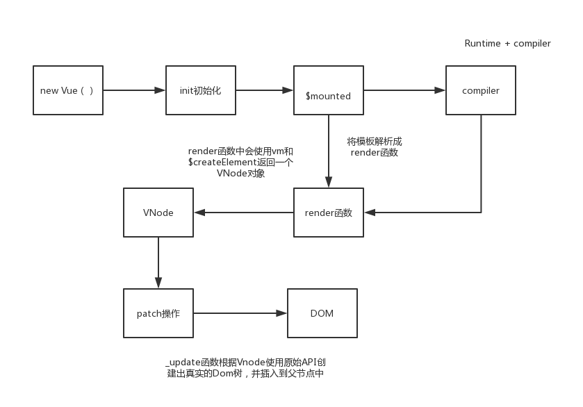

# 编译&渲染

## 编译过程

parse:

合并传入时的配置( 不同平台传入不同，如 weex ) 和基本的配置,根据配置将 HTML 模板解析成 AST 抽象语法树 ( 解析过程会使用大量的正则表达式来解析 HTML 字符串，来构造 AST 树 )

optimize:

遍历 AST 树，标记静态节点和静态根节点。静态节点就是非响应式的节点，标记静态节点用于辅助标记静态根节点，静态根节点在首次渲染后不会发生变化。

code-gen：

深度遍历 AST 树，根据静态节点，v-命令，插槽，组件等将 AST 代码转换成代码字符串。最后生成又由 with(this) {return ${code}的模板字符串，也就是 render 函数

## 渲染过程

- new Vue() init 初始化
- $mount 挂载，compiler 将模板解析成 render 函数
- render,使用 vm 个$creamElement 返回 vnode
- patch 操作，会调用\_update 函数生成真实的节点

